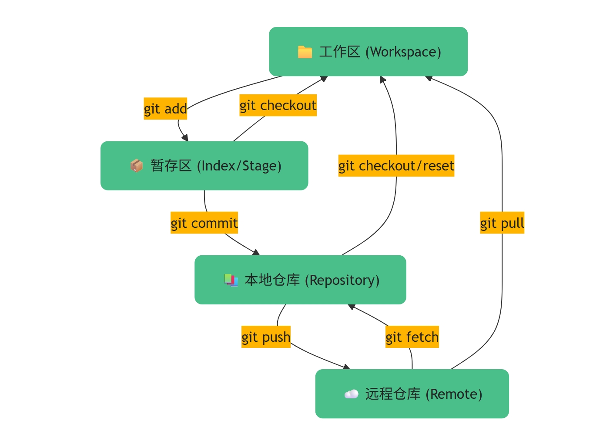

## 引言

一次 `git push --force` 覆盖同事的提交、一个遗漏的 `git stash` 导致半天的代码丢失、一条错误的 `git reset` 让重要功能提交消失——这些都不是理论风险，而是每个开发者迟早会踩的坑。Git 是团队协作的基石，但 80% 的开发者只用了 20% 的功能。读完本文，你将掌握 Git 的完整命令体系、分支管理规范、冲突解决策略，以及生产环境中必须遵守的安全操作清单。无论日常开发还是面试应对，这份指南都能帮你从"会用"进阶到"精通"。

---

## Git 版本控制完全指南

### Git 核心概念回顾

Git 是一套分布式版本控制系统。理解其核心概念是高效使用的前提。

几个专用名词的译名如下：

- **Workspace（工作区）：** 你电脑上实际看到的目录，存放正在编辑的文件。
- **Index / Stage（暂存区）：** 一个临时存放下次要提交的文件快照的区域。
- **Repository（仓库区/本地仓库）：** 存放所有提交历史、分支信息的完整版本库。
- **Remote（远程仓库）：** 托管在服务器上的仓库，用于团队协作。
 
> **💡 核心提示** ： `git pull` 本质是 `git fetch` + `git merge` 的组合操作。先理解这三个命令的区别，是掌握 Git 远程操作的关键。

### Git 分支模型

团队协作中，合理的分支管理策略能避免大量冲突和代码损失。

> **💡 核心提示** ：不要在 `main` 分支上直接开发。所有功能分支从 `develop` 或 `main` 创建，通过 Merge Request / Pull Request 合入，确保代码经过审查。

### 常用命令分类速查

#### 新建代码库

```bash
# 在当前目录新建一个 Git 代码库
git init

# 新建一个目录，将其初始化为 Git 代码库
git init [project-name]

# 下载一个项目和它的整个代码历史
git clone [url]
```

#### 配置

Git 的设置文件为 `.gitconfig` ，它可以在用户主目录下（全局配置），也可以在项目目录下（项目配置）。

```bash
# 显示当前的 Git 配置
git config --list

# 编辑 Git 配置文件
git config -e [--global]

# 设置提交代码时的用户信息
git config [--global] user.name "[name]"
git config [--global] user.email "[email address]"
```

#### 增加/删除文件

```bash
# 添加指定文件到暂存区
git add [file1] [file2] ...

# 添加指定目录到暂存区，包括子目录
git add [dir]

# 添加当前目录的所有文件到暂存区
git add .

# 添加每个变化前，都会要求确认（分次提交）
git add -p

# 删除工作区文件，并且将这次删除放入暂存区
git rm [file1] [file2] ...

# 停止追踪指定文件，但该文件会保留在工作区
git rm --cached [file]

# 改名文件，并且将这个改名放入暂存区
git mv [file-original] [file-renamed]
```

#### 代码提交

```bash
# 提交暂存区到仓库区
git commit -m [message]

# 提交暂存区的指定文件到仓库区
git commit [file1] [file2] ... -m [message]

# 提交工作区自上次 commit 之后的变化，直接到仓库区
git commit -a

# 提交时显示所有 diff 信息
git commit -v

# 使用一次新的 commit，替代上一次提交（修改上次提交信息）
git commit --amend -m [message]

# 重做上一次 commit，并包括指定文件的新变化
git commit --amend [file1] [file2] ...
```

#### 分支管理

```bash
# 列出所有本地分支
git branch

# 列出所有远程分支
git branch -r

# 列出所有本地分支和远程分支
git branch -a

# 新建一个分支，但依然停留在当前分支
git branch [branch-name]

# 新建一个分支，并切换到该分支
git checkout -b [branch]

# 新建一个分支，指向指定 commit
git branch [branch] [commit]

# 新建一个分支，与指定的远程分支建立追踪关系
git branch --track [branch] [remote-branch]

# 切换到指定分支，并更新工作区
git checkout [branch-name]

# 切换到上一个分支
git checkout -

# 建立追踪关系，在现有分支与指定的远程分支之间
git branch --set-upstream [branch] [remote-branch]

# 合并指定分支到当前分支
git merge [branch]

# 选择一个 commit，合并进当前分支
git cherry-pick [commit]

# 删除分支
git branch -d [branch-name]

# 删除远程分支
git push origin --delete [branch-name]
git branch -dr [remote/branch]
```

#### 标签

```bash
# 列出所有 tag
git tag

# 新建一个 tag 在当前 commit
git tag [tag]

# 新建一个 tag 在指定 commit
git tag [tag] [commit]

# 删除本地 tag
git tag -d [tag]

# 删除远程 tag
git push origin :refs/tags/[tagName]

# 查看 tag 信息
git show [tag]

# 提交指定 tag
git push [remote] [tag]

# 提交所有 tag
git push [remote] --tags

# 新建一个分支，指向某个 tag
git checkout -b [branch] [tag]
```

#### 查看信息

```bash
# 显示有变更的文件
git status

# 显示当前分支的版本历史
git log

# 显示 commit 历史，以及每次 commit 发生变更的文件
git log --stat

# 搜索提交历史，根据关键词
git log -S [keyword]

# 显示某个 commit 之后的所有变动，每个 commit 占据一行
git log [tag] HEAD --pretty=format:%s

# 显示某个 commit 之后的所有变动，其"提交说明"必须符合搜索条件
git log [tag] HEAD --grep feature

# 显示某个文件的版本历史，包括文件改名
git log --follow [file]
git whatchanged [file]

# 显示指定文件相关的每一次 diff
git log -p [file]

# 显示过去 5 次提交
git log -5 --pretty --oneline

# 显示所有提交过的用户，按提交次数排序
git shortlog -sn

# 显示指定文件是什么人在什么时间修改过
git blame [file]

# 显示暂存区和工作区的差异
git diff

# 显示暂存区和上一个 commit 的差异
git diff --cached [file]

# 显示工作区与当前分支最新 commit 之间的差异
git diff HEAD

# 显示两次提交之间的差异
git diff [first-branch]...[second-branch]

# 显示今天你写了多少行代码
git diff --shortstat "@{0 day ago}"

# 显示某次提交的元数据和内容变化
git show [commit]

# 显示某次提交发生变化的文件
git show --name-only [commit]

# 显示某次提交时，某个文件的内容
git show [commit]:[filename]

# 显示当前分支的最近几次提交
git reflog
```

#### 远程同步

```bash
# 下载远程仓库的所有变动
git fetch [remote]

# 显示所有远程仓库
git remote -v

# 显示某个远程仓库的信息
git remote show [remote]

# 增加一个新的远程仓库，并命名
git remote add [shortname] [url]

# 取回远程仓库的变化，并与本地分支合并
git pull [remote] [branch]

# 上传本地指定分支到远程仓库
git push [remote] [branch]

# 强行推送当前分支到远程仓库，即使有冲突
git push [remote] --force

# 推送所有分支到远程仓库
git push [remote] --all
```

#### 撤销操作

```bash
# 恢复暂存区的指定文件到工作区
git checkout [file]

# 恢复某个 commit 的指定文件到暂存区和工作区
git checkout [commit] [file]

# 恢复暂存区的所有文件到工作区
git checkout .

# 重置暂存区的指定文件，与上一次 commit 保持一致，但工作区不变
git reset [file]

# 重置暂存区与工作区，与上一次 commit 保持一致
git reset --hard

# 重置当前分支的指针为指定 commit，同时重置暂存区，但工作区不变
git reset [commit]

# 重置当前分支的 HEAD 为指定 commit，同时重置暂存区和工作区，与指定 commit 一致
git reset --hard [commit]

# 重置当前 HEAD 为指定 commit，但保持暂存区和工作区不变
git reset --keep [commit]

# 新建一个 commit，用来撤销指定 commit（反向操作）
git revert [commit]

# 暂时将未提交的变化移除，稍后再移入
git stash
git stash pop
```

#### 其他

```bash
# 生成一个可供发布的压缩包
git archive
```

### 核心操作对比表

| 操作 | 命令 | 影响范围 | 是否可恢复 | 使用场景 |
| --- | --- | --- | --- | --- |
| 撤销工作区修改 | `git checkout <file>` | 工作区 | 否 | 放弃未暂存的修改 |
| 撤销暂存 | `git reset <file>` | 暂存区 | 是 | 从暂存区移出，保留工作区 |
| 软重置 | `git reset --soft <commit>` | 仅 HEAD | 是 | 重新组织 commit |
| 混合重置 | `git reset --mixed <commit>` | HEAD + 暂存区 | 是 | 回退 commit，保留工作区 |
| 硬重置 | `git reset --hard <commit>` | HEAD + 暂存区 + 工作区 | 否 | 彻底回退到指定 commit |
| 反向提交 | `git revert <commit>` | 新增 commit | 是 | 安全撤销已推送的提交 |
| 暂存修改 | `git stash` | 工作区 + 暂存区 | 是 | 切换分支时保存未提交修改 |

> **💡 核心提示** ： `git reset` 和 `git revert` 的本质区别是： `reset` 是"回到过去"（修改历史）， `revert` 是"承认错误"（新增一次反向提交）。已推送到远程的提交必须用 `revert` ，绝不能用 `reset` 。

### Git 远程操作流程

<svg id="mermaid-261" width="875" xmlns="http://www.w3.org/2000/svg" height="782" viewBox="-57 -10 875 782" role="graphics-document document" aria-roledescription="sequence"><g><rect x="618" y="696" fill="#eaeaea" stroke="#666" width="150" height="65" name="Team" rx="3" ry="3"></rect><text x="693" y="728.5" dominant-baseline="central" alignment-baseline="central" style="text-anchor: middle; font-size: 16px; font-weight: 400;"><tspan x="693" dy="0">团队成员</tspan></text></g> <g><rect x="418" y="696" fill="#eaeaea" stroke="#666" width="150" height="65" name="Remote" rx="3" ry="3"></rect><text x="493" y="728.5" dominant-baseline="central" alignment-baseline="central" style="text-anchor: middle; font-size: 16px; font-weight: 400;"><tspan x="493" dy="0">远程仓库</tspan></text></g> <g><rect x="218" y="696" fill="#eaeaea" stroke="#666" width="150" height="65" name="Local" rx="3" ry="3"></rect><text x="293" y="728.5" dominant-baseline="central" alignment-baseline="central" style="text-anchor: middle; font-size: 16px; font-weight: 400;"><tspan x="293" dy="0">本地仓库</tspan></text></g> <g><rect x="0" y="696" fill="#eaeaea" stroke="#666" width="150" height="65" name="Dev" rx="3" ry="3"></rect><text x="75" y="728.5" dominant-baseline="central" alignment-baseline="central" style="text-anchor: middle; font-size: 16px; font-weight: 400;"><tspan x="75" dy="0">开发者</tspan></text></g> <g><line id="actor22" x1="693" y1="65" x2="693" y2="696" stroke-width="0.5px" stroke="#999" name="Team" data-et="life-line" data-id="Team"></line><g id="root-22" data-et="participant" data-type="participant" data-id="Team"><rect x="618" y="0" fill="#eaeaea" stroke="#666" width="150" height="65" name="Team" rx="3" ry="3"></rect><text x="693" y="32.5" dominant-baseline="central" alignment-baseline="central" style="text-anchor: middle; font-size: 16px; font-weight: 400;"><tspan x="693" dy="0">团队成员</tspan></text></g></g> <g><line id="actor21" x1="493" y1="65" x2="493" y2="696" stroke-width="0.5px" stroke="#999" name="Remote" data-et="life-line" data-id="Remote"></line><g id="root-21" data-et="participant" data-type="participant" data-id="Remote"><rect x="418" y="0" fill="#eaeaea" stroke="#666" width="150" height="65" name="Remote" rx="3" ry="3"></rect><text x="493" y="32.5" dominant-baseline="central" alignment-baseline="central" style="text-anchor: middle; font-size: 16px; font-weight: 400;"><tspan x="493" dy="0">远程仓库</tspan></text></g></g> <g><line id="actor20" x1="293" y1="65" x2="293" y2="696" stroke-width="0.5px" stroke="#999" name="Local" data-et="life-line" data-id="Local"></line><g id="root-20" data-et="participant" data-type="participant" data-id="Local"><rect x="218" y="0" fill="#eaeaea" stroke="#666" width="150" height="65" name="Local" rx="3" ry="3"></rect><text x="293" y="32.5" dominant-baseline="central" alignment-baseline="central" style="text-anchor: middle; font-size: 16px; font-weight: 400;"><tspan x="293" dy="0">本地仓库</tspan></text></g></g> <g><line id="actor19" x1="75" y1="65" x2="75" y2="696" stroke-width="0.5px" stroke="#999" name="Dev" data-et="life-line" data-id="Dev"></line><g id="root-19" data-et="participant" data-type="participant" data-id="Dev"><rect x="0" y="0" fill="#eaeaea" stroke="#666" width="150" height="65" name="Dev" rx="3" ry="3"></rect><text x="75" y="32.5" dominant-baseline="central" alignment-baseline="central" style="text-anchor: middle; font-size: 16px; font-weight: 400;"><tspan x="75" dy="0">开发者</tspan></text></g></g> <g></g><defs><symbol id="mermaid-261-computer" width="24" height="24"><path transform="scale(.5)" d="M2 2v13h20v-13h-20zm18 11h-16v-9h16v9zm-10.228 6l.466-1h3.524l.467 1h-4.457zm14.228 3h-24l2-6h2.104l-1.33 4h18.45l-1.297-4h2.073l2 6zm-5-10h-14v-7h14v7z"></path></symbol></defs><defs><symbol id="mermaid-261-database" fill-rule="evenodd" clip-rule="evenodd"><path transform="scale(.5)" d="M12.258.001l.256.004.255.005.253.008.251.01.249.012.247.015.246.016.242.019.241.02.239.023.236.024.233.027.231.028.229.031.225.032.223.034.22.036.217.038.214.04.211.041.208.043.205.045.201.046.198.048.194.05.191.051.187.053.183.054.18.056.175.057.172.059.168.06.163.061.16.063.155.064.15.066.074.033.073.033.071.034.07.034.069.035.068.035.067.035.066.035.064.036.064.036.062.036.06.036.06.037.058.037.058.037.055.038.055.038.053.038.052.038.051.039.05.039.048.039.047.039.045.04.044.04.043.04.041.04.04.041.039.041.037.041.036.041.034.041.033.042.032.042.03.042.029.042.027.042.026.043.024.043.023.043.021.043.02.043.018.044.017.043.015.044.013.044.012.044.011.045.009.044.007.045.006.045.004.045.002.045.001.045v17l-.001.045-.002.045-.004.045-.006.045-.007.045-.009.044-.011.045-.012.044-.013.044-.015.044-.017.043-.018.044-.02.043-.021.043-.023.043-.024.043-.026.043-.027.042-.029.042-.03.042-.032.042-.033.042-.034.041-.036.041-.037.041-.039.041-.04.041-.041.04-.043.04-.044.04-.045.04-.047.039-.048.039-.05.039-.051.039-.052.038-.053.038-.055.038-.055.038-.058.037-.058.037-.06.037-.06.036-.062.036-.064.036-.064.036-.066.035-.067.035-.068.035-.069.035-.07.034-.071.034-.073.033-.074.033-.15.066-.155.064-.16.063-.163.061-.168.06-.172.059-.175.057-.18.056-.183.054-.187.053-.191.051-.194.05-.198.048-.201.046-.205.045-.208.043-.211.041-.214.04-.217.038-.22.036-.223.034-.225.032-.229.031-.231.028-.233.027-.236.024-.239.023-.241.02-.242.019-.246.016-.247.015-.249.012-.251.01-.253.008-.255.005-.256.004-.258.001-.258-.001-.256-.004-.255-.005-.253-.008-.251-.01-.249-.012-.247-.015-.245-.016-.243-.019-.241-.02-.238-.023-.236-.024-.234-.027-.231-.028-.228-.031-.226-.032-.223-.034-.22-.036-.217-.038-.214-.04-.211-.041-.208-.043-.204-.045-.201-.046-.198-.048-.195-.05-.19-.051-.187-.053-.184-.054-.179-.056-.176-.057-.172-.059-.167-.06-.164-.061-.159-.063-.155-.064-.151-.066-.074-.033-.072-.033-.072-.034-.07-.034-.069-.035-.068-.035-.067-.035-.066-.035-.064-.036-.063-.036-.062-.036-.061-.036-.06-.037-.058-.037-.057-.037-.056-.038-.055-.038-.053-.038-.052-.038-.051-.039-.049-.039-.049-.039-.046-.039-.046-.04-.044-.04-.043-.04-.041-.04-.04-.041-.039-.041-.037-.041-.036-.041-.034-.041-.033-.042-.032-.042-.03-.042-.029-.042-.027-.042-.026-.043-.024-.043-.023-.043-.021-.043-.02-.043-.018-.044-.017-.043-.015-.044-.013-.044-.012-.044-.011-.045-.009-.044-.007-.045-.006-.045-.004-.045-.002-.045-.001-.045v-17l.001-.045.002-.045.004-.045.006-.045.007-.045.009-.044.011-.045.012-.044.013-.044.015-.044.017-.043.018-.044.02-.043.021-.043.023-.043.024-.043.026-.043.027-.042.029-.042.03-.042.032-.042.033-.042.034-.041.036-.041.037-.041.039-.041.04-.041.041-.04.043-.04.044-.04.046-.04.046-.039.049-.039.049-.039.051-.039.052-.038.053-.038.055-.038.056-.038.057-.037.058-.037.06-.037.061-.036.062-.036.063-.036.064-.036.066-.035.067-.035.068-.035.069-.035.07-.034.072-.034.072-.033.074-.033.151-.066.155-.064.159-.063.164-.061.167-.06.172-.059.176-.057.179-.056.184-.054.187-.053.19-.051.195-.05.198-.048.201-.046.204-.045.208-.043.211-.041.214-.04.217-.038.22-.036.223-.034.226-.032.228-.031.231-.028.234-.027.236-.024.238-.023.241-.02.243-.019.245-.016.247-.015.249-.012.251-.01.253-.008.255-.005.256-.004.258-.001.258.001zm-9.258 20.499v.01l.001.021.003.021.004.022.005.021.006.022.007.022.009.023.01.022.011.023.012.023.013.023.015.023.016.024.017.023.018.024.019.024.021.024.022.025.023.024.024.025.052.049.056.05.061.051.066.051.07.051.075.051.079.052.084.052.088.052.092.052.097.052.102.051.105.052.11.052.114.051.119.051.123.051.127.05.131.05.135.05.139.048.144.049.147.047.152.047.155.047.16.045.163.045.167.043.171.043.176.041.178.041.183.039.187.039.19.037.194.035.197.035.202.033.204.031.209.03.212.029.216.027.219.025.222.024.226.021.23.02.233.018.236.016.24.015.243.012.246.01.249.008.253.005.256.004.259.001.26-.001.257-.004.254-.005.25-.008.247-.011.244-.012.241-.014.237-.016.233-.018.231-.021.226-.021.224-.024.22-.026.216-.027.212-.028.21-.031.205-.031.202-.034.198-.034.194-.036.191-.037.187-.039.183-.04.179-.04.175-.042.172-.043.168-.044.163-.045.16-.046.155-.046.152-.047.148-.048.143-.049.139-.049.136-.05.131-.05.126-.05.123-.051.118-.052.114-.051.11-.052.106-.052.101-.052.096-.052.092-.052.088-.053.083-.051.079-.052.074-.052.07-.051.065-.051.06-.051.056-.05.051-.05.023-.024.023-.025.021-.024.02-.024.019-.024.018-.024.017-.024.015-.023.014-.024.013-.023.012-.023.01-.023.01-.022.008-.022.006-.022.006-.022.004-.022.004-.021.001-.021.001-.021v-4.127l-.077.055-.08.053-.083.054-.085.053-.087.052-.09.052-.093.051-.095.05-.097.05-.1.049-.102.049-.105.048-.106.047-.109.047-.111.046-.114.045-.115.045-.118.044-.12.043-.122.042-.124.042-.126.041-.128.04-.13.04-.132.038-.134.038-.135.037-.138.037-.139.035-.142.035-.143.034-.144.033-.147.032-.148.031-.15.03-.151.03-.153.029-.154.027-.156.027-.158.026-.159.025-.161.024-.162.023-.163.022-.165.021-.166.02-.167.019-.169.018-.169.017-.171.016-.173.015-.173.014-.175.013-.175.012-.177.011-.178.01-.179.008-.179.008-.181.006-.182.005-.182.004-.184.003-.184.002h-.37l-.184-.002-.184-.003-.182-.004-.182-.005-.181-.006-.179-.008-.179-.008-.178-.01-.176-.011-.176-.012-.175-.013-.173-.014-.172-.015-.171-.016-.17-.017-.169-.018-.167-.019-.166-.02-.165-.021-.163-.022-.162-.023-.161-.024-.159-.025-.157-.026-.156-.027-.155-.027-.153-.029-.151-.03-.15-.03-.148-.031-.146-.032-.145-.033-.143-.034-.141-.035-.14-.035-.137-.037-.136-.037-.134-.038-.132-.038-.13-.04-.128-.04-.126-.041-.124-.042-.122-.042-.12-.044-.117-.043-.116-.045-.113-.045-.112-.046-.109-.047-.106-.047-.105-.048-.102-.049-.1-.049-.097-.05-.095-.05-.093-.052-.09-.051-.087-.052-.085-.053-.083-.054-.08-.054-.077-.054v4.127zm0-5.654v.011l.001.021.003.021.004.021.005.022.006.022.007.022.009.022.01.022.011.023.012.023.013.023.015.024.016.023.017.024.018.024.019.024.021.024.022.024.023.025.024.024.052.05.056.05.061.05.066.051.07.051.075.052.079.051.084.052.088.052.092.052.097.052.102.052.105.052.11.051.114.051.119.052.123.05.127.051.131.05.135.049.139.049.144.048.147.048.152.047.155.046.16.045.163.045.167.044.171.042.176.042.178.04.183.04.187.038.19.037.194.036.197.034.202.033.204.032.209.03.212.028.216.027.219.025.222.024.226.022.23.02.233.018.236.016.24.014.243.012.246.01.249.008.253.006.256.003.259.001.26-.001.257-.003.254-.006.25-.008.247-.01.244-.012.241-.015.237-.016.233-.018.231-.02.226-.022.224-.024.22-.025.216-.027.212-.029.21-.03.205-.032.202-.033.198-.035.194-.036.191-.037.187-.039.183-.039.179-.041.175-.042.172-.043.168-.044.163-.045.16-.045.155-.047.152-.047.148-.048.143-.048.139-.05.136-.049.131-.05.126-.051.123-.051.118-.051.114-.052.11-.052.106-.052.101-.052.096-.052.092-.052.088-.052.083-.052.079-.052.074-.051.07-.052.065-.051.06-.05.056-.051.051-.049.023-.025.023-.024.021-.025.02-.024.019-.024.018-.024.017-.024.015-.023.014-.023.013-.024.012-.022.01-.023.01-.023.008-.022.006-.022.006-.022.004-.021.004-.022.001-.021.001-.021v-4.139l-.077.054-.08.054-.083.054-.085.052-.087.053-.09.051-.093.051-.095.051-.097.05-.1.049-.102.049-.105.048-.106.047-.109.047-.111.046-.114.045-.115.044-.118.044-.12.044-.122.042-.124.042-.126.041-.128.04-.13.039-.132.039-.134.038-.135.037-.138.036-.139.036-.142.035-.143.033-.144.033-.147.033-.148.031-.15.03-.151.03-.153.028-.154.028-.156.027-.158.026-.159.025-.161.024-.162.023-.163.022-.165.021-.166.02-.167.019-.169.018-.169.017-.171.016-.173.015-.173.014-.175.013-.175.012-.177.011-.178.009-.179.009-.179.007-.181.007-.182.005-.182.004-.184.003-.184.002h-.37l-.184-.002-.184-.003-.182-.004-.182-.005-.181-.007-.179-.007-.179-.009-.178-.009-.176-.011-.176-.012-.175-.013-.173-.014-.172-.015-.171-.016-.17-.017-.169-.018-.167-.019-.166-.02-.165-.021-.163-.022-.162-.023-.161-.024-.159-.025-.157-.026-.156-.027-.155-.028-.153-.028-.151-.03-.15-.03-.148-.031-.146-.033-.145-.033-.143-.033-.141-.035-.14-.036-.137-.036-.136-.037-.134-.038-.132-.039-.13-.039-.128-.04-.126-.041-.124-.042-.122-.043-.12-.043-.117-.044-.116-.044-.113-.046-.112-.046-.109-.046-.106-.047-.105-.048-.102-.049-.1-.049-.097-.05-.095-.051-.093-.051-.09-.051-.087-.053-.085-.052-.083-.054-.08-.054-.077-.054v4.139zm0-5.666v.011l.001.02.003.022.004.021.005.022.006.021.007.022.009.023.01.022.011.023.012.023.013.023.015.023.016.024.017.024.018.023.019.024.021.025.022.024.023.024.024.025.052.05.056.05.061.05.066.051.07.051.075.052.079.051.084.052.088.052.092.052.097.052.102.052.105.051.11.052.114.051.119.051.123.051.127.05.131.05.135.05.139.049.144.048.147.048.152.047.155.046.16.045.163.045.167.043.171.043.176.042.178.04.183.04.187.038.19.037.194.036.197.034.202.033.204.032.209.03.212.028.216.027.219.025.222.024.226.021.23.02.233.018.236.017.24.014.243.012.246.01.249.008.253.006.256.003.259.001.26-.001.257-.003.254-.006.25-.008.247-.01.244-.013.241-.014.237-.016.233-.018.231-.02.226-.022.224-.024.22-.025.216-.027.212-.029.21-.03.205-.032.202-.033.198-.035.194-.036.191-.037.187-.039.183-.039.179-.041.175-.042.172-.043.168-.044.163-.045.16-.045.155-.047.152-.047.148-.048.143-.049.139-.049.136-.049.131-.051.126-.05.123-.051.118-.052.114-.051.11-.052.106-.052.101-.052.096-.052.092-.052.088-.052.083-.052.079-.052.074-.052.07-.051.065-.051.06-.051.056-.05.051-.049.023-.025.023-.025.021-.024.02-.024.019-.024.018-.024.017-.024.015-.023.014-.024.013-.023.012-.023.01-.022.01-.023.008-.022.006-.022.006-.022.004-.022.004-.021.001-.021.001-.021v-4.153l-.077.054-.08.054-.083.053-.085.053-.087.053-.09.051-.093.051-.095.051-.097.05-.1.049-.102.048-.105.048-.106.048-.109.046-.111.046-.114.046-.115.044-.118.044-.12.043-.122.043-.124.042-.126.041-.128.04-.13.039-.132.039-.134.038-.135.037-.138.036-.139.036-.142.034-.143.034-.144.033-.147.032-.148.032-.15.03-.151.03-.153.028-.154.028-.156.027-.158.026-.159.024-.161.024-.162.023-.163.023-.165.021-.166.02-.167.019-.169.018-.169.017-.171.016-.173.015-.173.014-.175.013-.175.012-.177.01-.178.01-.179.009-.179.007-.181.006-.182.006-.182.004-.184.003-.184.001-.185.001-.185-.001-.184-.001-.184-.003-.182-.004-.182-.006-.181-.006-.179-.007-.179-.009-.178-.01-.176-.01-.176-.012-.175-.013-.173-.014-.172-.015-.171-.016-.17-.017-.169-.018-.167-.019-.166-.02-.165-.021-.163-.023-.162-.023-.161-.024-.159-.024-.157-.026-.156-.027-.155-.028-.153-.028-.151-.03-.15-.03-.148-.032-.146-.032-.145-.033-.143-.034-.141-.034-.14-.036-.137-.036-.136-.037-.134-.038-.132-.039-.13-.039-.128-.041-.126-.041-.124-.041-.122-.043-.12-.043-.117-.044-.116-.044-.113-.046-.112-.046-.109-.046-.106-.048-.105-.048-.102-.048-.1-.05-.097-.049-.095-.051-.093-.051-.09-.052-.087-.052-.085-.053-.083-.053-.08-.054-.077-.054v4.153zm8.74-8.179l-.257.004-.254.005-.25.008-.247.011-.244.012-.241.014-.237.016-.233.018-.231.021-.226.022-.224.023-.22.026-.216.027-.212.028-.21.031-.205.032-.202.033-.198.034-.194.036-.191.038-.187.038-.183.04-.179.041-.175.042-.172.043-.168.043-.163.045-.16.046-.155.046-.152.048-.148.048-.143.048-.139.049-.136.05-.131.05-.126.051-.123.051-.118.051-.114.052-.11.052-.106.052-.101.052-.096.052-.092.052-.088.052-.083.052-.079.052-.074.051-.07.052-.065.051-.06.05-.056.05-.051.05-.023.025-.023.024-.021.024-.02.025-.019.024-.018.024-.017.023-.015.024-.014.023-.013.023-.012.023-.01.023-.01.022-.008.022-.006.023-.006.021-.004.022-.004.021-.001.021-.001.021.001.021.001.021.004.021.004.022.006.021.006.023.008.022.01.022.01.023.012.023.013.023.014.023.015.024.017.023.018.024.019.024.02.025.021.024.023.024.023.025.051.05.056.05.06.05.065.051.07.052.074.051.079.052.083.052.088.052.092.052.096.052.101.052.106.052.11.052.114.052.118.051.123.051.126.051.131.05.136.05.139.049.143.048.148.048.152.048.155.046.16.046.163.045.168.043.172.043.175.042.179.041.183.04.187.038.191.038.194.036.198.034.202.033.205.032.21.031.212.028.216.027.22.026.224.023.226.022.231.021.233.018.237.016.241.014.244.012.247.011.25.008.254.005.257.004.26.001.26-.001.257-.004.254-.005.25-.008.247-.011.244-.012.241-.014.237-.016.233-.018.231-.021.226-.022.224-.023.22-.026.216-.027.212-.028.21-.031.205-.032.202-.033.198-.034.194-.036.191-.038.187-.038.183-.04.179-.041.175-.042.172-.043.168-.043.163-.045.16-.046.155-.046.152-.048.148-.048.143-.048.139-.049.136-.05.131-.05.126-.051.123-.051.118-.051.114-.052.11-.052.106-.052.101-.052.096-.052.092-.052.088-.052.083-.052.079-.052.074-.051.07-.052.065-.051.06-.05.056-.05.051-.05.023-.025.023-.024.021-.024.02-.025.019-.024.018-.024.017-.023.015-.024.014-.023.013-.023.012-.023.01-.023.01-.022.008-.022.006-.023.006-.021.004-.022.004-.021.001-.021.001-.021-.001-.021-.001-.021-.004-.021-.004-.022-.006-.021-.006-.023-.008-.022-.01-.022-.01-.023-.012-.023-.013-.023-.014-.023-.015-.024-.017-.023-.018-.024-.019-.024-.02-.025-.021-.024-.023-.024-.023-.025-.051-.05-.056-.05-.06-.05-.065-.051-.07-.052-.074-.051-.079-.052-.083-.052-.088-.052-.092-.052-.096-.052-.101-.052-.106-.052-.11-.052-.114-.052-.118-.051-.123-.051-.126-.051-.131-.05-.136-.05-.139-.049-.143-.048-.148-.048-.152-.048-.155-.046-.16-.046-.163-.045-.168-.043-.172-.043-.175-.042-.179-.041-.183-.04-.187-.038-.191-.038-.194-.036-.198-.034-.202-.033-.205-.032-.21-.031-.212-.028-.216-.027-.22-.026-.224-.023-.226-.022-.231-.021-.233-.018-.237-.016-.241-.014-.244-.012-.247-.011-.25-.008-.254-.005-.257-.004-.26-.001-.26.001z"></path></symbol></defs><defs><symbol id="mermaid-261-clock" width="24" height="24"><path transform="scale(.5)" d="M12 2c5.514 0 10 4.486 10 10s-4.486 10-10 10-10-4.486-10-10 4.486-10 10-10zm0-2c-6.627 0-12 5.373-12 12s5.373 12 12 12 12-5.373 12-12-5.373-12-12-12zm5.848 12.459c.202.038.202.333.001.372-1.907.361-6.045 1.111-6.547 1.111-.719 0-1.301-.582-1.301-1.301 0-.512.77-5.447 1.125-7.445.034-.192.312-.181.343.014l.985 6.238 5.394 1.011z"></path></symbol></defs><defs><marker id="mermaid-261-arrowhead" refX="7.9" refY="5" markerUnits="userSpaceOnUse" markerWidth="12" markerHeight="12" orient="auto-start-reverse"><path d="M -1 0 L 10 5 L 0 10 z"></path></marker></defs><defs><marker id="mermaid-261-crosshead" markerWidth="15" markerHeight="8" orient="auto" refX="4" refY="4.5"><path fill="none" stroke="#000000" stroke-width="1pt" d="M 1,2 L 6,7 M 6,2 L 1,7" style="stroke-dasharray: 0, 0;"></path></marker></defs><defs><marker id="mermaid-261-filled-head" refX="15.5" refY="7" markerWidth="20" markerHeight="28" orient="auto"><path d="M 18,7 L9,13 L14,7 L9,1 Z"></path></marker></defs><defs><marker id="mermaid-261-sequencenumber" refX="15" refY="15" markerWidth="60" markerHeight="40" orient="auto"><circle cx="15" cy="15" r="6"></circle></marker></defs><defs><marker id="mermaid-261-solidTopArrowHead" refX="7.9" refY="7.25" markerUnits="userSpaceOnUse" markerWidth="12" markerHeight="12" orient="auto-start-reverse"><path d="M 0 0 L 10 8 L 0 8 z"></path></marker></defs><defs><marker id="mermaid-261-solidBottomArrowHead" refX="7.9" refY="0.75" markerUnits="userSpaceOnUse" markerWidth="12" markerHeight="12" orient="auto-start-reverse"><path d="M 0 0 L 10 0 L 0 8 z"></path></marker></defs><defs><marker id="mermaid-261-stickTopArrowHead" refX="7.5" refY="7" markerUnits="userSpaceOnUse" markerWidth="12" markerHeight="12" orient="auto-start-reverse"><path d="M 0 0 L 7 7" stroke="black" stroke-width="1.5" fill="none"></path></marker></defs><defs><marker id="mermaid-261-stickBottomArrowHead" refX="7.5" refY="0" markerUnits="userSpaceOnUse" markerWidth="12" markerHeight="12" orient="auto-start-reverse"><path d="M 0 7 L 7 0" stroke="black" stroke-width="1.5" fill="none"></path></marker></defs><g data-et="note" data-id="i1"><rect x="50" y="131" fill="#EDF2AE" stroke="#666" width="268" height="39"></rect><text x="184" y="136" text-anchor="middle" dominant-baseline="middle" alignment-baseline="middle" dy="1em" style="font-size: 16px; font-weight: 400;"><tspan x="184">1. 提交到本地仓库</tspan></text></g> <g data-et="note" data-id="i3"><rect x="50" y="236" fill="#EDF2AE" stroke="#666" width="468" height="39"></rect><text x="284" y="241" text-anchor="middle" dominant-baseline="middle" alignment-baseline="middle" dy="1em" style="font-size: 16px; font-weight: 400;"><tspan x="284">2. 拉取远程最新变更</tspan></text></g> <g data-et="note" data-id="i5"><rect x="0" y="371" fill="#EDF2AE" stroke="#666" width="150" height="39"></rect><text x="75" y="376" text-anchor="middle" dominant-baseline="middle" alignment-baseline="middle" dy="1em" style="font-size: 16px; font-weight: 400;"><tspan x="75">3. 解决冲突</tspan></text></g> <g data-et="note" data-id="i7"><rect x="50" y="476" fill="#EDF2AE" stroke="#666" width="468" height="39"></rect><text x="284" y="481" text-anchor="middle" dominant-baseline="middle" alignment-baseline="middle" dy="1em" style="font-size: 16px; font-weight: 400;"><tspan x="284">4. 推送到远程</tspan></text></g> <g data-et="note" data-id="i10"><rect x="618" y="637" fill="#EDF2AE" stroke="#666" width="150" height="39"></rect><text x="693" y="642" text-anchor="middle" dominant-baseline="middle" alignment-baseline="middle" dy="1em" style="font-size: 16px; font-weight: 400;"><tspan x="693">6. 拉取最新代码</tspan></text></g> <text x="183" y="80" text-anchor="middle" dominant-baseline="middle" alignment-baseline="middle" dy="1em" style="font-size: 16px; font-weight: 400;">git add + git commit</text> <line x1="76" y1="121" x2="289" y2="121" data-et="message" data-id="i0" data-from="Dev" data-to="Local" stroke-width="2" stroke="none" marker-end="url(#mermaid-261-arrowhead)" style="fill: none;"></line><text x="283" y="185" text-anchor="middle" dominant-baseline="middle" alignment-baseline="middle" dy="1em" style="font-size: 16px; font-weight: 400;">git fetch</text> <line x1="76" y1="226" x2="489" y2="226" data-et="message" data-id="i2" data-from="Dev" data-to="Remote" stroke-width="2" stroke="none" marker-end="url(#mermaid-261-arrowhead)" style="fill: none;"></line><text x="76" y="290" text-anchor="middle" dominant-baseline="middle" alignment-baseline="middle" dy="1em" style="font-size: 16px; font-weight: 400;">git merge 或 git rebase</text> <path d="M 76,331 C 136,321 136,361 76,351" data-et="message" data-id="i4" data-from="Dev" data-to="Dev" stroke-width="2" stroke="none" marker-end="url(#mermaid-261-arrowhead)" style="fill: none;"></path><text x="283" y="425" text-anchor="middle" dominant-baseline="middle" alignment-baseline="middle" dy="1em" style="font-size: 16px; font-weight: 400;">git push</text> <line x1="76" y1="466" x2="489" y2="466" data-et="message" data-id="i6" data-from="Dev" data-to="Remote" stroke-width="2" stroke="none" marker-end="url(#mermaid-261-arrowhead)" style="fill: none;"></line><text x="592" y="530" text-anchor="middle" dominant-baseline="middle" alignment-baseline="middle" dy="1em" style="font-size: 16px; font-weight: 400;">5. 团队成员可见</text> <line x1="494" y1="571" x2="689" y2="571" data-et="message" data-id="i8" data-from="Remote" data-to="Team" stroke-width="2" stroke="none" marker-end="url(#mermaid-261-arrowhead)" style="stroke-dasharray: 3, 3; fill: none;"></line><text x="595" y="586" text-anchor="middle" dominant-baseline="middle" alignment-baseline="middle" dy="1em" style="font-size: 16px; font-weight: 400;">git pull</text><line x1="692" y1="627" x2="497" y2="627" data-et="message" data-id="i9" data-from="Team" data-to="Remote" stroke-width="2" stroke="none" marker-end="url(#mermaid-261-arrowhead)" style="fill: none;"></line></svg>

### 面试问题示例与深度解析

- "请描述 `git merge` 和 `git rebase` 的区别？"（ `merge` 会创建合并节点保留完整历史， `rebase` 会重写提交历史保持线性。公共分支用 `merge` ，本地功能分支用 `rebase` ）
- "如果误删了一个重要分支，如何恢复？"（使用 `git reflog` 找到分支删除前的 HEAD 指针，再用 `git branch <name> <commit-hash>` 重建分支）
- "如何解决 Git 合并冲突？"（ `git status` 查看冲突文件 -> 手动编辑解决冲突标记 -> `git add` 标记已解决 -> `git commit` 完成合并）
- " `git pull --rebase` 和普通的 `git pull` 有什么区别？"（ `--rebase` 会将本地未推送的提交重新变基到远程分支上，避免产生多余的 merge commit，保持历史线性）

### 总结

Git 是开发者日常工作中最重要的协作工具。掌握其核心概念（工作区、暂存区、仓库区）、常用命令体系、分支管理规范，以及安全的撤销和恢复策略，是提升团队协作效率、避免代码丢失的必备技能。理解 `reset` 与 `revert` 的区别、 `merge` 与 `rebase` 的适用场景，能让你在复杂协作中游刃有余。

### 生产环境避坑指南

1. **禁止 `git push --force` 到共享分支：** 强制推送会覆盖远程历史，可能永久丢失同事的提交。如必须使用，请用 `--force-with-lease` （安全强制推送，仅在远程没有新提交时才允许）。
2. **敏感信息泄露：** 密码、API Key、Token 一旦提交到 Git 历史，即使后续删除，仍可通过 `git log` 恢复。使用 `.gitignore` 和 `git filter-branch` 或 BFG 工具彻底清除。
3. **大文件入库：** 二进制大文件（图片、编译产物）会导致仓库体积暴增。使用 Git LFS（Large File Storage）管理大文件。
4. **忽略文件配置：** 确保 `.gitignore` 包含 IDE 配置文件（`.idea/` 、`.vscode/` ）、编译产物（ `target/` 、 `build/` ）、环境变量文件（`.env` ）等。
5. **Commit 消息规范：** 遵循 Conventional Commits 规范（如 `feat:`、 `fix:`、 `docs:`），便于自动生成 Changelog 和追溯变更。
6. **分支保护：** 在 GitHub/GitLab 上为 `main` 、 `develop` 分支开启 Branch Protection，禁止直接推送，要求通过 Pull Request 和 Code Review 合入。
7. **定期 `git gc` ：** 对本地仓库执行 `git gc --prune=now` 清理无用对象，避免仓库膨胀。

### 行动清单

1. **检查 `.gitignore` ：** 确认项目中的 `.gitignore` 已覆盖 IDE 配置、编译产物、敏感文件（`.env` 、 `*.key` ）。
2. **配置全局 alias：** 设置常用别名，如 `git config --global alias.lg "log --oneline --graph --decorate"` 。
3. **实践安全推送：** 将习惯从 `git push --force` 改为 `git push --force-with-lease` 。
4. **Commit 消息规范：** 在团队内推行 Conventional Commits 规范，确保每次提交都有明确的类型和描述。
5. **扩展阅读：** 推荐阅读 Pro Git 官方文档（https://git-scm.com/book/zh/v2），重点阅读"Git 分支"和"Git 工具"章节。