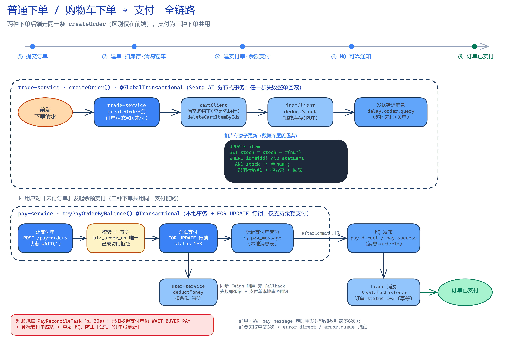
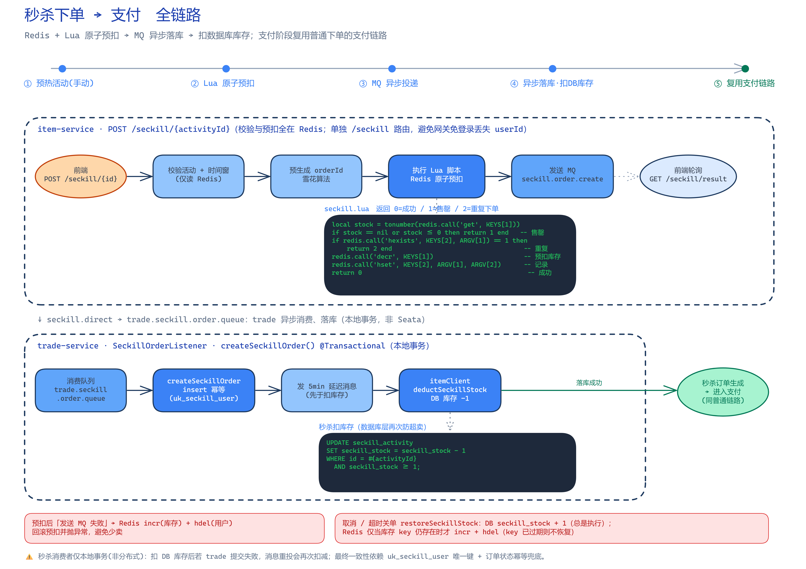
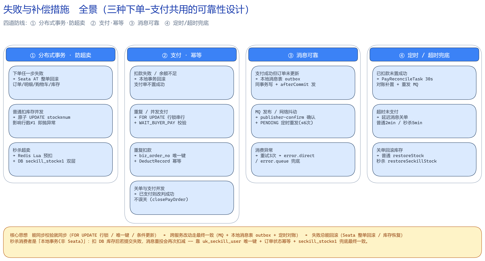

# hmall 下单 - 支付 业务流程与失败补偿

本文梳理 hmall 微服务商城中三种「下单 → 支付」链路的完整业务流程，以及各环节可能失败时的补偿 / 兜底措施。

涉及服务：

| 服务 | 职责 |
| --- | --- |
| trade-service | 订单（建单、明细、取消、超时关单、消费支付/秒杀消息） |
| pay-service | 支付单（余额支付、幂等、本地消息表、对账） |
| item-service | 商品 / 普通库存 / 秒杀（Redis+Lua 预扣、DB 库存） |
| cart-service | 购物车（下单后清理选中项） |
| user-service | 用户余额（扣款、扣款流水幂等） |
| hm-gateway | 网关（登录校验、路由；秒杀走独立 /seckill 路由避免丢 userId） |
| hmall-api | 各服务间 OpenFeign 契约 + Sentinel fallback |

> 普通下单与购物车下单在**后端走的是同一个 `createOrder`**，区别只在前端（购物车下单会带上被选中的购物车项 id，用于下单后清理）。支付链路三种下单完全共用。

---

## 一、普通下单 / 购物车下单 → 支付



### 1. 下单（trade-service · `createOrder` · `@GlobalTransactional`）

Seata AT 全局事务，任一步失败整单回滚：

1. 组装 `itemId → num` 映射，调用 `itemClient.queryItemByIds` 校验商品是否存在 / 是否上架；
2. 以**数据库价格**在服务端重新计算订单总额（不信任前端金额）；
3. 保存订单 `order`（status=1 未付款）+ 批量保存订单明细 `order_detail`；
4. `cartClient.deleteCartItemByIds` 清理购物车选中项（**总是执行，且在扣库存之前**）；
5. `itemClient.deductStock` 扣减库存（PUT）；
6. 发送**延迟消息**（`trade.delay.direct`，key=`delay.order.query`）用于后续超时关单；
7. 返回 orderId。

扣库存用**原子条件更新**防止并发超卖：

```sql
UPDATE item SET stock = stock - #{num}
WHERE id = #{id} AND status = 1 AND stock >= #{num};
-- 影响行数 ≠ 1  →  抛 BizIllegalException  →  Seata 整单回滚
```

### 2. 支付（pay-service · `tryPayOrderByBalance` · `@Transactional`）

用户对「未付订单」发起**余额支付**（当前仅支持余额支付）：

1. **建支付单** `POST /pay-orders`：`applyPayOrder` 校验订单、幂等（`biz_order_no` 唯一，已 `TRADE_SUCCESS`/`CLOSED` 则拒绝），生成支付单 status=`WAIT_BUYER_PAY(1)`，`payOverTime = now + 120min`；
2. **支付** `POST /pay-orders/{id}`（本地事务 + `FOR UPDATE` 行锁）：
   - `selectByIdForUpdate` 锁定支付单并校验状态；
   - `userClient.deductMoney` **同步扣款**（PUT，**无 fallback**，失败即抛错 → 本地事务回滚）；
   - `markPayOrderSuccess` 把支付单 1 → 3；
   - `payMessagePublisher.saveAndPublishAfterCommit`：写**本地消息表** `pay_message`，事务提交后（`afterCommit`）才发布 `pay.direct` / `pay.success`（消息体 = orderId）。
3. trade 侧 `PayStatusListener` 消费 `trade.pay.success.queue`：`markOrderPaySuccess` 条件更新（`set status=2 where id=? and status=1`，天然幂等），订单变为「已支付」。

user-service `deductMoney`（`@Transactional`）：先 `insert DeductRecord`（`pay_order_id` 唯一，防重复扣款）+ 条件更新余额（影响行数≠1 → 余额不足）。

---

## 二、秒杀下单 → 支付



### 0. 预热（手动）

`POST /seckill/activity/{id}/preheat` 把活动库存 / 活动信息 / 已购用户 hash 写入 Redis：
- `seckill:stock:{id}`（库存）、`seckill:activity:{id}`（活动 + 时间窗）、`seckill:order:{id}`（已购用户 hash）；
- TTL = 活动结束 + 1 天。

### 1. 秒杀下单（item-service · `POST /seckill/{activityId}`）

校验与预扣**全部在 Redis 完成**（单独 `/seckill` 路由，避免网关免登录场景丢失 userId）：

1. 校验活动是否存在、是否在时间窗内（只读 Redis）；
2. 雪花算法**预生成 orderId**；
3. 执行 **Lua 脚本**原子预扣库存（返回 `0=成功 / 1=售罄 / 2=重复下单`）；
4. `convertAndSend(seckill.direct, seckill.order.create, SeckillOrderMsgDTO)` 发送 MQ；
5. 前端轮询 `GET /seckill/result` 拿下单结果。

```lua
-- seckill.lua  返回 0=成功 / 1=售罄 / 2=重复下单
local stock = tonumber(redis.call('get', KEYS[1]))
if stock == nil or stock <= 0 then return 1 end
if redis.call('hexists', KEYS[2], ARGV[1]) == 1 then return 2 end
redis.call('decr', KEYS[1])
redis.call('hset', KEYS[2], ARGV[1], ARGV[2])
return 0
```

### 2. 异步落库（trade-service · `SeckillOrderListener` · `createSeckillOrder` · `@Transactional` 本地事务）

`seckill.direct → trade.seckill.order.queue`，trade 异步消费落库（**本地事务，非 Seata**）：

1. `queryItemByIds` 兜底校验；
2. 用预生成 orderId 建单（status=1，带 `seckillActivityId`）；`try insert` 捕获 `DuplicateKeyException` 则直接返回（`uk_seckill_user` 唯一键幂等）；
3. 保存订单明细；
4. 发送 **5min 延迟消息**（**先于扣库存**发送，保证超时一定能关单）；
5. `itemClient.deductSeckillStock` 扣减 **DB** 秒杀库存：

```sql
UPDATE seckill_activity SET seckill_stock = seckill_stock - 1
WHERE id = #{activityId} AND seckill_stock >= 1;
```

### 3. 支付

落库成功后订单即进入「未付款」状态，**支付链路与普通下单完全一致**（余额支付 → 本地消息表 → MQ 通知 trade 改单）。

---

## 三、失败与补偿措施



四道防线覆盖全链路：

| # | 失败场景 | 补偿 / 兜底措施 | 位置 |
| --- | --- | --- | --- |
| ① | 下单任一步失败（建单 / 清购物车 / 扣库存） | Seata AT `@GlobalTransactional` **整单回滚**（订单 / 明细 / 购物车 / 库存全部撤销） | trade `createOrder` |
| ① | 普通库存并发超卖 | 原子 `UPDATE ... stock >= num`，影响行数≠1 抛异常回滚 | item `deductStock` |
| ① | 秒杀超卖 | Redis Lua 预扣 + DB `seckill_stock >= 1` **双层拦截** | item `/seckill` + `deductSeckillStock` |
| ② | 扣款失败 / 余额不足 | 本地事务回滚，支付单不置成功；余额条件更新影响行数≠1 报「余额不足」 | pay `tryPayOrderByBalance` / user `deductMoney` |
| ② | 重复 / 并发支付 | `selectByIdForUpdate` 行锁串行 + `WAIT_BUYER_PAY` 状态校验 | pay `tryPayOrderByBalance` |
| ② | 重复扣款 | `biz_order_no` 支付单唯一 + `DeductRecord.pay_order_id` 唯一键幂等 | pay / user |
| ② | 关单与支付并发（误关已付订单） | `closePayOrderByBizOrderNo`：查到已支付则改判为成功（不误关） | trade `cancelOrder` |
| ③ | 支付成功但订单未更新（消息丢失） | **本地消息表 outbox**：与业务同事务写入，`afterCommit` 才发布 | pay `PayMessagePublisher` |
| ③ | MQ 发布 / 网络抖动 | publisher-confirm 确认 + `pay_message` PENDING **定时重发**（指数退避，最多 6 次） | pay `retryPendingMessages`（5s） |
| ③ | 消费异常 | 消费重试 3 次（退避）→ 进 `error.direct` / `error.queue` 兜底 | 各消费者 |
| ④ | 已扣款但支付单仍 WAIT | **对账任务** `PayReconcileTask`（每 30s）：存在扣款流水则补置成功 + 重发 MQ | pay `PayReconcileTask` |
| ④ | 超时未支付 | 建单时发的**延迟消息**触发关单（普通 2min / 秒杀 5min，可配置） | trade `OrderDelayMessageListener` |
| ④ | 关单需回滚库存 | `cancelOrder`（Seata）：普通 `restoreStock`；秒杀 `restoreSeckillStock`（DB+1，Redis 库存 key 存在才 incr+hdel） | trade / item |
| — | 秒杀发 MQ 失败（预扣后） | Redis `incr`(库存) + `hdel`(用户) **回滚预扣**并抛异常，避免少卖 | item `/seckill` |

### 关键设计说明

- **能同步校验就同步**：`FOR UPDATE` 行锁、数据库唯一键、条件更新（`stock >= num` / `status` 判断），把并发与重复问题在单库内解决。
- **跨服务改动走最终一致**：支付成功通知订单，用「本地消息表(outbox) + MQ + 定时对账」三重保障，而不是分布式事务，避免长事务锁。
- **失败总能回滚**：下单用 Seata AT 整单回滚；关单用 `restoreStock` / `restoreSeckillStock` 恢复库存。
- **秒杀消费者是本地事务（非 Seata）的取舍**：`createSeckillOrder` 扣 DB 库存后若事务提交失败，消息重投会再次扣减。最终一致性依赖三点兜底 —— `uk_seckill_user` 唯一键（同一用户同活动只建一单）+ 订单状态幂等 + `seckill_stock >= 1` 条件更新（不会扣成负数）。


