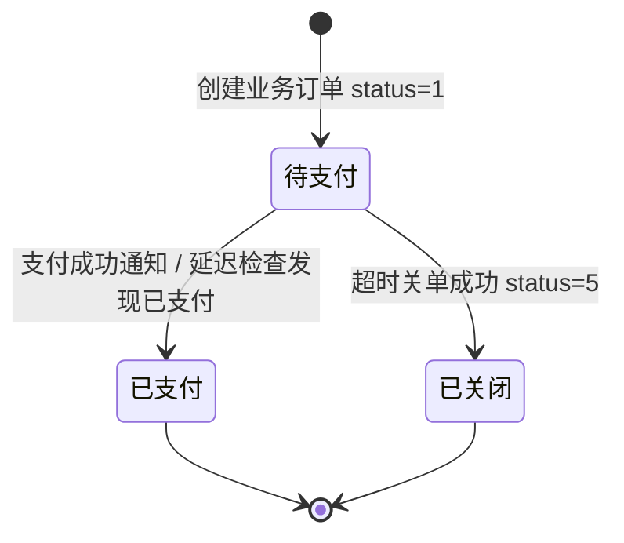
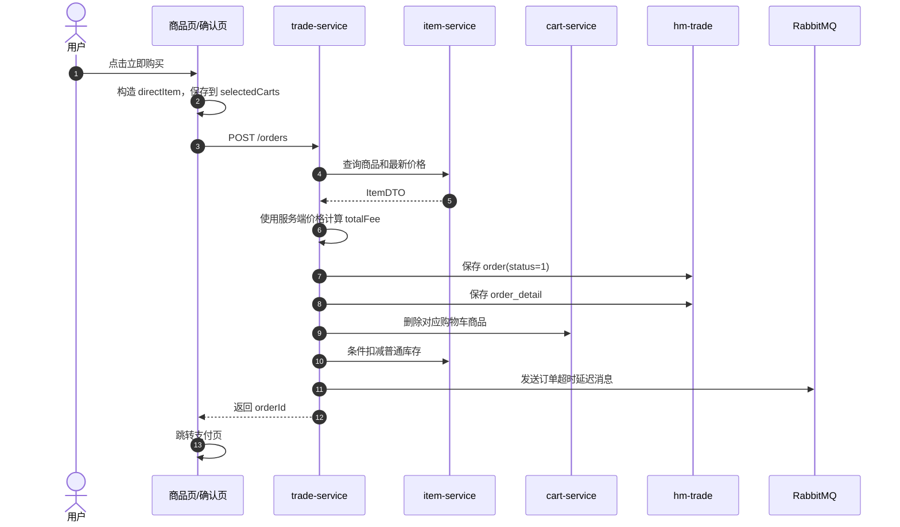
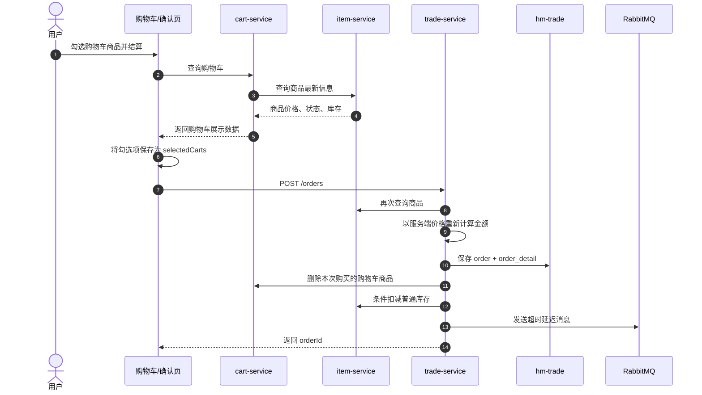
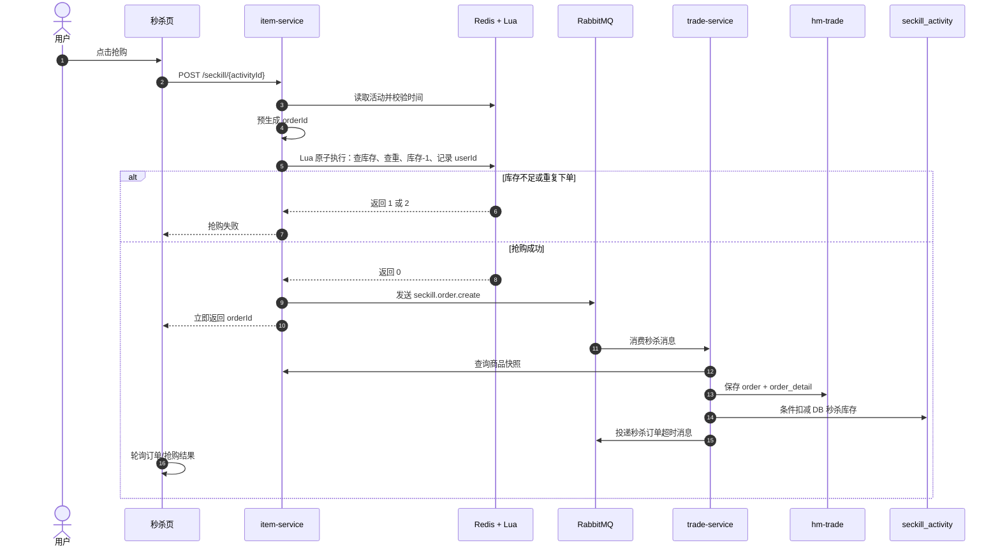
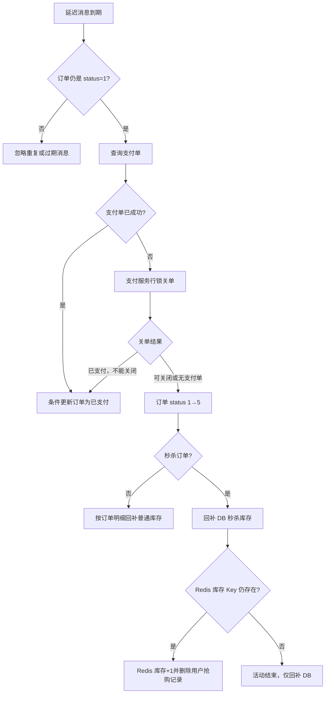

# HMall 普通下单、购物车下单、秒杀下单与支付补偿流程

> 本文根据 HMall 当前项目代码整理，重点说明三类下单方式、统一支付流程，以及库存、支付、消息和超时关单失败时如何补偿。
>
> 配套可编辑图：`下单支付补偿流程.excalidraw`  
> 配套 PNG 图：`下单支付补偿流程.png`


---

## 一、先看整体结论

三种下单流程可以概括为：

```text
普通立即购买：同步创建订单 + Seata 管理购物车/库存/订单事务
购物车下单：同步创建订单 + 删除选中购物车商品 + Seata 管理库存事务
秒杀下单：Redis Lua 原子抢资格 + RabbitMQ 异步建单 + DB 库存兜底
支付：支付单幂等 + 余额扣款流水幂等 + 本地消息表可靠通知
超时：先关闭支付单，再关闭业务订单，最后回补库存
```

| 类型 | 入口 | 订单创建 | 库存策略 | 当前支付超时 |
|---|---|---|---|---|
| 普通立即购买 | 商品页“立即购买” | 同步调用 `POST /orders` | 数据库条件扣减 | 约 2 分钟 |
| 购物车下单 | 购物车勾选后结算 | 同步调用 `POST /orders` | 数据库条件扣减 | 约 2 分钟 |
| 秒杀下单 | `POST /seckill/{activityId}` | MQ 异步落库 | Redis Lua 预减 + DB 兜底扣减 | 5 分钟 |

---

## 二、共同的订单状态流转



订单创建成功后，三种订单都会进入统一的支付链路：


### 支付流程中的关键设计

1. **金额以服务端为准**：支付服务会重新查询交易订单，前端金额只用于比对。
2. **支付单幂等**：`biz_order_no` 唯一，重复申请支付不会创建多张支付单。
3. **支付与关单互斥**：支付单使用 `SELECT ... FOR UPDATE` 行锁。
4. **扣款幂等**：用户服务使用 `payOrderId` 作为扣款流水唯一键。
5. **支付通知幂等**：交易订单使用 `WHERE status = 1` 条件更新，重复消息不会重复处理。

---

# 三、普通立即购买 → 支付

这里的普通下单指用户在商品页点击“立即购买”。

## 3.1 下单流程



## 3.2 代码层面的执行顺序

`trade-service` 中的 `OrderServiceImpl.createOrder()` 大致执行：

```text
1. 查询商品
2. 汇总商品数量
3. 根据商品服务返回的价格计算订单总额
4. 保存订单主表，初始 status=1
5. 保存订单明细
6. 删除购物车中的商品
7. 调用 item-service 扣减库存
8. 投递支付超时延迟消息
9. 返回订单号
```

普通下单使用：

```java
@GlobalTransactional
public Long createOrder(OrderFormDTO orderFormDTO) { ... }
```

因此订单、明细、购物车删除和普通库存扣减可以通过 Seata AT 参与全局事务。

## 3.3 普通下单失败补偿

### 场景：库存扣减失败

```text
订单写入成功
    ↓
订单明细写入成功
    ↓
购物车删除成功
    ↓
库存不足或库存服务异常
```

库存扣减抛异常后，Seata 会回滚已经执行的分支事务：

- 删除的订单回滚；
- 删除的订单明细回滚；
- 被删除的购物车记录恢复；
- 已扣减的普通库存恢复。

最终结果是：**本次下单失败，但系统不会留下半成品订单。**

---

# 四、购物车下单 → 支付

购物车下单和普通立即购买最终复用同一个后端接口：

```http
POST /orders
```

区别主要在于购买项来源不同。

## 4.1 下单流程



## 4.2 为什么下单时必须再次查询商品？

购物车页面查询到的数据只是展示快照。用户停留期间可能发生：

- 商品价格变化；
- 商品下架；
- 库存变化；
- 前端参数被篡改。

所以创建订单时必须再次查询商品，并且重新使用服务端数据计算价格。

## 4.3 当前实现的一个注意点

当前 `createOrder()` 会按照商品 ID 调用：

```java
cartClient.deleteCartItemByIds(itemIds);
```

因此，如果用户已经把商品加入购物车，又从商品页点击“立即购买”，同一商品的购物车记录也可能被删除。

更严谨的设计是增加：

```text
orderSource = DIRECT / CART
cartItemIds = 本次实际勾选的购物车记录
```

这样可以做到：

- 立即购买：不清理购物车；
- 购物车下单：只删除本次选中的购物车记录。

---

# 五、秒杀下单 → 支付

秒杀场景的核心目标是：**高并发下不能超卖，同时不能让数据库被瞬时流量击穿。**

当前项目使用：

```text
Redis 活动预热
    ↓
Redis Lua 原子抢购
    ↓
RabbitMQ 异步落库
    ↓
数据库库存兜底扣减
    ↓
进入统一支付流程
```

## 5.1 秒杀流程



## 5.2 Lua 脚本为什么重要？

Lua 将以下步骤变成一次 Redis 原子操作：

1. 判断秒杀库存是否大于 0；
2. 判断该用户是否已经抢购过；
3. Redis 库存减 1；
4. 记录 `userId -> orderId`。

这样可以避免：

- 两个请求同时抢到最后一件商品；
- 同一用户并发创建多个抢购资格；
- 库存已经扣减但用户抢购记录没有写入。

## 5.3 为什么 Redis 扣库存后还要扣数据库库存？

Redis 是高并发入口的快速库存账，数据库是最终持久化库存账。

MQ 消费者落库时再次执行 DB 条件扣减，可以及时发现：

```text
Redis 库存与数据库库存不一致
```

如果 DB 扣减失败，秒杀订单本地事务回滚，消息消费者抛异常并进行重试。

## 5.4 秒杀失败补偿

### Redis 抢购成功，但 MQ 发送失败

当前代码会执行：

```text
Redis 库存 + 1
删除 userId -> orderId 抢购记录
抛出“系统繁忙”
```

这样可以避免 MQ 发送失败造成库存永久减少。

但要注意：同步 `convertAndSend()` 没抛异常，并不完全代表消息已经可靠到达 Broker。生产环境还应该增加：

- Publisher Confirm；
- Publisher Return；
- Mandatory；
- 本地消息表或 Redis Stream；
- 定时补偿任务。

### MQ 消费落库失败

当前交易服务配置了：

```yaml
spring.rabbitmq.listener.simple.retry.enabled: true
max-attempts: 3
```

失败处理过程是：

```text
本地重试 3 次
    ↓
仍然失败
    ↓
投递 error.queue
    ↓
人工查看后重放或执行库存回滚
```

### 秒杀消息重复消费

当前通过以下方式保证幂等：

- 使用抢购阶段预生成的 `orderId`；
- `(seckill_activity_id, user_id)` 唯一索引保证一人一单；
- 重复消息导致 `DuplicateKeyException` 时视为已经处理。

---

# 六、统一支付流程详解

## 6.1 申请支付单

前端调用：

```http
POST /pay-orders
```

支付服务向交易服务查询订单，并校验：

```text
订单存在
订单属于当前用户
订单状态为待支付
前端金额与服务端金额一致
```

支付服务最终使用交易服务返回的订单金额，不信任前端金额。

## 6.2 幂等创建支付单

同一个业务订单通过 `biz_order_no` 唯一约束只创建一张支付单。

如果用户重复点击支付：

- 支付单不存在：创建；
- 支付单待支付：直接复用；
- 支付单已成功：拒绝重复支付；
- 支付单已关闭：拒绝继续支付。

## 6.3 余额扣款

支付服务锁定支付单后调用用户服务扣款：

```text
payOrderId 作为扣款流水唯一键
```

用户服务先写 `deduct_record`，再执行条件扣余额。即使支付服务因为网络超时重试，也不会重复扣钱。

## 6.4 支付成功通知

支付服务在同一个本地事务中完成：

```text
支付单状态改为成功
    +
pay_message 写入支付成功消息
```

事务提交后再投递 RabbitMQ。

支付消息发布器还使用：

- Publisher Confirm；
- Publisher Return；
- 定时扫描待发送消息；
- 指数退避重试；
- 超过最大重试次数进入失败状态并告警。

交易服务收到 `pay.success` 后执行条件更新：

```sql
UPDATE order
SET status = 2,
    pay_time = NOW()
WHERE id = ?
  AND status = 1;
```

重复通知不会重复修改订单。

---

# 七、超时关单与库存回补



## 7.1 为什么必须先关支付单？

正确顺序：

```text
关闭支付单
    ↓
关闭业务订单
    ↓
回补库存
```

如果先关闭业务订单、再回补库存，用户可能在这个时间窗口中付款成功，最终产生：

```text
业务订单已关闭 + 库存已释放 + 用户却付款成功
```

当前项目通过支付单行锁保证付款和关单互斥。

## 7.2 普通订单回补

普通订单超时后：

1. 支付单关闭；
2. 订单状态从 `1` 改成 `5`；
3. 查询订单明细；
4. 按购买数量调用 `item-service` 恢复 `item.stock`。

## 7.3 秒杀订单回补

秒杀订单超时后：

1. 回补 `seckill_activity` 数据库库存；
2. 如果 Redis 库存 Key 还存在，则 Redis 库存加 1；
3. 删除该用户抢购记录，恢复再次抢购资格；
4. 如果 Redis Key 已过期，说明活动已经结束，只回补数据库库存。

---

# 八、失败场景与补偿措施总表

| 失败场景 | 当前补偿措施 | 结果 | 需要重点关注 |
|---|---|---|---|
| 商品查询失败/商品不存在 | Feign 降级返回空列表，交易服务拒绝下单 | 不创建订单 | 监控商品服务错误率 |
| 普通下单库存不足 | 抛异常，由 Seata 回滚订单、购物车和库存 | 不超卖 | 远程降级不能误报成功 |
| 普通下单中途异常 | Seata AT 全局回滚 | 订单链路基本一致 | TC、undo_log、数据源必须可用 |
| 支付单重复申请 | `biz_order_no` 唯一索引，复用支付单 | 支付单幂等 | 合理 |
| 并发重复支付 | 支付单行锁 + 状态条件更新 | 只成功一次 | 合理 |
| 重复扣余额 | `payOrderId` 唯一扣款流水 | 不重复扣款 | 合理 |
| 用户已扣款，支付服务宕机 | 定时对账查询扣款流水，补齐支付单并补发消息 | 最终一致 | 对账失败需要告警 |
| 支付成功消息投递失败 | `pay_message` + confirm/return + 定时退避重试 | 最终通知交易服务 | 失败消息要能人工重放 |
| 支付通知重复投递 | `status=1` 条件更新 | 消费幂等 | 合理 |
| 延迟关单与支付同时发生 | 支付单行锁，付款和关单互斥 | 只允许一方成功 | 交易状态还要条件更新 |
| 延迟关单消息丢失 | 当前普通/秒杀超时消息缺少完整本地消息表机制 | 订单可能长期待支付 | 建议增加超时消息表和定时扫描 |
| 秒杀 Redis 预减后 MQ 发送异常 | Redis 库存加回，删除用户抢购记录 | 避免库存泄漏 | 增加 confirm/return 或本地消息表 |
| 秒杀落库失败 | 消费者本地重试 3 次，耗尽进入 `error.queue` | 消息不直接丢失 | 人工处理要核对三账 |
| 秒杀消息重复消费 | 订单号和一人一单唯一约束 | 只创建一单 | 合理 |
| 秒杀订单超时未支付 | 关闭支付单、关闭订单、回补 DB/Redis 库存 | 释放库存和资格 | Redis 与 DB 回补不是同一事务 |
| 用户连续点击普通下单 | 当前缺少明显业务请求幂等键 | 可能重复建单 | 建议 `requestId + 唯一索引` |
| `error.queue` 长期无人处理 | 当前仅保留失败消息 | 业务可能悬挂 | 增加堆积告警、管理后台和重放入口 |

---

# 九、建议增加的最终一致性补偿任务

当前已有支付对账任务，建议进一步补充以下任务：

## 1. 待支付订单超时扫描

定时扫描：

```sql
status = 1
AND create_time < 当前时间 - 支付有效期
```

重新执行关单流程，防止延迟消息丢失导致库存长期被占用。

## 2. 支付单与业务订单对账

检查：

```text
支付单已成功，但业务订单仍是待支付
```

处理方式：

```text
补发 pay.success
或直接执行幂等的订单支付状态更新
```

## 3. 秒杀三账对账

定期核对：

```text
Redis 秒杀库存
数据库 seckill_activity 库存
成功订单 + 待支付订单 + 已关闭订单数量
```

发现差异时，需要根据订单状态和库存流水进行修复，不能简单地盲目加库存。

## 4. 错误队列治理

`error.queue` 不能只是“消息暂存区”，还应具备：

- 告警通知；
- 失败原因和业务上下文；
- 自动重试入口；
- 人工重放入口；
- 库存回滚/退款操作记录；
- 操作审计。

---

# 十、面试时可以这样总结

> HMall 的普通下单和购物车下单共用订单创建接口，使用服务端商品价格重新计算金额，并通过 Seata 保证订单、购物车和普通库存的一致性。秒杀下单则采用 Redis Lua 做原子库存预减和一人一单校验，再通过 RabbitMQ 异步落库，数据库库存作为最终兜底。支付部分通过支付单唯一约束、行锁、用户扣款流水唯一键和状态条件更新实现幂等。支付成功后使用本地消息表、Confirm、Return 和重试机制保证通知可靠。订单超时关闭时必须先关闭支付单，再关闭业务订单，最后回补普通库存或秒杀库存；如果 MQ、服务调用或数据库操作失败，则分别通过事务回滚、消息重试、错误队列、定时对账和人工重放实现最终一致性。

---

## 相关核心代码位置

```text
trade-service/
  src/main/java/com/hmall/trade/service/impl/OrderServiceImpl.java
  src/main/java/com/hmall/trade/service/impl/SeckillOrderServiceImpl.java
  src/main/java/com/hmall/trade/listener/PayStatusListener.java
  src/main/java/com/hmall/trade/listener/OrderDelayMessageListener.java
  src/main/java/com/hmall/trade/listener/SeckillOrderListener.java

pay-service/
  src/main/java/com/hmall/pay/service/impl/PayOrderServiceImpl.java
  src/main/java/com/hmall/pay/mq/PayMessagePublisher.java
  src/main/java/com/hmall/pay/task/PayReconcileTask.java

item-service/
  src/main/java/com/hmall/item/service/impl/SeckillServiceImpl.java
  src/main/resources/lua/seckill.lua
```
