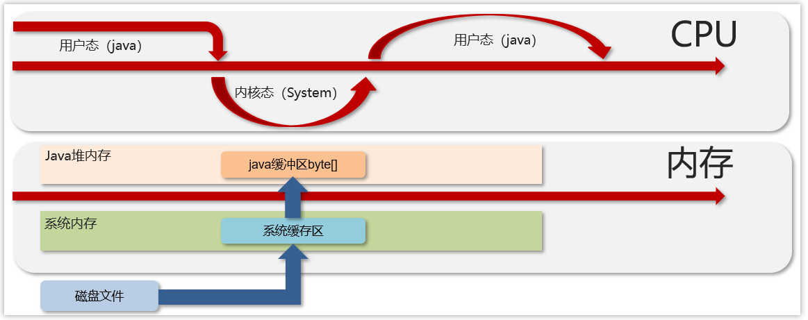
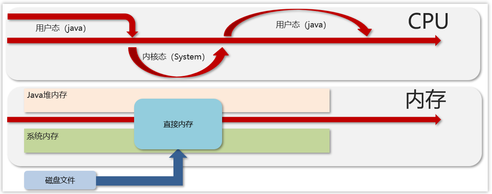
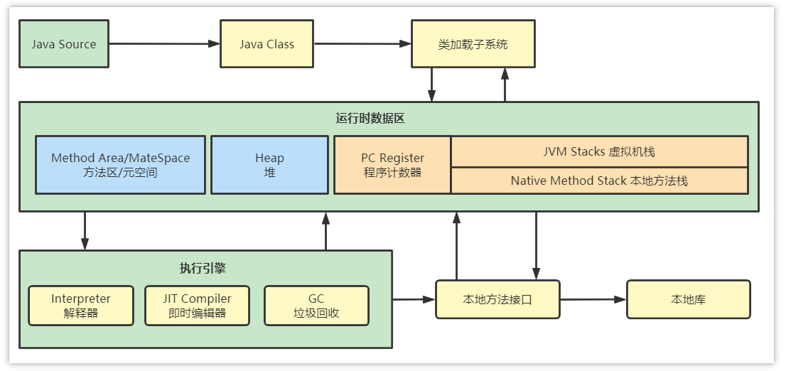
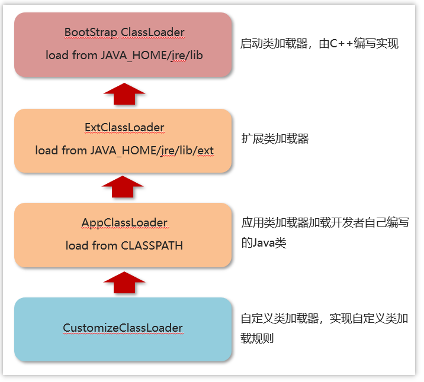
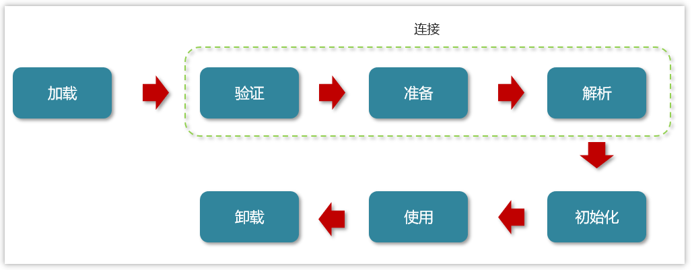

1. JVM是什么

    Java Virtual Machine Java程序的运行环境（java二进制字节码的运行环境）

    好处： 
- 一次编写，到处运行
    
- 自动内存管理，垃圾回收机制


2. JVM由哪些部分组成，运行流程是什么？


- ClassLoader（类加载器）
    
- Runtime Data Area（运行时数据区，内存分区）
    
- Execution Engine（执行引擎）
    
- Native Method Library（本地库接口）
    

运行流程：

（1）类加载器（ClassLoader）把Java代码转换为字节码

（2）运行时数据区（Runtime Data Area）把字节码加载到内存中，而字节码文件只是JVM的一套指令集规范，并不能直接交给底层系统去执行，而是有执行引擎运行

（3）执行引擎（Execution Engine）将字节码翻译为底层系统指令，再交由CPU执行去执行，此时需要调用其他语言的本地库接口（Native Method Library）来实现整个程序的功能。

2.  什么是程序计数器？

    程序计数器是线程私有的(线程安全)，每个线程一份，内部存储的是字节码的行号(记录上一次该线程执行到哪个行号了)，用于记录正在运行的字节码指令的地址。程序计数器不存在OOM，不会被GC回收。

3. 你能给我详细的介绍Java堆吗?

- 线程共享的区域：主要用来保存对象实例，数组等，当堆中没有内存空间可分配给实例，也无法再扩展时，则抛出OutOfMemoryError异常。

- 年轻代被划分为三部分，Eden区和两个大小严格相同的Survivor区，根据JVM的策略，在经过几次垃圾收集后，任然存活于Survivor的对象将被移动到老年代区间。
    
- 老年代主要保存生命周期长的对象，一般是一些老的对象
    
- 元空间保存的类信息、静态变量、常量、编译后的代码
- 
- 为了避免方法区出现OOM，所以在java8中将堆上的方法区【永久代】给移动到了本地内存上，重新开辟了一块空间，叫做**元空间**。那么现在就可以避免掉OOM的出现了。
-  元空间(MetaSpace)介绍
- 在 HotSpot JVM 中，永久代（ ≈ 方法区）中用于存放类和方法的元数据以及常量池，比如Class 和 Method。每当一个类初次被加载的时候，它的元数据都会放到永久代中。
- 永久代是有大小限制的，因此如果加载的类太多，很有可能导致永久代内存溢出，即OutOfMemoryError
- 元空间的本质和永久代类似，都是对 JVM 规范中方法区的实现。不过元空间与永久代之间最大的区别在于：元空间并不在虚拟机中，而是使用本地内存。因此，默认情况下，元空间的大小仅受本地内存限制。

4. ### 什么是虚拟机栈
- Java Virtual machine Stacks (java 虚拟机栈)

- 每个线程运行时所需要的内存，称为虚拟机栈，先进后出
    
- 每个栈由多个栈帧（frame）组成，对应着每次方法调用时所占用的内存
    
- 每个线程只能有一个活动栈帧，对应着当前正在执行的那个方法

1. 垃圾回收是否涉及栈内存？
    
2. 垃圾回收主要指就是堆内存，当栈帧弹栈以后，内存就会释放
    
3. 栈内存分配越大越好吗？
    
4. 未必，默认的栈内存通常为1024k
    
5. 栈帧过大会导致线程数变少，例如，机器总内存为512m，目前能活动的线程数则为512个，如果把栈内存改为2048k，那么能活动的栈帧就会减半
    
6. 方法内的局部变量是否线程安全？
    
    1. 如果方法内局部变量没有逃离方法的作用范围，它是线程安全的
        
    2. 如果是局部变量引用了对象，并逃离方法的作用范围，需要考虑线程安全


**栈内存溢出情况**

- 栈帧过多导致栈内存溢出，典型问题：递归调用

- 栈帧过大导致栈内存溢出

5.  说一下 JVM 运行时数据区
    

组成部分：堆、方法区、栈、本地方法栈、程序计数器

1、堆解决的是对象实例存储的问题，垃圾回收器管理的主要区域。

2、方法区可以认为是堆的一部分，用于存储已被虚拟机加载的信息，常量、静态变量、即时编译器编译后的代码。

3、栈解决的是程序运行的问题，栈里面存的是栈帧，栈帧里面存的是局部变量表、操作数栈、动态链接、方法出口等信息。

4、本地方法栈与栈功能相同，本地方法栈执行的是本地方法，一个Java调用非Java代码的接口。

5、程序计数器（PC寄存器）程序计数器中存放的是当前线程所执行的字节码的行数。JVM工作时就是通过改变这个计数器的值来选取下一个需要执行的字节码指令。

6. ### 能不能解释一下方法区？

- 方法区(Method Area)是各个线程共享的内存区域
    
- 主要存储类的信息、运行时常量池
    
- 虚拟机启动的时候创建，关闭虚拟机时释放
    
- 如果方法区域中的内存无法满足分配请求，则会抛出OutOfMemoryError: Metaspace

7. #### 常量池
    - 可以看作是一张表，虚拟机指令根据这张常量表找到要执行的类名、方法名、参数类型、字面量等信息
    - 查看字节码结构（类的基本信息、常量池、方法定义）`javap -v xx.class`
    - 找到类对应的class文件存放目录，执行命令：`javap -v Application.class` 查看字节码结构
    - main方法按照指令执行的时候，需要到常量池中查表翻译找到具体的类和方法地址去执行


8.   运行时常量池
    常量池是 *.class 文件中的，当该类被加载，它的常量池信息就会放入运行时常量池，并把里面的符号地址变为真实地址

9. ### 你听过直接内存吗？
    

难易程度：☆☆☆

出现频率：☆☆☆

不受 JVM 内存回收管理，是虚拟机的系统内存，常见于 NIO 操作时，用于数据缓冲区，分配回收成本较高，但读写性能高，不受 JVM 内存回收管理

10. 传统的IO操作
    - java代码发起读请求后，Java 虚拟机（JVM）将控制权交给操作系统，通过系统调用进入内核态，操作系统将数据从磁盘读入系统缓存区，再拷贝到Java堆内存中的缓冲区，操作系统完成数据拷贝后，将控制权交还给 JVM，最后切回用户态由CPU处理数据。

11. NIO操作

    NIO传输数据的流程，在这个里面主要使用到了一个直接内存，不需要在堆中开辟空间进行数据的拷贝，jvm可以直接操作直接内存，从而使数据读写传输更快。

12. ### 堆栈的区别是什么？

    1、栈内存一般会用来存储局部变量和方法调用，但堆内存是用来存储Java对象和数组的的。堆会GC垃圾回收，而栈不会。

    2、栈内存是线程私有的，而堆内存是线程共有的。

    3,、两者异常错误不同，但如果栈内存或者堆内存不足都会抛出异常。

    栈空间不足：java.lang.StackOverFlowError。

    堆空间不足：java.lang.OutOfMemoryError。

13. 什么是类加载器，类加载器有哪些?
   - 类加载器：用于装载字节码文件(.class文件)
    
- 运行时数据区：用于分配存储空间
    
- 执行引擎：执行字节码文件或本地方法
    
- 垃圾回收器：用于对JVM中的垃圾内容进行回收

**类加载器**

JVM只会运行二进制文件，而类加载器（ClassLoader）的主要作用就是将**字节码文件加载到JVM中**，从而让Java程序能够启动起来。现有的类加载器基本上都是java.lang.ClassLoader的子类，该类的只要职责就是用于将指定的类找到或生成对应的字节码文件，同时类加载器还会负责加载程序所需要的资源

**类加载器种类**

类加载器根据各自加载范围的不同，划分为四种类加载器：

- **启动类加载器(BootStrap ClassLoader)：**
    
- 该类并不继承ClassLoader类，其是由C++编写实现。用于加载**JAVA_HOME/jre/lib**目录下的类库。
    
- **扩展类加载器(ExtClassLoader)：**
    
- 该类是ClassLoader的子类，主要加载**JAVA_HOME/jre/lib/ext**目录中的类库。
    
- **应用类加载器(AppClassLoader)：**
    
- 该类是ClassLoader的子类，主要用于加载**classPath**下的类，也就是加载开发者自己编写的Java类。
    
- **自定义类加载器：**
    
- 开发者自定义类继承ClassLoader，实现自定义类加载规则。

2. ### 什么是双亲委派模型？

    如果一个类加载器在接到加载类的请求时，它首先不会自己尝试去加载这个类，而是把这个请求任务委托给父类加载器去完成，依次递归，如果父类加载器可以完成类加载任务，就返回成功；只有父类加载器无法完成此加载任务时，才由下一级去加载。

3. ### JVM为什么采用双亲委派机制

（1）通过双亲委派机制可以避免某一个类被重复加载，当父类已经加载后则无需重复加载，保证唯一性。

（2）为了安全，保证类库API不会被修改

在工程中新建java.lang包，接着在该包下新建String类，并定义main函数

```Java
public class String {
 
     public static void main(String[] args) {
 
         System.out.println("demo info");
     }
 }
```

此时执行main函数，会出现异常，在类 java.lang.String 中找不到 main 方法

```Java
错误：在类java.lang.string中找不到main方氵去，请将main方法定义为：PUbtiCstaticVOidmain(String[]args)否则JavaFX应用程序类必须扩展javafx.apptication.App1ication
```

出现该信息是因为由双亲委派的机制，java.lang.String的在启动类加载器(Bootstrap classLoader)得到加载，因为在核心jre库中有其相同名字的类文件，但该类中并没有main方法。这样就能防止恶意篡改核心API库。

4. 说一下类装载的执行过程？
    类从加载到虚拟机中开始，直到卸载为止，它的整个生命周期包括了：加载、验证、准备、解析、初始化、使用和卸载这7个阶段。其中，验证、准备和解析这三个部分统称为连接（linking）。
    - 1．加载，通过类的全限定名获取字节码文件，并将其转换为方法区内的运行时数据结构。
    - 2．验证，对字节码进行校验，确保符合java虚拟机规范。
    - 3．准备，为类的静态变量分配内存，并设置默认初始值。
    - 4．解析，将符号引用转换为直接引用，即将类、方法、字段等解析为具体的内存地址。5．初始化，执行类的初始化代码，包括静态变量赋值和静态代码块的执行。
    - 6.  使用,JVM开始从入口方法开始执行用户的程序代码
    - 7.  卸载：当用户程序代码执行完毕后，JVM便开始销毁创建的Class对象


1. 简述Java垃圾回收机制？（GC是什么？为什么要GC）
    - GC是什么？
        GC 就是 Java 的垃圾回收机制（Garbage Collection），由 JVM 自动管理内存，负责回收程序中不再使用的对象所占用的堆内存。
    
    - 为什么需要 GC：
   
        避免内存泄漏和内存溢出：如果对象不回收，内存会越占越多，最终导致 OOM。
        解放开发者：不需要像 C/C++ 那样手动 free、delete，减少手动管理内存的错误。
        提高开发效率与安全性：降低野指针、重复释放、内存泄漏等问题。

1.  对象什么时候可以被垃圾器回收
    如果一个或多个对象没有任何的引用指向它了，那么这个对象现在就是垃圾，如果定位了垃圾，则有可能会被垃圾回收器回收。
    有两种方式来确定垃圾，
    第一个是引用计数法，
    第二个是可达性分析算法

    引用计数法：一个对象被引用了一次，在当前的对象头上递增一次引用次数，如果这个对象的引用次数为0，代表这个对象可回收
     当对象间出现了循环引用的话，则引用计数法就会失效