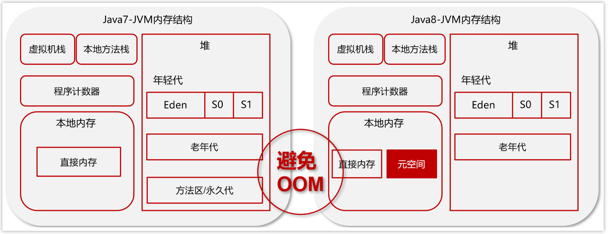

1. JVM是什么

    Java Virtual Machine Java程序的运行环境（java二进制字节码的运行环境）

    好处： 
- 一次编写，到处运行
    
- 自动内存管理，垃圾回收机制

2. JVM由哪些部分组成，运行流程是什么？

- ClassLoader（类加载器）
    
- Runtime Data Area（运行时数据区，内存分区）
    
- Execution Engine（执行引擎）
    
- Native Method Library（本地库接口）
    

运行流程：

（1）类加载器（ClassLoader）把Java代码转换为字节码

（2）运行时数据区（Runtime Data Area）把字节码加载到内存中，而字节码文件只是JVM的一套指令集规范，并不能直接交给底层系统去执行，而是有执行引擎运行

（3）执行引擎（Execution Engine）将字节码翻译为底层系统指令，再交由CPU执行去执行，此时需要调用其他语言的本地库接口（Native Method Library）来实现整个程序的功能。

2.  什么是程序计数器？

    程序计数器是线程私有的(线程安全)，每个线程一份，内部存储的是字节码的行号(记录上一次该线程执行到哪个行号了)，用于记录正在运行的字节码指令的地址。程序计数器不存在OOM，不会被GC回收。

3. 你能给我详细的介绍Java堆吗?

- 线程共享的区域：主要用来保存对象实例，数组等，当堆中没有内存空间可分配给实例，也无法再扩展时，则抛出OutOfMemoryError异常。

- 年轻代被划分为三部分，Eden区和两个大小严格相同的Survivor区，根据JVM的策略，在经过几次垃圾收集后，任然存活于Survivor的对象将被移动到老年代区间。
    
- 老年代主要保存生命周期长的对象，一般是一些老的对象
    
- 元空间保存的类信息、静态变量、常量、编译后的代码
- 
- 为了避免方法区出现OOM，所以在java8中将堆上的方法区【永久代】给移动到了本地内存上，重新开辟了一块空间，叫做**元空间**。那么现在就可以避免掉OOM的出现了。
-  元空间(MetaSpace)介绍
- 在 HotSpot JVM 中，永久代（ ≈ 方法区）中用于存放类和方法的元数据以及常量池，比如Class 和 Method。每当一个类初次被加载的时候，它的元数据都会放到永久代中。
- 永久代是有大小限制的，因此如果加载的类太多，很有可能导致永久代内存溢出，即OutOfMemoryError
- 元空间的本质和永久代类似，都是对 JVM 规范中方法区的实现。不过元空间与永久代之间最大的区别在于：元空间并不在虚拟机中，而是使用本地内存。因此，默认情况下，元空间的大小仅受本地内存限制。

4. ### 什么是虚拟机栈
- Java Virtual machine Stacks (java 虚拟机栈)

- 每个线程运行时所需要的内存，称为虚拟机栈，先进后出
    
- 每个栈由多个栈帧（frame）组成，对应着每次方法调用时所占用的内存
    
- 每个线程只能有一个活动栈帧，对应着当前正在执行的那个方法

1. 垃圾回收是否涉及栈内存？
    
2. 垃圾回收主要指就是堆内存，当栈帧弹栈以后，内存就会释放
    
3. 栈内存分配越大越好吗？
    
4. 未必，默认的栈内存通常为1024k
    
5. 栈帧过大会导致线程数变少，例如，机器总内存为512m，目前能活动的线程数则为512个，如果把栈内存改为2048k，那么能活动的栈帧就会减半
    
6. 方法内的局部变量是否线程安全？
    
    1. 如果方法内局部变量没有逃离方法的作用范围，它是线程安全的
        
    2. 如果是局部变量引用了对象，并逃离方法的作用范围，需要考虑线程安全

**栈内存溢出情况**

- 栈帧过多导致栈内存溢出，典型问题：递归调用

- 栈帧过大导致栈内存溢出