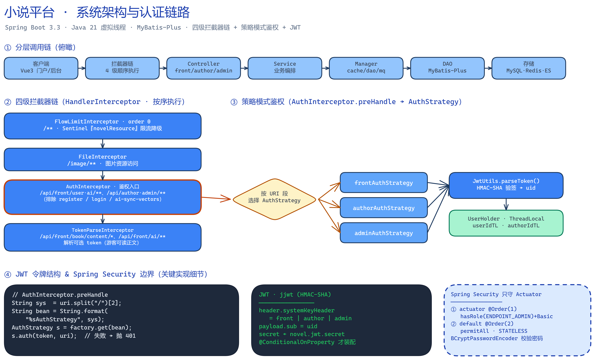
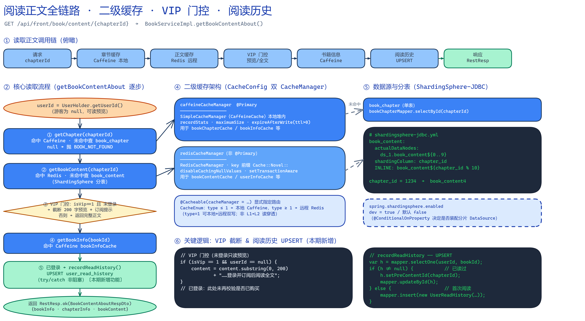
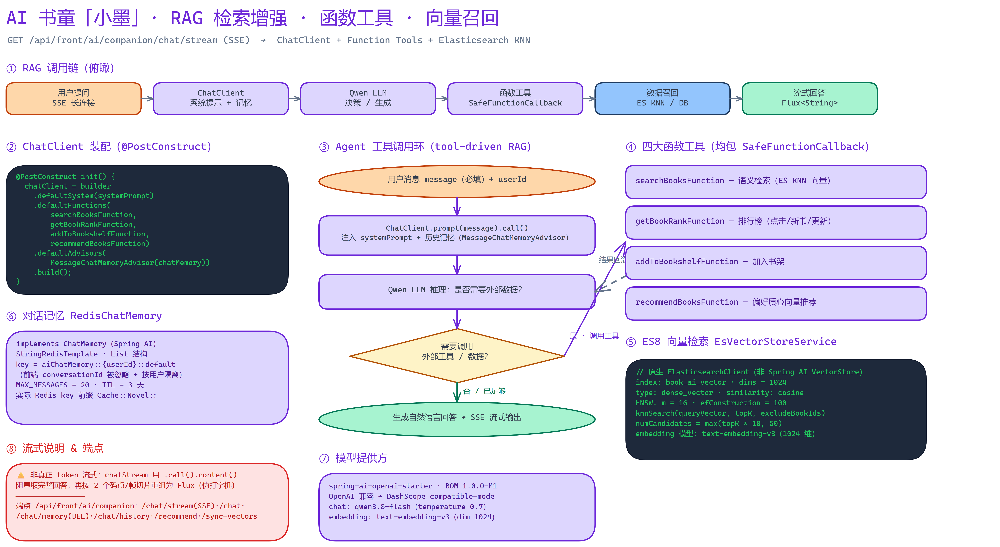

# 小说门户项目 · 业务流程与技术栈知识库

> 面向面试/复盘的知识沉淀。配套三张全链路图（Excalidraw 渲染），覆盖「系统架构与认证」「阅读正文全链路」「AI 书童 RAG」三大核心链路。
>
> 后端：Spring Boot 3.3.0 / Java 21（虚拟线程）/ MyBatis-Plus 3.5.6 / MySQL 8 / Redis / Elasticsearch 8 / RabbitMQ / Spring AI 1.0.0-M1。

---

## 一、技术栈总览

| 领域 | 选型 | 关键点 |
| --- | --- | --- |
| 框架 | Spring Boot 3.3.0 + Java 21 | 开启虚拟线程（`spring.threads.virtual.enabled`），高并发 IO 友好 |
| ORM | MyBatis-Plus 3.5.6 | `LambdaQueryWrapper`、分页插件、`selectBatchIds` 批量回表 |
| 缓存 | Caffeine（本地）+ Redis（远程） | 双 `CacheManager`，按 `@Cacheable(cacheManager=…)` 显式路由，非 L1→L2 读穿透 |
| 分库分表 | ShardingSphere-JDBC | `book_content` 按 `chapter_id % 10` 分 10 张表 |
| 鉴权 | JWT（jjwt/HMAC-SHA）+ 拦截器链 + 策略模式 | Spring Security 仅守护 Actuator，业务鉴权自实现 |
| 限流 | Sentinel | `FlowLimitInterceptor` 全局资源 `novelResource` |
| 分布式 | Redisson / RabbitMQ / XXL-JOB | 分布式锁、Fanout 广播、定时任务同步 ES |
| 搜索 | Elasticsearch 8 | 全文检索 + AI KNN 向量检索（`dense_vector`） |
| AI | Spring AI 1.0.0-M1 | ChatClient + 函数工具 + RedisChatMemory + 工具驱动 RAG |
| 模型 | DashScope / Qwen | OpenAI 兼容协议，chat `qwen3.8-flash`、embedding `text-embedding-v3` |

> 说明：本库中的「阅读历史」为本期新增功能，仿书架（bookshelf）链路实现，已补充单元测试（Mockito，5 用例通过）。

---

## 二、系统架构与认证链路



### 2.1 分层调用链

`客户端 → 拦截器链 → Controller → Service → Manager → DAO → 存储`

- **Controller**：按业务域拆分 `front / author / admin` 三套接口，统一返回 `RestResp<T>`。
- **Service / ServiceImpl**：业务编排，事务边界（`@Transactional`）。
- **Manager**：缓存层封装（`@Cacheable`），隔离 DAO，缓存 Key 与 TTL 由 `CacheEnum` 统一管理。
- **DAO（MyBatis-Plus Mapper）**：单表 CRUD 交给 MP，复杂查询走 XML / Wrapper。

### 2.2 四级拦截器链（顺序即优先级）

| 顺序 | 拦截器 | 路径 | 职责 |
| --- | --- | --- | --- |
| 0 | `FlowLimitInterceptor` | `/**` | Sentinel 限流，资源名 `novelResource` |
| 1 | `FileInterceptor` | `/image/**` | 静态资源/图片访问控制 |
| 2 | `AuthInterceptor` | 业务接口 | **鉴权核心**：解析 URI 段选择策略、校验 Token |
| 3 | `TokenParseInterceptor` | 其余 | 解析 Token 写入 `UserHolder`，不强制登录 |

### 2.3 策略模式鉴权

`AuthInterceptor` 依据 URI 首段（front/author/admin）用 `String.format("%sAuthStrategy", sys)` 拼出 Bean 名，从容器取对应 `AuthStrategy`：

- `frontAuthStrategy`：普通用户，校验登录态即可。
- `authorAuthStrategy`：作家专区，额外校验作家身份。
- `adminAuthStrategy`：管理后台，校验管理员。

三条策略最终收敛到 `JwtUtils.parseToken()` 解析出 `userId`，写入 `UserHolder`（ThreadLocal）。

### 2.4 JWT & Spring Security

- JWT：HMAC-SHA 签名（jjwt），Header/Payload/Signature 三段式，Payload 携带 `userId` 与系统标识。
- Spring Security：**仅**保护 Actuator 端点，业务鉴权完全由自定义拦截器 + 策略完成，避免 Security 过滤器链的复杂度。

### 2.5 面试要点

- **为什么不用 Spring Security 做业务鉴权？** 业务需要按端（front/author/admin）差异化鉴权，自定义拦截器 + 策略模式更轻量、可读、易扩展；Security 仅兜底 Actuator。
- **策略模式的落点？** Bean 名约定（`%sAuthStrategy`）+ 容器按名取 Bean，新增一端只需加一个策略 Bean，符合开闭原则。
- **ThreadLocal 泄漏风险？** 请求结束需清理 `UserHolder`（拦截器 `afterCompletion`），虚拟线程下尤其注意不要跨线程复用。

---

## 三、阅读正文全链路



> 入口：`BookServiceImpl.getBookContentAbout(chapterId)`，一次请求聚合「章节信息 + 正文内容 + 书籍信息」三块数据，并顺带更新阅读历史。

### 3.1 主流程（7 步）

1. **`getChapter(chapterId)`**：走 `caffeineCacheManager`（本地缓存）。未命中回表 `book_chapter`；查不到抛 `BOOK_NOT_FOUND`。
2. **`getBookContent(chapterId)`**：走 `redisCacheManager`（远程缓存）。未命中回表 `book_content`——该表经 **ShardingSphere** 按 `chapter_id % 10` 路由到 10 张分表。
3. **VIP 门控**：`if (isVip == 1 && userId == null)` → 截断为前 200 字预览 + 「……登录并订阅后阅读全文」。注意：**已登录用户此处未再校验是否已购买**（潜在越权阅读点，见第五节）。
4. **`getBookInfo(bookId)`**：走 `caffeineCacheManager`，补齐书名/作者等展示字段。
5. **`recordReadHistory(userId, bookId, chapterId)`**：**本期新增**。`try/catch` 包裹、失败不阻塞正文返回（阅读体验优先）。UPSERT 语义：先 `selectOne` 查历史，有则 `updateById` 更新 `preContentId`，无则 `insert`。
6. 组装 `BookContentAboutRespDto`。
7. 返回 `RestResp.ok(...)`。

### 3.2 两级缓存的真相（高频面试点）

- **不是** L1→L2 读穿透链（Caffeine 未命中再查 Redis）。而是**每个 `@Cacheable` 通过 `cacheManager` 属性显式指定唯一一级缓存**：章节信息走 Caffeine、正文走 Redis。
- `caffeineCacheManager` 标注 `@Primary`（本地，进程内，最快，容量/TTL 受限）；`redisCacheManager` 远程（可共享、可扛重启，Key 前缀 `Cache::Novel::`）。
- 路由由 `CacheConsts.CacheEnum` 集中管理：`type` 字段 `0=仅本地`、`1=本地+远程`、`2=仅远程`；`isLocal() = type<=1`、`isRemote() = type>=1`。

### 3.3 ShardingSphere 分库分表

- 逻辑表 `book_content` → 真实表 `ds_1.book_content${0..9}`。
- 分片算法 `INLINE`：`book_content${chapter_id % 10}`。例：`chapter_id = 1234` → `1234 % 10 = 4` → 落 `book_content4`。
- 开关 `spring.shardingsphere.enabled`（dev 环境为 `true`）。关闭时退化为单表，便于本地调试。

### 3.4 面试要点

- **为什么正文用 Redis、章节信息用 Caffeine？** 正文体量大、跨实例共享价值高、变更少 → Redis；章节元信息小、访问极热、可容忍各实例副本 → Caffeine 进程内零网络开销。
- **阅读历史为什么 try/catch 吞异常？** 它是「副作用」而非「主数据」，写历史失败不应影响用户读正文；以可用性换一致性，后续可由异步补偿。
- **分表键为什么选 `chapter_id`？** 正文按章读写，`chapter_id` 天然均匀且查询即带该键，避免跨分片扫描。

---

## 四、AI 书童「小墨」· RAG 检索增强



> 入口：`GET /api/front/ai/companion/chat/stream`（SSE）→ `ChatClient` + 函数工具 + Elasticsearch KNN 向量召回。

### 4.1 ChatClient 装配（`@PostConstruct`）

```
chatClient = builder
    .defaultSystem(systemPrompt)                       // 角色人设「小墨」
    .defaultFunctions("searchBooksFunction",
                      "getBookRankFunction",
                      "addToBookshelfFunction",
                      "recommendBooksFunction")         // 4 个函数工具
    .defaultAdvisors(new MessageChatMemoryAdvisor(chatMemory))  // 挂记忆
    .build();
```

### 4.2 Agent 工具调用环（tool-driven RAG）

用户提问 → ChatClient（注入系统提示 + 历史记忆）→ Qwen LLM 判断「是否需要外部工具/数据」：

- **否** → 直接生成回答。
- **是** → LLM 选择并调用对应函数工具 → 工具返回结构化数据 → **结果回灌 LLM** → 生成最终回答。

关键点：**没有使用 Spring AI 的 `QuestionAnswerAdvisor`**（即不是「先检索再塞 Prompt」的经典 RAG），而是**由 LLM 自主决定何时调用哪个工具**去取数据，属于 tool-driven / agentic RAG。

### 4.3 四大函数工具（均以 `SafeFunctionCallback` 包装，异常兜底不崩会话）

| 工具 | 职责 | 数据源 |
| --- | --- | --- |
| `searchBooksFunction` | 语义检索小说 | Elasticsearch KNN 向量检索 |
| `getBookRankFunction` | 取排行榜 | 数据库 |
| `addToBookshelfFunction` | 加入书架 | 数据库 |
| `recommendBooksFunction` | 基于「偏好质心向量」推荐 | ES 向量 + 用户行为 |

### 4.4 向量召回（Elasticsearch 8）

- **直接使用原生 `ElasticsearchClient`，未走 Spring AI 的 `VectorStore` 抽象**。
- 索引 `book_ai_vector`：`dense_vector`，`dims = 1024`，相似度 `cosine`，HNSW（`m = 16`、`ef_construction = 100`）。
- 检索 `knnSearch(queryVector, topK, excludeBookIds)`，`num_candidates = max(topK*10, 50)`。
- Embedding 模型 `text-embedding-v3`（1024 维），与索引维度对齐。

### 4.5 会话记忆（RedisChatMemory）

- 自定义 `implements ChatMemory`，底层 `StringRedisTemplate` 的 List 结构。
- Key = `aiChatMemory::{userId}::default`——**忽略 `conversationId`，按用户隔离**。
- `MAX_MESSAGES = 20`（滑动窗口），TTL = 3 天，统一前缀 `Cache::Novel::`。

### 4.6 模型 Provider

- `spring-ai-openai-starter`（BOM `1.0.0-M1`），走 DashScope 的 `compatible-mode`（OpenAI 兼容协议）。
- chat：`qwen3.8-flash`，`temperature = 0.7`；embedding：`text-embedding-v3`，`dim = 1024`。

### 4.7 面试要点与已知局限

- **⚠ 并非真正的 token 级流式**：`chatStream` 实际用 `.call().content()` **阻塞取完整回答**，再按「每 2 个码点/帧」切片重组成 `Flux<String>`，是**伪打字机**效果，并未降低首字延迟。真正流式应接入 `stream()` API。
- **为什么用函数工具而非 `QuestionAnswerAdvisor`？** 工具驱动让模型按需取数、可组合多种动作（检索/排行/加书架/推荐），比「无脑前置检索」更灵活；代价是多一轮 LLM 往返。
- 端点全景 `/api/front/ai/companion`：`/chat/stream`（SSE）、`/chat`、`/chat/memory`（DELETE 清空记忆）、`/chat/history`、`/recommend`、`/sync-vectors`。

---

## 五、安全与改进建议

> 探索代码时发现的问题，按优先级整理。**以下涉及密钥的部分仅按「键名」描述，不复述任何真实值。**

### 5.1 🔴 硬编码密钥入库（最高优先级）

- `src/main/resources/application-dev.yml` 中 AI 平台的 API Key（`spring.ai.openai.api-key`，`sk-` 开头）被**直接写死并提交进仓库**，且该行紧邻的注释恰恰写着「勿硬编码进仓库」——自相矛盾，属于**已泄漏凭据**。
- 同文件还硬编码了 **数据库密码、Redis 密码、RabbitMQ 账号/密码**；`application.yml` 中 **JWT 签名密钥**存在默认值。
- **处置建议**：
  1. 视为已泄漏——**立即在对应平台轮换（吊销并重签）**上述所有密钥，而不仅是从文件里删除。
  2. 改用环境变量 / 配置中心（Nacos、Spring Cloud Config）/ 密钥管理（Vault、云 KMS）注入，代码里只留占位符 `${AI_API_KEY}`。
  3. 用 `git filter-repo` / BFG 清理历史中的密钥；将 `application-*.yml` 纳入 `.gitignore` 或改为模板文件 `application-*.yml.example`。
  4. CI 接入密钥扫描（gitleaks / trufflehog）防回归。

### 5.2 🟠 VIP 正文越权风险

- `getBookContentAbout` 中 VIP 门控仅拦截「未登录用户」（`isVip==1 && userId==null` 才截断）；**已登录用户未再校验是否已实际订阅/购买该书**，存在「登录即可读全部 VIP 正文」的越权隐患。
- 建议：在返回全文前补充「该用户对该书/该章的购买或会员权限」校验。

### 5.3 🟡 AI「流式」名不副实

- 见 4.7：`chat/stream` 是先阻塞取全量、再切片的伪流式，首字延迟等同非流式。若追求体验，应接入真正的 `stream()` token 流。

### 5.4 🟡 其他可优化项

- **阅读历史写入**：目前同步 UPSERT + try/catch 吞异常，可改为发消息（RabbitMQ）异步落库，进一步与正文读取解耦。
- **缓存与 DB 一致性**：正文/章节更新时需主动失效对应 Caffeine/Redis Key，避免脏读。
- **ThreadLocal 清理**：确认 `UserHolder` 在 `afterCompletion` 中清理，虚拟线程场景下避免串号。

---

> 附：三张全链路图源文件（`.excalidraw`）与渲染 PNG 均位于本目录，可用 Excalidraw 打开二次编辑。


