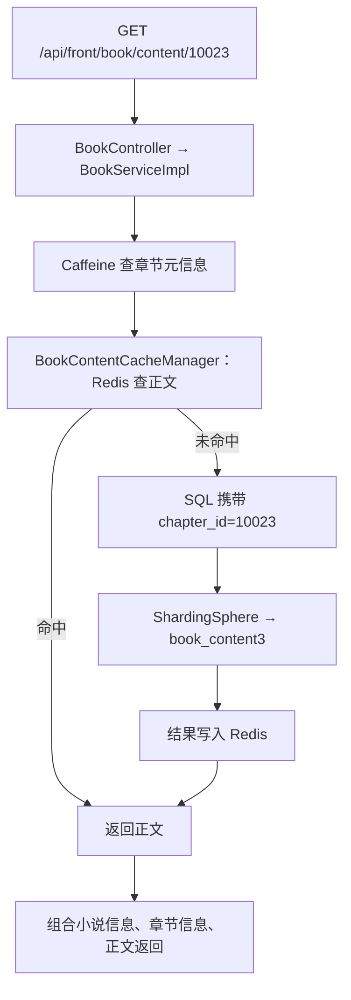
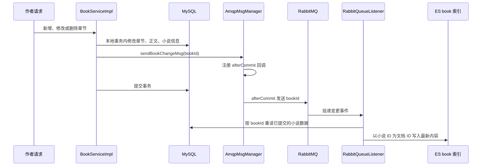
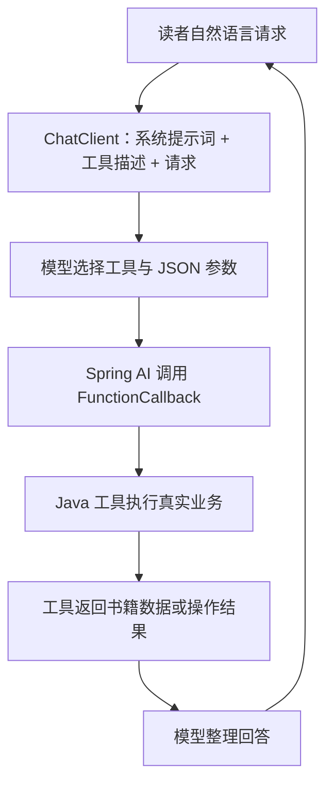
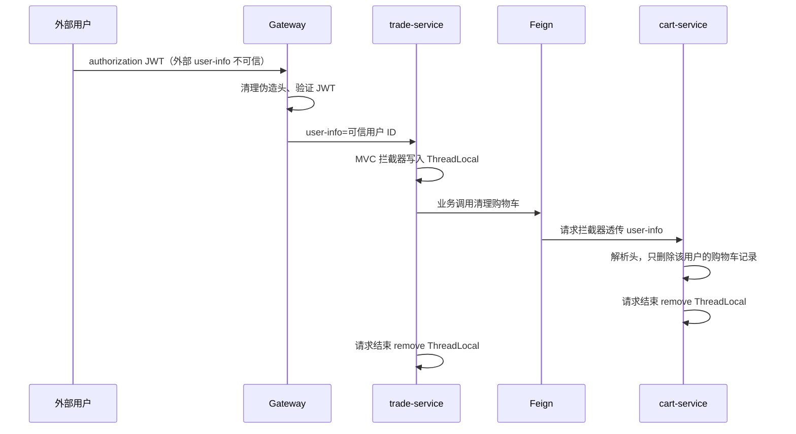
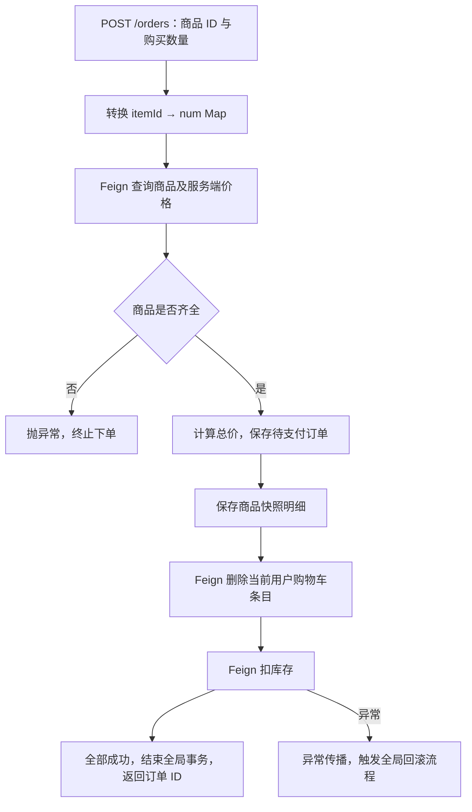
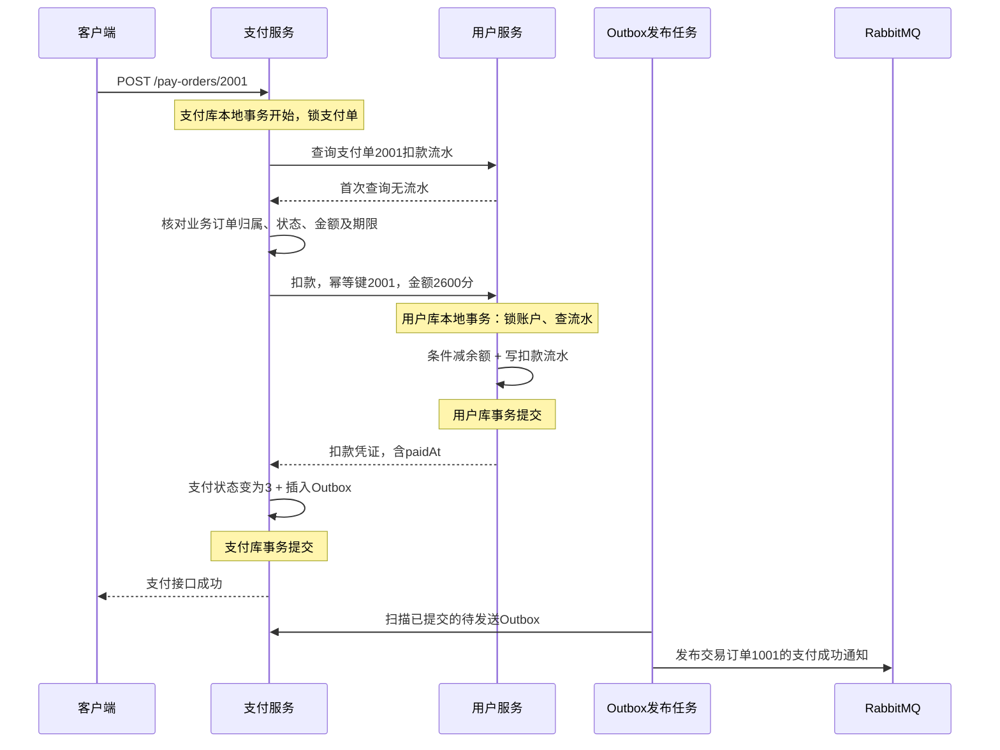
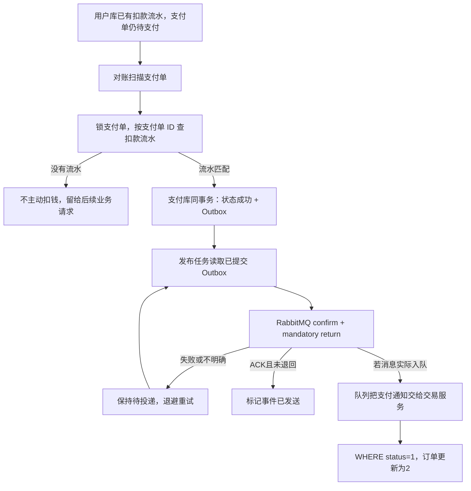

# 简历 0.3：两个项目亮点的业务流程与源码详解

> 对照材料：[简历 0.3](C:/Users/35998/Desktop/job/简历0.3.md)。核对日期：2026-09-13。
> 本文依据当前工作区源码（含尚未提交的修改），按简历的 **4 个 novel 亮点 + 5 个商城亮点**逐项解释。
> 本次只做源码阅读与说明，没有修改项目实现、执行数据库迁移或启动依赖服务，也没有重新运行测试。代码能证明“实现了哪些逻辑”，不能替代对 Nacos 配置、数据库约束和线上行为的验证。

## 怎么读这份说明

每个亮点都按“业务为什么需要 → 一次请求怎么走 → 核心代码怎么实现 → 保证什么、不保证什么 → 面试怎么讲”展开。展示的源码块为指定文件的原文节选；标明“等价伪代码 / 建议”的块不是现有实现。

**两个项目的理解主线：**

- **novel：** 作者发布/修改章节 → 数据库保存 → 缓存失效 → 事务提交后通知 ES → 读者通过正文阅读、关键词检索或 AI 工具找到书。
- **商城：** 网关确认身份 → Feign 跨服务传递身份 → Seata 下单 → 余额扣款留流水 → 支付状态与消息同事务落库 → RabbitMQ 通知交易服务 → 条件更新订单。

**先区分三个容易混淆的概念：**

1. novel 是按业务选择 Caffeine 或 Redis，不是同一个查询自动逐级经过 Caffeine → Redis → MySQL。
2. 下单使用 Seata；当前余额支付使用“各服务本地事务 + 扣款幂等流水 + Outbox + 对账”，不能把两条链路的事务方案混为一谈。
3. “事务提交后发送 MQ”与“可靠本地消息表”不是同一种可靠性等级；后者能记录提交后的待发送任务，前者仍有进程崩溃丢消息的窗口。

## 目录

1. [novel：章节正文水平分表](#highlight-1)
2. [novel：本地与分布式缓存设计](#highlight-2)
3. [novel：全文搜索与数据同步](#highlight-3)
4. [novel：AI 找书助手](#highlight-4)
5. [商城：统一网关鉴权与动态路由](#highlight-5)
6. [商城：Feign 远程调用与异常处理](#highlight-6)
7. [商城：下单主链路与分布式事务](#highlight-7)
8. [商城：余额支付与扣款幂等](#highlight-8)
9. [商城：支付通知与异常补偿](#highlight-9)
10. [综合故障推演、简历表述边界与源码阅读顺序](#highlight-10)

---

# 第一部分：novel 在线小说平台

<a id="highlight-1"></a>

## 1. 章节正文水平分表

### 1.1 业务问题：大正文不能无限堆在一张表里

一本小说对应很多章节，每个章节正文又是长文本。随着小说和章节增加，正文表的数据、索引维护和存储规模持续增长。读者的典型动作却很简单：**已经知道章节 ID，读取这一章正文**。

因此分片键选择 chapter_id：它直接出现在最常见的查询条件里，可以在执行 SQL 前计算目标表。不是按用户分表，也不是按小说 ID 分表。

### 1.2 当前真实的数据布局

| 内容 | 当前实现 |
|---|---|
| 逻辑表 | book_content，业务代码始终操作这个名字 |
| 物理表 | book_content0 ～ book_content9，名字中没有下划线 |
| 数据源 | 当前规则只有 ds_1，即单库分表，不是十个库 |
| 路由公式 | chapter_id % 10 |
| 元信息 | book_chapter 存章节名、章序、字数等；当前 YAML 没有为它配置同样的分片规则 |
| 正文表索引 | 建表脚本给每张正文表的 chapter_id 建唯一索引 |

分片规则：[shardingsphere-jdbc.yml:30](C:/Users/35998/Desktop/job/project/novel/src/main/resources/shardingsphere-jdbc.yml#L30)。

```yaml
- !SHARDING
  tables: # 数据分片规则配置
    book_content:
      # 分库策略，缺省表示使用默认分库策略
      actualDataNodes: ds_${1}.book_content${0..9}
      # 分表策略
      tableStrategy:
        standard:
          # 分片列名称
          shardingColumn: chapter_id
          # 分片算法名称
          shardingAlgorithmName: bookContentSharding

  shardingAlgorithms:
    bookContentSharding:
      # 行表达式分片算法，使用 Groovy 的表达式，提供对 SQL 语句中的 = 和 IN 的分片操作支持
      type: INLINE
      props:
        # 分片算法的行表达式
        algorithm-expression: book_content${chapter_id % 10}
```

例如 chapter_id = 10023，10023 % 10 = 3，因此读写 book_content3。即使业务 SQL 仍然写 book_content，ShardingSphere 也会解析分片条件并改写到物理表。

```sql
-- 等价 SQL 示意，不是另外新增的 Mapper
-- 应用看到的逻辑查询
SELECT * FROM book_content WHERE chapter_id = 10023 LIMIT 1;
-- ShardingSphere 路由并改写后的目标
SELECT * FROM book_content3 WHERE chapter_id = 10023 LIMIT 1;
```

[ShardingSphereConfiguration.java:21](C:/Users/35998/Desktop/job/project/novel/src/main/java/novel/core/config/ShardingSphereConfiguration.java#L21) 在 spring.shardingsphere.enabled=true 时创建带分片规则的 DataSource，并用 @Primary 让数据库访问使用它。实体仍映射逻辑表，见 [BookContent.java:17](C:/Users/35998/Desktop/job/project/novel/src/main/java/novel/dao/entity/BookContent.java#L17)。物理表定义见 [shardingsphere-jdbc.sql:40](C:/Users/35998/Desktop/job/project/novel/doc/sql/shardingsphere-jdbc.sql#L40)，其中唯一索引位于第 60 行。

### 1.3 阅读一章时的完整业务流程



入口见 [BookController.java:102](C:/Users/35998/Desktop/job/project/novel/src/main/java/novel/controller/front/BookController.java#L102)；组装阅读响应见 [BookServiceImpl.java:607](C:/Users/35998/Desktop/job/project/novel/src/main/java/novel/service/impl/BookServiceImpl.java#L607)。后者先取得章节元信息，章节不存在则报错，再读取正文与小说信息。

真正使查询精准路由的不是 Controller 参数名字，而是 Mapper 最终接收到的 **chapter_id 等值条件**，见 [BookContentCacheManager.java:28](C:/Users/35998/Desktop/job/project/novel/src/main/java/novel/manager/cache/BookContentCacheManager.java#L28)：

```java
@Cacheable(cacheManager = CacheConsts.REDIS_CACHE_MANAGER,
    value = CacheConsts.BOOK_CONTENT_CACHE_NAME, unless = "#result == null")
public String getBookContent(Long chapterId) {
    QueryWrapper<BookContent> contentQueryWrapper = new QueryWrapper<>();
    contentQueryWrapper.eq(DatabaseConsts.BookContentTable.COLUMN_CHAPTER_ID, chapterId)
        .last(DatabaseConsts.SqlEnum.LIMIT_1.getSql());
    BookContent bookContent = bookContentMapper.selectOne(contentQueryWrapper);
    return bookContent != null ? bookContent.getContent() : null;
}
```

逐句理解：

1. @Cacheable 指定 Redis 缓存管理器：命中缓存时不执行方法体。
2. eq(...COLUMN_CHAPTER_ID, chapterId) 是路由依据；ShardingSphere 从 SQL 里提取它。
3. limit 1 约束结果数量；章节正文在物理表里还有 chapter_id 唯一约束。
4. 返回 content 字符串，由缓存切面保存。查不到时返回 null，不缓存 null。

因此，**缓存命中时根本不会访问分表；只有回源数据库时才发生分片路由**。缓存与分表解决的是不同层次的问题。

### 1.4 作者发布章节时怎样写入正确分表

发布入口最终调用 [BookServiceImpl.saveBookChapter:355](C:/Users/35998/Desktop/job/project/novel/src/main/java/novel/service/impl/BookServiceImpl.java#L355)，方法带本地事务。顺序是：

1. 查询作品并核对当前作者身份。
2. 查询已有的最大章序，确定新章节序号。
3. 插入 book_chapter，取得新章节 ID。
4. 把这个 ID 放入 BookContent.chapterId，再插入逻辑正文表。
5. 更新小说的最新章节和总字数。
6. 删除小说详情缓存，登记事务提交后的小说变更消息。

最关键的写入代码：

```java
bookChapterMapper.insert(newBookChapter);

// 2) 保存章节内容到小说内容表
BookContent bookContent = new BookContent();
bookContent.setContent(dto.getChapterContent());
bookContent.setChapterId(newBookChapter.getId());
bookContent.setCreateTime(LocalDateTime.now());
bookContent.setUpdateTime(LocalDateTime.now());
bookContentMapper.insert(bookContent);
```

注意：正文表自己的 id 与章节 ID 不是同一个概念。路由看 chapterId，不看 BookContent.id。修改正文也是 WHERE chapter_id = ?，见 [BookServiceImpl.java:576](C:/Users/35998/Desktop/job/project/novel/src/main/java/novel/service/impl/BookServiceImpl.java#L576)；删除正文同样带分片键，见 [BookServiceImpl.java:500](C:/Users/35998/Desktop/job/project/novel/src/main/java/novel/service/impl/BookServiceImpl.java#L500)。

### 1.5 为什么这样设计，以及实际边界

- 按 chapter_id 查询可定位一个分片，避免这个查询模式下访问全部十张表；分片内的索引继续负责快速定位行。
- 业务只认识逻辑表，路由集中在规则中，不需要 Service 手动拼表名。
- 单章阅读是等值查询；IN 多个章节 ID 可能落到多个分片，缺失分片键的查询也不能宣称单分片。
- 单库分表主要控制表规模，**不会凭空把一台数据库的总 CPU、IO 能力变成十倍**。
- 从 %10 改成 %20 会改变大量历史数据的归属，不能只改配置就扩容，需要数据迁移方案。
- 不应凭这套代码宣称“性能提升 X 倍”：没有在本次分析中做压测。

**面试表达：**“我根据正文按章节 ID 访问的特点，用 ShardingSphere 把逻辑正文表路由到十张物理表。新增、修改、删除和读取正文都携带 chapter_id，因此常见阅读请求在缓存未命中时也只访问一个分片。这里是单库分表，扩容仍需要考虑取模规则变化后的数据迁移。”

<a id="highlight-2"></a>

## 2. 本地与分布式缓存设计

### 2.1 先纠正“多级缓存”的直觉

你的简历 0.3 写的是“按业务特征选用 Caffeine 和 Redis”，这与源码吻合。**当前不是为同一份数据做自动的 L1 Caffeine → L2 Redis → DB 查询链。**

Spring Cache 是注解抽象；Caffeine、Redis 是两种不同的存储实现。每个方法通过 cacheManager 属性明确选择一个管理器。即使枚举里预留了“本地和远程”的类型，也不代表已经实现自动两级回源。

### 2.2 哪些数据放在哪里，保留多久

以下是 [CacheConsts.java:101](C:/Users/35998/Desktop/job/project/novel/src/main/java/novel/core/constant/CacheConsts.java#L101) 的实际配置：

| 数据 | 存储 | TTL | 本地最大条目数 | 业务取舍 |
|---|---|---:|---:|---|
| 首页推荐列表 | Caffeine | 24 小时 | 1 | 一份聚合列表、访问频繁 |
| 小说详情 | Caffeine | 18 小时 | 500 | 热门详情就近读取 |
| 章节元信息 | Caffeine | 6 小时 | 5000 | 章节名、章序等小对象 |
| 章节正文 | Redis | 12 小时 | 不适用 | 文本较大，可由多个应用实例共享 |
| 点击榜 | Redis | 6 小时 | 不适用 | 共享榜单结果 |
| 新书榜 | Caffeine | 30 分钟 | 1 | 接受一定更新延迟 |
| 更新榜 | Caffeine | 60 秒 | 1 | 对更新时效更敏感 |

**注意最大容量的含义：**枚举也给远程缓存保存了 maxSize 字段，但当前 RedisCacheManager 构造过程没有使用它。因此不能说“Redis 正文缓存只允许 3000 条”。Caffeine 的 maximumSize 才真正执行条目数约束。

配置源码：[CacheConfig.java:35](C:/Users/35998/Desktop/job/project/novel/src/main/java/novel/core/config/CacheConfig.java#L35)。

```java
for (var c : CacheConsts.CacheEnum.values()) {
    if (c.isLocal()) {
        Caffeine<Object, Object> caffeine = Caffeine.newBuilder().recordStats()
            .maximumSize(c.getMaxSize());
        if (c.getTtl() > 0) {
            caffeine.expireAfterWrite(Duration.ofSeconds(c.getTtl()));
        }
        caches.add(new CaffeineCache(c.getName(), caffeine.build()));
    }
```

- maximumSize 是缓存条目数量限制，不是内存字节数。
- expireAfterWrite 从写入或更新缓存开始计时，并非每次读都顺延。
- recordStats 开启本地缓存统计能力，但不等于项目已经接好统计看板。

Redis 则为各缓存名设置 entryTtl，并禁止缓存 null。前缀来自 CacheConsts.REDIS_CACHE_PREFIX，形成类似 Cache::Novel::bookContentCache::10023 的 key。

### 2.3 一次读取怎样经过 Spring Cache

以小说详情为例：

1. 业务层调用独立 Spring Bean 的 getBookInfo(bookId)。
2. Spring 缓存代理先查 bookInfoCache，默认单参数 key 就是 bookId。
3. 命中：直接返回 BookInfoRespDto，不执行数据库代码。
4. 未命中：查小说表，再查首章 ID，组装 DTO。
5. 结果不为 null：放入 Caffeine，然后返回。

入口与查询实现见 [BookInfoCacheManager.java:36](C:/Users/35998/Desktop/job/project/novel/src/main/java/novel/manager/cache/BookInfoCacheManager.java#L36)。

首页推荐稍有不同：[HomeBookCacheManager.java:38](C:/Users/35998/Desktop/job/project/novel/src/main/java/novel/manager/cache/HomeBookCacheManager.java#L38) 没有参数，所以缓存的是一整份推荐列表。未命中时先读首页推荐配置，再批量查询涉及的小说信息，最后按推荐记录组装结果。不是首页每展示一本书就逐条查一次数据库。

这些缓存管理类被 Service 作为独立 Bean 调用，是为了让 Spring AOP 的缓存注解能经过代理执行；同一个对象内部直接调用自己的注解方法，不能一概认为会被代理拦截。

### 2.4 写操作为什么选择“删缓存”而不是把旧缓存改一下

作者修改章节时，会同时影响：

- 章节元信息：章名、字数、VIP 标记等；
- 正文字符串；
- 小说详情：总字数、最新章节信息等。

因此更新数据库后删除这三类相关缓存，下次读取再用数据库的新结果重建，见 [BookServiceImpl.java:594](C:/Users/35998/Desktop/job/project/novel/src/main/java/novel/service/impl/BookServiceImpl.java#L594)：

```java
bookInfoMapper.updateById(newBookInfo);
// 6.清理章节信息缓存
bookChapterCacheManager.evictBookChapterCache(chapterId);
// 7.清理章节内容缓存
bookContentCacheManager.evictBookContentCache(chapterId);
// 8.清理小说信息缓存
bookInfoCacheManager.evictBookInfoCache(chapter.getBookId());
// 9.发送小说信息更新的 MQ 消息
amqpMsgManager.sendBookChangeMsg(chapter.getBookId());
```

这是 Cache-Aside 思路：数据库是权威数据，缓存允许被删除、再构建。

[BookContentCacheManager.java:38](C:/Users/35998/Desktop/job/project/novel/src/main/java/novel/manager/cache/BookContentCacheManager.java#L38) 中的删除方法看起来是空的，但 @CacheEvict 的操作由 Spring 切面完成，并不是“方法没写代码所以没有删除”。

首页推荐配置修改也有对应删除：[AdminServiceImpl.java:362](C:/Users/35998/Desktop/job/project/novel/src/main/java/novel/service/impl/AdminServiceImpl.java#L362) 中新增、修改、删除推荐记录后都调用 evictHomeBookCache；后者 allEntries=true，因为缓存的是整份无参数列表。

### 2.5 缓存与数据库事务：Redis 和本地缓存不能一概而论

Redis 管理器有这句，见 [CacheConfig.java:84](C:/Users/35998/Desktop/job/project/novel/src/main/java/novel/core/config/CacheConfig.java#L84)：

```java
RedisCacheManager redisCacheManager = new RedisCacheManager(redisCacheWriter,
    defaultCacheConfig, cacheMap);
redisCacheManager.setTransactionAware(true);
redisCacheManager.initializeCaches();
return redisCacheManager;
```

其含义是：处于 Spring 事务时，事务感知缓存装饰器会把相关 put/evict/clear 操作安排到成功提交后，避免数据库回滚却提前改变缓存的部分问题。

但 **Caffeine 的 SimpleCacheManager 没有同样的事务感知包装**。因此在 updateBookChapter 中，本地缓存删除可能在数据库真正提交前发生。并发请求可能在这段窗口里回源读到旧值并重新填入缓存。这份源码不能证明数据库与所有缓存强一致。

### 2.6 多实例、穿透、击穿与雪崩应该怎么回答

| 问题 | 当前代码能证明什么 | 不能直接声称什么 |
|---|---|---|
| 多实例共享 | Redis 正文可共享 | Caffeine 的失效不会自动广播到别的实例 |
| 缓存穿透 | 查不到就返回 null，且不缓存 null | 不能说已经靠空值缓存或布隆过滤器解决 |
| 缓存击穿 | 缓存失效后正常回源 | 当前这些读取方法没有 sync=true 或重建锁，不能保证只有一个请求回源 |
| 缓存雪崩 | 不同业务 TTL 不同 | 没看到统一的随机 TTL 抖动策略 |
| 数据一致性 | 相关写操作主动失效 + TTL 兜底 | 不是任意写入路径、任意实例都立即一致 |

举例：实例 A 修改书籍后只删除 A 的小说详情 Caffeine，实例 B 仍可能读到自己内存里的旧详情，直到过期或被主动失效。若将来扩展成多实例，可增加失效广播或缩短 TTL，但这是改进方向，不是当前已经实现的能力。

**面试表达：**“我按数据体积、访问频率和共享需求选择本地或 Redis 缓存，使用 Spring Cache 管理查询和失效，TTL 按业务时效差异设置。正文走 Redis，首页与详情走 Caffeine；当前是分业务缓存，不是自动两级缓存。写操作会删除相关条目，Redis 接了事务感知，但多实例本地缓存失效仍需要补充广播机制。”

<a id="highlight-3"></a>

## 3. 全文搜索与数据同步链路

### 3.1 这项亮点实际包含两条链路

- **查询链：** 读者搜索 → ES 组合查询 → 高亮、排序、分页 → 返回小说列表。
- **同步链：** 作者改章节 → MySQL 提交 → MQ 发送小说 ID → 消费者重读数据库 → 更新 ES。

MySQL 是业务权威数据，ES 是面向搜索的派生索引。阅读正文仍然走前面讲的缓存与 MySQL 分表，不是从 ES 读取完整章节。

### 3.2 读者搜索时，入口和参数怎样传递

接口：GET /api/front/search/books。

[SearchController.java:35](C:/Users/35998/Desktop/job/project/novel/src/main/java/novel/controller/front/SearchController.java#L35) 接收 BookSearchReqDto，委托 SearchService。在 spring.elasticsearch.enabled=true 时装配 [EsSearchServiceImpl.java:38](C:/Users/35998/Desktop/job/project/novel/src/main/java/novel/service/impl/EsSearchServiceImpl.java#L38)，检索索引 book。

用户可以表达这样的搜索条件：关键词“修仙”、指定分类、完结、免费、字数大于 20 万、按点击量排序、第 2 页。这个例子是业务说明，不是已执行请求。

### 3.3 bool 查询：相关性与硬条件分开

构造逻辑见 [EsSearchServiceImpl.java:115](C:/Users/35998/Desktop/job/project/novel/src/main/java/novel/service/impl/EsSearchServiceImpl.java#L115)：

```java
BoolQuery boolQuery = BoolQuery.of(b -> {

    // 1. 只有全文检索关键词保留在 must 中计算相关度得分
    if (!StringUtils.isBlank(condition.getKeyword())) {
        b.must((q -> q.multiMatch(t -> t
            .fields(EsConsts.BookIndex.FIELD_BOOK_NAME + "^2",
                EsConsts.BookIndex.FIELD_AUTHOR_NAME + "^1.8",
                EsConsts.BookIndex.FIELD_BOOK_DESC + "^0.1")
            .query(condition.getKeyword())
        )
        ));
    }

    // 2. 精确条件与范围条件全部移至 filter（不计算得分，且自动被 ES 节点缓存）
    // 只查有字数的小说
    b.filter(RangeQuery.of(m -> m
        .field(EsConsts.BookIndex.FIELD_WORD_COUNT)
        .gt(JsonData.of(0))
    )._toQuery());
```

**must 中的 multi_match：**

- bookName^2：书名匹配权重 2；
- authorName^1.8：作者匹配权重 1.8；
- bookDesc^0.1：简介匹配权重 0.1。

它表达的是“不同字段对相关度的贡献不同”，不是把所有匹配视为同样重要。

**filter 中的条件：**

- wordCount > 0，只展示有正文的作品；
- 频道、分类、连载/完结状态、是否收费等 term 精确匹配；
- 字数范围、最后更新时间范围等 range 查询。

filter 负责判定能不能进入结果集，不参与相关度评分，也更适合 ES 复用过滤结果；是否实际缓存仍由 ES 的执行与缓存策略决定。源码注释写“自动被缓存”不应被理解为所有 filter 都必然命中缓存。

一个细节：字数最小值使用 gte，最大值使用 lt，所以当前区间是“最小值包含、最大值不包含”。见 [EsSearchServiceImpl.java:167](C:/Users/35998/Desktop/job/project/novel/src/main/java/novel/service/impl/EsSearchServiceImpl.java#L167)。

### 3.4 排序、分页、高亮怎么实现

见 [EsSearchServiceImpl.java:50](C:/Users/35998/Desktop/job/project/novel/src/main/java/novel/service/impl/EsSearchServiceImpl.java#L50)：

1. 传 sort 时取第一个字段名，并把下划线转为驼峰，再按 **Desc 降序** 排序；不是完整解析任意 ASC/DESC 表达式。
2. 分页使用 from=(pageNum-1)*pageSize、size=pageSize。
3. 只给书名和作者名配置高亮标签。
4. 遍历 hits，用高亮片段替换返回 DTO 中的书名/作者名，再组装 PageRespDto。

```java
// 排序
if (!StringUtils.isBlank(condition.getSort())) {
    searchBuilder.sort(o -> o.field(f -> f
        .field(StringUtils.underlineToCamel(condition.getSort().split(" ")[0]))
        .order(SortOrder.Desc))
    );
}
// 分页
searchBuilder.from((condition.getPageNum() - 1) * condition.getPageSize())
    .size(condition.getPageSize());
// 设置高亮显示
searchBuilder.highlight(h -> h.fields(EsConsts.BookIndex.FIELD_BOOK_NAME,
        t -> t.preTags("<em style='color:red'>").postTags("</em>"))
    .fields(EsConsts.BookIndex.FIELD_AUTHOR_NAME,
        t -> t.preTags("<em style='color:red'>").postTags("</em>")));
```

[PageReqDto.java:48](C:/Users/35998/Desktop/job/project/novel/src/main/java/novel/core/common/req/PageReqDto.java#L48) 将页码限制为至少 1、每页大小限制在 1～100。不过 from/size 本身并不解决深分页成本，代码里没有 search_after。

还存在数据库版 SearchService，用配置决定装配哪一种；**不是 ES 请求异常后自动切换 MySQL**。当前 ES 方法异常会向外传播。

### 3.5 作者更新章节以后，ES 为什么不会抢在事务前读取



如果在事务未提交时立即发消息，消费者可能先查到旧数据，或者数据库最终回滚但 ES 已更新。事务同步器就是针对这个先后顺序问题。

核心代码见 [AmqpMsgManager.java:35](C:/Users/35998/Desktop/job/project/novel/src/main/java/novel/manager/mq/AmqpMsgManager.java#L35)：

```java
// 如果在事务中则在事务执行完成后再发送，否则可以直接发送
if (TransactionSynchronizationManager.isActualTransactionActive()) {
    TransactionSynchronizationManager.registerSynchronization(
        new TransactionSynchronization() {
            @Override
            public void afterCommit() {
                amqpTemplate.convertAndSend(exchange, routingKey, message);
            }
        });
    return;
}
amqpTemplate.convertAndSend(exchange, routingKey, message);
```

- 有实际事务：只注册回调，不立即发送。
- 提交成功：执行 afterCommit。
- 回滚：不执行 afterCommit。
- 没有事务：直接发送。

消息通过 FanoutExchange EXCHANGE-BOOK-CHANGE 广播到 QUEUE-ES-BOOK-UPDATE；配置见 [AmqpConfig.java:24](C:/Users/35998/Desktop/job/project/novel/src/main/java/novel/core/config/AmqpConfig.java#L24)。消息体只有 bookId，不携带整个 BookInfo。

### 3.6 消费者怎样更新 ES，为什么文档 ID 很重要

消费代码见 [RabbitQueueListener.java:35](C:/Users/35998/Desktop/job/project/novel/src/main/java/novel/core/listener/RabbitQueueListener.java#L35)：

```java
@RabbitListener(queues = AmqpConsts.BookChangeMq.QUEUE_ES_UPDATE)
@SneakyThrows
public void updateEsBook(Long bookId) {
    BookInfo bookInfo = bookInfoMapper.selectById(bookId);
    IndexResponse response = esClient.index(i -> i
        .index(EsConsts.BookIndex.INDEX_NAME)
        .id(bookInfo.getId().toString())
        .document(EsBookDto.build(bookInfo))
    );
    log.info("Indexed with version " + response.version());
```

消费者重读数据库，组装 EsBookDto，以小说 ID 作为 ES 文档 ID。重复收到同一本书的消息，会写回同一个文档，而不是生成多个重复小说文档。

但这个覆盖写不等于完整的版本控制。两次消费若并发读取不同快照，仍需考虑乱序覆盖；删除整本小说时也需要明确的删除事件或空值处理，当前方法没有处理 bookInfo=null 的删除语义。

### 3.7 这条链路能保证什么，不能保证什么

**能够说明：**数据库先提交，消费者之后再读取；搜索索引异步更新；短时间内搜索结果与刚写入的数据库可能不同，这是最终一致性方案的正常表现。

**仍存在的窗口：**数据库已经提交，但 afterCommit 执行前进程崩溃，消息没有持久记录，恢复后也没有本地任务可重发。配置里虽然有 RabbitTemplate 的短时发送重试，但不能弥补进程崩溃后任务丢失。

当前还必须注意三点：

1. 当前 dev 配置的 novel.amqp.enabled=false，而发送方法和消费者都有开关条件；因此**默认开发配置并未开启这条增量同步链路**。配置见 [application-dev.yml:40](C:/Users/35998/Desktop/job/project/novel/src/main/resources/application-dev.yml#L40)，消费者要求 ES 与 AMQP 同时开启。
2. 能明确找到的 sendBookChangeMsg 调用点是章节新增、删除、修改，分别位于 BookServiceImpl 的 406、538、602 行。不能据此声称所有小说后台元信息修改都已全覆盖。
3. 这条 MQ 消费者更新的是普通 book 索引，不会自动更新 AI 的 book_ai_vector 向量索引。

**面试表达：**“我把搜索条件分成参与打分的关键词和不参与打分的过滤条件，完成高亮、分页和排序。章节变更后注册 Spring 事务 afterCommit 回调，再用 MQ 通知 ES 消费者按小说 ID 重建文档，防止消费者读到未提交数据。但 afterCommit 本身还不是持久化事务消息，若要求崩溃后可恢复，需要像商城支付那样引入 Outbox。”

<a id="highlight-4"></a>

## 4. AI 找书助手：模型理解意图，业务工具执行动作

### 4.1 与普通关键词搜索的差别

普通检索更适合“书名、作者、关键词”。读者若说“想找主角杀伐果断、在修真界种田的小说”，库里不一定有完全相同的词，语义检索更合适。

这项功能组合了两个能力：

- **Embedding + ES kNN：**把自然语言与书籍简介映射到同一向量空间，召回语义相近的书。
- **Function Calling：**模型根据意图选择后台提供的工具；真正查榜、检索和加书架的仍是 Java 代码。

不是让大模型直接连接数据库，也不是让大模型凭记忆编造平台书库。

### 4.2 总调用链与四个工具

入口位于 [AiBookCompanionController.java:38](C:/Users/35998/Desktop/job/project/novel/src/main/java/novel/controller/front/AiBookCompanionController.java#L38)。普通对话最终调用 chatClient.prompt().user(message).call().content()。

初始化见 [BookCompanionServiceImpl.java:49](C:/Users/35998/Desktop/job/project/novel/src/main/java/novel/service/impl/BookCompanionServiceImpl.java#L49)：

```java
@PostConstruct
public void init() {
    this.chatClient = chatClientBuilder
            .defaultSystem(aiProperties.getSystemPrompt())
            .defaultFunctions("searchBooksFunction", "getBookRankFunction", "addToBookshelfFunction", "recommendBooksFunction")
            .build();
    log.info("[智能书童] 初始化完成，已加载默认人设 Prompt 与 4 大业务 Function Tools");
}
```

| 工具名 | 请求参数 | 实际执行的方法 | 数据来源/效果 |
|---|---|---|---|
| searchBooksFunction | queryPrompt、limit | searchBooksBySemantics | Embedding + 向量索引召回 |
| getBookRankFunction | rankType | getBookRank | 复用 BookService 的点击、新书、更新榜 |
| addToBookshelfFunction | bookId | addToBookshelf | 校验当前用户后调用 UserService 写书架 |
| recommendBooksFunction | count | analyzeUserReadingAndRecommend | 最近书架的向量均值 + 排除样本书籍 |

定义见 [BookCompanionTools.java:81](C:/Users/35998/Desktop/job/project/novel/src/main/java/novel/core/ai/tools/BookCompanionTools.java#L81)。



例如在同一个请求里要求“找三本修仙种田小说，把第一本加入我的书架”，模型可以先调用检索工具，拿到真实 bookId 后再调用书架工具。**是否执行写操作，以工具的服务端校验为准，不以模型一句‘已加入’为准。**

### 4.3 工具参数为什么使用 record 和 SafeFunctionCallback

SearchBooksRequest、AddToBookshelfRequest 等 record 给模型描述允许传什么字段。JsonPropertyDescription 提供字段含义，SafeFunctionCallback 生成 JSON Schema。

[SafeFunctionCallback.java:30](C:/Users/35998/Desktop/job/project/novel/src/main/java/novel/core/ai/tools/SafeFunctionCallback.java#L30) 和第 56 行后的 call 方法完成：

1. 暴露工具名称、用途、输入 Schema。
2. 用 Jackson 把模型返回的 JSON 解析为具体请求类型。
3. 空字符串、空对象或解析异常时允许 request=null，交给工具使用默认值或拒绝非法写入。
4. 调用 Java Function；把执行结果转换为字符串返回模型。

例如检索条数默认 3、上限 10；缺少 bookId 则书架工具拒绝。参数容错减少模型输出格式不稳定导致的异常，但它不是身份认证与权限校验的替代品。

### 4.4 先建立书籍向量库，读者的语义查询才有比较对象

全量同步入口是 POST /api/front/ai/companion/sync-vectors，服务最终调用 [BookVectorSyncService.java:39](C:/Users/35998/Desktop/job/project/novel/src/main/java/novel/core/ai/vector/BookVectorSyncService.java#L39)。

业务顺序：

1. 初始化向量索引；不存在时创建映射。
2. 从 MySQL 读取 wordCount>0 的小说，按点击量排序。
3. 为每本书拼出摘要文本：书名 + 分类 + 作者 + 评分 + 简介。
4. 调用 Spring AI EmbeddingModel 把摘要变成向量。
5. 将向量与书籍基本信息保存到 ES；每累计 20 本执行一次 ES bulk 写入。

**“每批 20 本”指 ES 写入批次；当前 Embedding 仍逐本调用，不是一次批量生成 20 本向量。**代码注释里的“约 1000 本”也不是查询的硬编码上限，实际读取的是所有满足条件的记录。

摘要拼装见 [EsVectorBookDto.java:104](C:/Users/35998/Desktop/job/project/novel/src/main/java/novel/core/ai/dto/EsVectorBookDto.java#L104)；向量生成核心见 [BookVectorSyncService.java:121](C:/Users/35998/Desktop/job/project/novel/src/main/java/novel/core/ai/vector/BookVectorSyncService.java#L121)：

```java
public List<Float> embedText(String text) {
    if (text == null || text.isBlank()) {
        return Collections.emptyList();
    }
    try {
        List<Double> embeddings = embeddingModel.embed(text);
        if (embeddings == null || embeddings.isEmpty()) {
            return Collections.emptyList();
        }
        return embeddings.stream().map(Double::floatValue).toList();
    } catch (Exception e) {
        log.error("[AI Embedding] 生成文本向量失败: {}", e.getMessage(), e);
        return Collections.emptyList();
```

默认向量索引名 book_ai_vector，默认维度 1024，见 [AiProperties.java:26](C:/Users/35998/Desktop/job/project/novel/src/main/java/novel/core/ai/config/AiProperties.java#L26)。索引中的 embedding 映射为可索引 dense_vector，使用 cosine 相似度与 HNSW 索引，见 [EsVectorStoreService.java:70](C:/Users/35998/Desktop/job/project/novel/src/main/java/novel/core/ai/vector/EsVectorStoreService.java#L70)。

- 维度表示向量里有多少个数，不是“书的特征标签数量”。
- cosine 衡量向量方向的相似性。
- HNSW 是近似最近邻检索的数据结构，不是项目自己训练的推荐模型。
- 入库文本和用户查询必须使用匹配的 Embedding 模型与维度；更换模型后旧向量通常不能直接沿用，应重新生成。

### 4.5 工具一：自然语言找书的逐步执行

工具实现见 [BookCompanionTools.java:126](C:/Users/35998/Desktop/job/project/novel/src/main/java/novel/core/ai/tools/BookCompanionTools.java#L126)：

```java
public String searchBooksBySemantics(String queryPrompt, Integer limit) {
    int safeLimit = (limit == null || limit <= 0) ? 3 : Math.min(limit, 10);
    String prompt = (queryPrompt == null || queryPrompt.isBlank()) ? "热门高分小说推荐" : queryPrompt;
    log.info("[AI Tool - 语义找书] 收到检索词: {}, 数量: {}", prompt, safeLimit);

    List<Float> queryVector = bookVectorSyncService.embedText(prompt);
    if (queryVector.isEmpty()) {
        return "未能解析语义向量，请尝试更详细的描述。";
    }

    List<EsVectorBookDto> matchedBooks = esVectorStoreService.knnSearch(queryVector, safeLimit, null);
    if (matchedBooks.isEmpty()) {
        return "在书库中暂未找到与该描述高度契合的小说，请尝试换个题材或描述。";
```

1. 对 queryPrompt 和 limit 做默认值、上限处理。
2. 用与入库相同的 EmbeddingModel 对读者问题向量化。
3. 调用 knnSearch，以这个向量在 embedding 字段上找近邻。
4. 把命中书籍的 ID、名称、分类、作者、评分和简介交给模型组织回答。

kNN 代码见 [EsVectorStoreService.java:138](C:/Users/35998/Desktop/job/project/novel/src/main/java/novel/core/ai/vector/EsVectorStoreService.java#L138)：

- 底层 topK 限制在 1～50；工具层已经进一步限制到 10。
- numCandidates=max(topK×10, 50)，先考察更多候选，再返回 topK。
- 使用 size=topK 返回匹配列表。
- ES 查询失败会记录日志并返回空列表。因此工具展示“没有找到”时，当前实现没有完全区分“确实无结果”和“向量服务异常”。

### 4.6 工具二：查榜单不是让模型自行排名

[BookCompanionTools.java:159](C:/Users/35998/Desktop/job/project/novel/src/main/java/novel/core/ai/tools/BookCompanionTools.java#L159) 将 rankType 分发到已有业务服务：newest → 新书榜，update → 更新榜，其余默认点击榜。取最多 5 本组织返回。

因此榜单依赖的仍是既有缓存与数据库统计，AI 只负责理解读者想看哪个榜、把真实结果讲清楚。

### 4.7 工具三：加入书架必须以服务端当前用户为准

工具实现见 [BookCompanionTools.java:198](C:/Users/35998/Desktop/job/project/novel/src/main/java/novel/core/ai/tools/BookCompanionTools.java#L198)：

```java
public String addToBookshelf(Long bookId) {
    Long userId = UserHolder.getUserId();
    log.info("[AI Tool - 自动加书架] 操作人 userId: {}, 目标 bookId: {}", userId, bookId);

    if (userId == null) {
        return "【提示】读者当前未登录，无法自动加入书架。请提示读者在右上角登录账号后再试。";
    }

    if (bookId == null) {
        return "未获取到有效的小说 ID，请确认要加入书架的书籍。";
    }

    BookInfo bookInfo = bookInfoMapper.selectById(bookId);
    if (bookInfo == null) {
        return "书库中未找到 ID 为 " + bookId + " 的小说。";
    }

    try {
        userService.addBookshelf(userId, bookId);
        return "已成功将《" + bookInfo.getBookName() + "》(ID: " + bookId + ") 加入读者的个人书架！";
```

关键安全边界有三层：

1. userId 来自 UserHolder，而不是模型传入。工具请求只包含 bookId，不能替模型指定别人的 userId。
2. 未登录、书籍 ID 缺失、书籍不存在都会停止写入。
3. UserService.addBookshelf 再验证书籍、检查当前用户是否已收藏，然后插入 user_bookshelf，见 [UserServiceImpl.java:210](C:/Users/35998/Desktop/job/project/novel/src/main/java/novel/service/impl/UserServiceImpl.java#L210)。

另外，当前 [WebConfig.java:46](C:/Users/35998/Desktop/job/project/novel/src/main/java/novel/core/config/WebConfig.java#L46) 已把普通 AI 接口纳入登录拦截（向量全量同步接口是例外）。因此不能把工具内部的未登录提示分支，误讲成“当前所有 AI 查询接口都对游客开放”。

### 4.8 工具四：个性化推荐的算法其实很清晰

见 [BookCompanionTools.java:226](C:/Users/35998/Desktop/job/project/novel/src/main/java/novel/core/ai/tools/BookCompanionTools.java#L226)：

1. 获取当前用户，限制推荐数量默认 3、上限 5。
2. 按书架记录更新时间取最近 10 本。
3. 获取这批书的向量，丢弃缺失向量的条目。
4. 对每一维求平均，形成偏好中心向量。
5. 以中心向量做 kNN 检索，并在 filter.mustNot.terms 中排除本次取出的书籍 ID。
6. 返回候选书与最近收藏情况，由模型解释推荐理由。

```text
若有效书籍向量为 v1, v2, ..., vn：
用户偏好向量 u = (v1 + v2 + ... + vn) / n
推荐结果 = KNN(u) - 本次样本中的书籍
```

这实际上是**基于书籍内容向量的推荐**。虽然注释用了“加权偏好”，循环执行的只是普通算术平均，没有阅读时长、点击次数等权重，也不是用户协同过滤。

还要准确说“最近收藏”，因为输入来自书架，不是完整阅读历史；排除的也只是这次拿到的最多 10 本，并不等于排除了用户全部已读或全部收藏。

工具在未登录、空书架时返回引导信息，让模型提示登录或展示榜单；无有效向量时返回分类偏好说明。独立 recommend 接口另有直接查热门书的兜底，见 [BookCompanionServiceImpl.java:151](C:/Users/35998/Desktop/job/project/novel/src/main/java/novel/service/impl/BookCompanionServiceImpl.java#L151)。这两种返回路径不要混讲。

### 4.9 实现边界：哪些能力不能夸大

- **不是训练模型：**当前调用已有大模型与 Embedding 服务，没有训练或微调代码。
- **不是自动增量向量同步：**syncSingleBook 方法存在，但在当前业务源码中没有找到调用点；普通 MQ 消费者也没调用它。不能说作品变更已经同时自动刷新两个 ES 索引。
- **不是模型实时 token 流：**chatStream 先同步 call().content() 拿完整回答，再按每 2 个 Unicode 码点切块返回 Flux。见 [BookCompanionServiceImpl.java:59](C:/Users/35998/Desktop/job/project/novel/src/main/java/novel/service/impl/BookCompanionServiceImpl.java#L59)。外部形式是 SSE，内部却是“完整结果分块”，首段响应仍需等待模型完成。
- **不能声称已持久化多轮记忆：**当前 ChatClient 配置没有显式会话记忆组件。一次请求内工具来回交互，不等于不同 HTTP 请求间自动记住“上一轮的第一本书”。
- **异步上下文需验证：**UserHolder 基于线程上下文；若后续把工具或流式处理切到其他线程，必须显式处理用户上下文传播，不能只因为返回 Flux 就认为身份会自动继承。
- **管理接口需收紧：**WebConfig 对全量同步接口有登录拦截例外。生产环境宜将高成本向量同步归到有管理权限的入口，这属于改进建议。

**面试表达：**“AI 负责识别意图，Spring AI Function Calling 负责把意图连接到四个确定的业务工具。语义找书先把简介和问题向量化，再用 ES HNSW kNN 召回；个性化推荐取最近收藏书籍的平均向量作为偏好。加书架始终使用服务端解析出的用户 ID，不能让模型传用户身份。当前向量增量同步与真正的模型流式响应还有完善空间。”

---

# 第二部分：万佳商城微服务系统

商城分析以商品、购物车、用户、交易、支付服务和网关为准，**不是同目录里遗留单体 hm-service 的同名实现**。两个项目框架版本也不同：novel 的父 POM 为 Spring Boot 3.3.0，商城的父 POM 为 Spring Boot 2.7.12；不要把 novel 的 Boot 3 技术栈照搬到商城。

版本依据：[pom.xml:5](C:/Users/35998/Desktop/job/project/novel/pom.xml#L5)、[pom.xml:23](C:/Users/35998/Desktop/job/project/hmall/pom.xml#L23)。

<a id="highlight-5"></a>

## 5. 统一网关鉴权与动态路由

### 5.1 业务问题：身份校验不应该散落在每个服务

请求从外部进入商品、购物车、订单、支付等服务。若每个服务都重复解析 JWT、维护公开接口规则，既重复又容易不一致。

网关先验证 JWT，并把可信的用户 ID 放到内部请求头；业务服务再把这个头解析成当前请求的用户上下文。

### 5.2 当前鉴权执行顺序，注意不是直接读完 token 就放行

核心入口：[AuthGlobalFilter.java:26](C:/Users/35998/Desktop/job/project/hmall/hm-gateway/src/main/java/com/hmall/gateway/filters/AuthGlobalFilter.java#L26)。

1. 提取路径的第一个有效分段；若为 internal，直接返回 403，防止外部访问余额扣款/对账内部接口。
2. **先删除外部传入的 user-info 头**，防止客户端自己冒充某个用户。
3. 用 AntPathMatcher 匹配白名单；命中则放行已清理的请求。
4. 不在白名单时，从 authorization 头读取 JWT。
5. 校验签名、有效期和用户载荷；无效或用户 ID 不合法则返回 401。
6. 把验证出来的用户 ID 写成 user-info 头，转发到目标服务。

```java
// 不接受外部伪造的用户透传头，包括白名单请求。
ServerWebExchange sanitized = exchange.mutate()
        .request(builder -> builder.headers(headers -> headers.remove("user-info"))).build();
if (isExclude(request.getPath().value())) {
    return chain.filter(sanitized);
}
Long userId;
try {
    userId = jwtTool.parseToken(request.getHeaders().getFirst("authorization"));
} catch (UnauthorizedException unauthorized) {
    return reject(exchange, HttpStatus.UNAUTHORIZED);
}
if (userId == null || userId <= 0) {
    return reject(exchange, HttpStatus.UNAUTHORIZED);
}
ServerWebExchange authenticated = sanitized.mutate()
        .request(builder -> builder.headers(headers -> headers.set("user-info", userId.toString()))).build();
return chain.filter(authenticated);
```

这里使用 exchange.mutate() 构造带新请求头的请求对象，符合 Gateway/WebFlux 请求对象的使用方式；并不是直接修改一个全局共享请求。

JWT 细节见 [JwtTool.java:44](C:/Users/35998/Desktop/job/project/hmall/hm-gateway/src/main/java/com/hmall/gateway/utils/JwtTool.java#L44)：先解析并验证签名，再验证日期，最后将 user 载荷转换为 Long。过滤器 getOrder() 返回 0，表示它在过滤器链中的排序值。

### 5.3 下游服务如何知道“当前用户是谁”



[UserInfoInterceptor.java:13](C:/Users/35998/Desktop/job/project/hmall/hm-common/src/main/java/com/hmall/common/interceptor/UserInfoInterceptor.java#L13) 在 preHandle 中读 user-info，调用 UserContext.setUser；afterCompletion 调用 removeUser。

清理非常重要：Servlet 线程池会复用线程，不删除 ThreadLocal 可能使后续请求拿到前一次请求的用户身份，也会增加对象滞留风险。

公共 MvcConfig 注册拦截器，并通过自动配置文件加载，见 [MvcConfig.java:9](C:/Users/35998/Desktop/job/project/hmall/hm-common/src/main/java/com/hmall/common/config/MvcConfig.java#L9) 和 [spring.factories:1](C:/Users/35998/Desktop/job/project/hmall/hm-common/src/main/resources/META-INF/spring.factories#L1)。

### 5.4 Nacos 动态路由：启动读取 + 配置监听

动态路由不是 JWT 功能的一部分，它负责决定“什么 URL 转发给哪个服务”。两者放在同一个简历亮点里，是因为都位于网关。

核心类：[DynamicRoutLoader.java:24](C:/Users/35998/Desktop/job/project/hmall/hm-gateway/src/main/java/com/hmall/gateway/routers/DynamicRoutLoader.java#L24)。

启动时：

1. @PostConstruct 调用初始化方法。
2. 从 Nacos 读取 DEFAULT_GROUP 下的 gateway-routes.json。
3. getConfigAndSignListener 同时注册监听器。
4. 对首次获取的配置执行 updateConfigInfo。

运行期间：配置发生变化，receiveConfigInfo 接收新内容，再调用同一个更新方法。

更新实现：

```java
public void updateConfigInfo(String configInfo){
    log.debug("监听到路由配置信息：{}",configInfo);
    //解析配置文件 转换为RoutDefinition
    List<RouteDefinition> routeDefinitions = JSONUtil.toList(configInfo, RouteDefinition.class);
    //删除旧的路由表
    for (String routeId : routeIds) {
        writer.delete(Mono.just(routeId)).subscribe();
    }
   routeIds.clear();
    // 2.2.判断是否有新的路由要更新
    if (CollUtils.isEmpty(routeDefinitions)) {
        // 无新路由配置，直接结束
        return;
    }
    //更新路由表
    for (RouteDefinition routeDefinition : routeDefinitions) {
        //更新路由表
        writer.save(Mono.just(routeDefinition)).subscribe();
        //记录路由id
        routeIds.add(routeDefinition.getId());
    }
```

- JSON 被解析为 RouteDefinition 列表，包含路由 ID、目标 URI、断言、过滤器等。
- routeIds 保存该加载器上次登记的路由 ID。
- 删除旧定义，清空集合，再保存新定义。
- writer 返回响应式 Mono，subscribe() 才触发对应操作。

例如一个路由可以用 Path=/items/** 与 uri=lb://item-service 表达“商品路径通过服务名负载均衡转发”。这是配置结构示例；本次未读取实际 Nacos 服务端配置。

### 5.5 真实保障和运行边界

- 网关提供统一身份入口，但**认证不等于授权**：支付单是否属于当前用户，仍要在业务层检查。
- 业务服务信任 user-info 的前提是端口不对不可信外部开放；只有网关删伪造头，而允许外部直接访问服务端口，不能构成完整信任边界。
- 当前白名单按路径匹配，不能自动区分同一路径下的读写权限。生产环境应审视粗粒度 /items/** 白名单，并补上写接口权限。
- 动态路由代码确实包含配置监听与 RouteDefinitionWriter 更新，但该类没有显式发布 RefreshRoutesEvent；是否及时刷新 Gateway 的路由缓存仍需结合运行环境验证。
- 删除和保存是分别 subscribe 的，不是一次原子替换，缺少错误回滚与配置版本控制。不能表述成“已验证的无损原子热更新”。

**面试表达：**“我在 Gateway 全局过滤器中清理不可信身份头，再做 JWT 校验、白名单处理与用户 ID 透传；内部余额接口不通过外部网关暴露。动态路由通过 Nacos 首次拉取和监听配置变更实现路由定义更新。业务归属权限仍在服务层检查，动态路由的缓存刷新和原子切换属于后续要加强的部分。”

<a id="highlight-6"></a>

## 6. Feign 远程调用与异常处理

### 6.1 为什么要区分本地方法与远程调用

交易服务需要查询商品价格、扣减商品库存、清理购物车，但数据分属不同服务。OpenFeign 用 Java 接口声明 HTTP 调用，让业务层通过接口调用服务。

它只是把远程调用写得像本地方法，**并没有消除网络超时、服务不可用和请求结果不确定性**。

### 6.2 接口、服务发现与默认配置如何连接

```java
@FeignClient(value = "item-service",fallbackFactory = ItemClientFallbackFacotry.class)
public interface ItemClient {

    @GetMapping("/items")
    List<ItemDTO> queryItemByIds(@RequestParam("ids") Collection<Long> ids);

    @PutMapping("/items/stock/deduct")
    void deductStock(@RequestBody List<OrderDetailDTO> items);
```

含义：

- @FeignClient 的 value 是服务名 item-service，不是固定 IP。
- queryItemByIds 映射 GET /items，ids 作为查询参数。
- deductStock 映射 PUT /items/stock/deduct，商品 ID 与数量列表作为 JSON 请求体。
- fallbackFactory 指定调用失败时构造替代行为的工厂。

[TradeApplication.java:9](C:/Users/35998/Desktop/job/project/hmall/trade-service/src/main/java/com/hmall/trade/TradeApplication.java#L9) 使用 @EnableFeignClients 扫描公共 API 包，并指定 DefaultFeignConfig。后者注册身份拦截器和回退工厂。

### 6.3 用户身份为什么还要传一次

网关到交易服务的请求头，并不会自动出现在交易服务新发起的 HTTP 请求里。所以 Feign 必须重新从当前 UserContext 读取用户 ID 并加到出站请求：

```java
public RequestInterceptor userInfoRequestInterceptor(){
    return new RequestInterceptor() {
        @Override
        public void apply(RequestTemplate template) {
           Long userId = UserContext.getUser();
           if (userId != null){
               template.header("user-info",userId.toString());
           }
        }
    };
```

例如清购物车时，下游服务用 user-info 得到当前用户，再执行 WHERE user_id=? AND item_id IN (...)。如果漏传，轻则业务取不到用户，重则开发者错误地省略用户条件导致越权。

ThreadLocal 只在当前线程内生效，不自动跨线程或线程池传递；这是以后做异步 Feign 调用时必须显式处理的边界。

另一个细节：DefaultFeignConfig 把日志级别设为 BASIC，代码注释明确避免记录含支付密码的请求体，不是 FULL。

### 6.4 为什么查询可以返回空结果，库存扣减却必须抛异常

工厂实现见 [ItemClientFallbackFacotry.java:15](C:/Users/35998/Desktop/job/project/hmall/hmall-api/src/main/java/com/hmall/api/fallback/ItemClientFallbackFacotry.java#L15)：

```java
@Override
public List<ItemDTO> queryItemByIds(Collection<Long> ids) {
    log.error("查询商品失败",cause);
    return CollUtils.emptyList();
}

@Override
public void deductStock(List<OrderDetailDTO> items) {
    log.error("扣减商品库存失败",cause);
    throw new RuntimeException();
}
```

**查询失败：**日志记录 cause，返回空列表。购物车展示逻辑拿不到实时商品信息时可以跳过补充数据，不让整个页面完全失效，见 [CartServiceImpl.java:94](C:/Users/35998/Desktop/job/project/hmall/cart-service/src/main/java/com/hmall/cart/service/impl/CartServiceImpl.java#L94)。

**库存写入失败：**必须抛异常。若回退方法什么都不做直接返回，调用方会以为库存扣减成功，随后提交订单，产生“有订单但没扣库存”的错误。

这就是读写降级策略不同的原因：允许某些展示场景信息不全，但不能让核心写入假成功。

### 6.5 同一个查询回退，为什么购物车能容忍、下单不能容忍

这里的设计不是“商品查询失败都无所谓”。不同上层业务对空结果的处理不同：

| 调用场景 | 返回空列表后的处理 | 业务意义 |
|---|---|---|
| 购物车补充最新商品信息 | 返回，不再填充最新价格/库存等 | 展示降级 |
| 下单查询商品 | 数量不足，抛“商品不存在”异常 | 阻止按不完整或缺失价格下单 |

下单的判断就在 [OrderServiceImpl.java:59](C:/Users/35998/Desktop/job/project/hmall/trade-service/src/main/java/com/hmall/trade/service/impl/OrderServiceImpl.java#L59)。

FallbackFactory 会拿到失败原因 cause，比单纯固定 fallback 更适合记录与分析。但当前扣库存回退重新抛的是空 RuntimeException，原始异常没有作为 cause 继续向上传递；日志是现有主要诊断依据。

### 6.6 生效前提与边界

- Feign 回退能否触发还依赖实际启用的 Sentinel/熔断支持配置，不是只写 fallbackFactory 就在所有运行配置下必然触发。本地能看到购物车开启 feign.sentinel.enabled=true，见 [application.yaml:9](C:/Users/35998/Desktop/job/project/hmall/cart-service/src/main/resources/application.yaml#L9)；其他服务还要结合完整配置核对。
- 返回空列表会把“下游故障”和“没有商品”合并成一种返回形态，调用方需要知道这个约定。
- 对支付扣款这样的写接口，不能靠简单重试解决超时，必须有后面讲的业务幂等键和流水。

**面试表达：**“Feign 封装的是远程 HTTP 调用，我通过统一拦截器透传当前用户。回退策略根据业务性质区分：展示查询失败可返回空集合，但核心库存写入失败必须抛异常，交给上层事务处理；即使是同一个空集合，下单场景也会拒绝继续，而不是默认当作成功。”

<a id="highlight-7"></a>

## 7. 下单主链路与分布式事务

### 7.1 一次下单真正改了哪些服务的数据

业务目标不是简单插入订单，而是让这些动作形成一致的结果：

- 交易服务：保存订单与订单明细；
- 购物车服务：删除当前用户已经下单的商品；
- 商品服务：扣减对应库存。

入口是 POST /orders，见 [OrderController.java:45](C:/Users/35998/Desktop/job/project/hmall/trade-service/src/main/java/com/hmall/trade/controller/OrderController.java#L45)。主逻辑见 [OrderServiceImpl.java:46](C:/Users/35998/Desktop/job/project/hmall/trade-service/src/main/java/com/hmall/trade/service/impl/OrderServiceImpl.java#L46)。

### 7.2 按源码顺序拆解，不要自己调整流程



1. 把明细列表转成 itemId→num 的 Map，得到需要查询的商品 ID 集合。
2. Feign 查询商品，如果返回数量少于请求的商品种类，抛异常。
3. 用服务端商品价格×数量求总金额，**不接受前端自己算出的商品总价**。
4. 设置当前用户、支付类型、状态 1（待支付），插入订单。
5. buildDetails 保存商品名称、规格、当时价格、数量、图片等快照。以后商品信息变化，历史订单仍有当时的购买内容。
6. 清理购物车。
7. 扣减库存；失败则抛异常，不返回订单 ID。

核心片段：

```java
List<ItemDTO> items = itemClient.queryItemByIds(itemIds);

if (items == null || items.size() < itemIds.size()) {
    throw new BadRequestException("商品不存在");
}
// 1.4.基于商品价格、购买数量计算商品总价：totalFee
int total = 0;
for (ItemDTO item : items) {
    total += item.getPrice() * itemNumMap.get(item.getId());
}
order.setTotalFee(total);
// 1.5.其它属性
order.setPaymentType(orderFormDTO.getPaymentType());
order.setUserId(UserContext.getUser());
order.setStatus(1);
// 1.6.将Order写入数据库order表中
save(order);

// 2.保存订单详情
List<OrderDetail> details = buildDetails(order.getId(), items, itemNumMap);
detailService.saveBatch(details);
```

### 7.3 @Transactional 为什么不够，@GlobalTransactional 管什么

普通 Spring 本地事务无法仅凭一个注解就撤销另一个服务已经提交的数据库操作。比如订单已经写入、购物车已经清空，最后库存扣减失败，本地事务只能管理自己的事务资源。

这里方法入口使用 @GlobalTransactional：

```java
@Override
@GlobalTransactional
public Long createOrder(OrderFormDTO orderFormDTO) {
```

在典型 Seata AT 部署中，可以这样理解角色与流程：

1. 交易服务作为事务发起方开启全局事务，获得 XID。
2. Seata 与 RPC 集成把全局事务上下文传到分支服务。
3. 各服务受代理的数据源执行本地事务，登记分支，并写入用于回滚的数据记录。
4. 全链路成功，提交全局事务。
5. 若异常向外传播，协调器通知相关分支回滚，恢复订单、购物车、库存等已执行的分支操作。

这里“AT、数据源代理、undo_log、XID 传播”是方案成立的运行前提，不是凭方法注解就已经核实的部署事实。当前能看到 trade、item、cart 引入 Seata 依赖，并在 bootstrap 配置中引用 Nacos 的 shared-seata.yaml，例如 [bootstrap.yaml:11](C:/Users/35998/Desktop/job/project/hmall/trade-service/src/main/resources/bootstrap.yaml#L11)；仓库里没有该远端共享配置的完整内容，本次也未验证数据库 undo_log。

还要记住：**异常要能被上层感知，事务才知道失败。**库存回退抛异常、下单方法继续抛出 RuntimeException，都是为了避免写失败被吞掉后仍提交。

### 7.4 库存“原子扣减”究竟是什么意思

商品服务方法带 @Transactional，使用 MyBatis 批处理更新库存，见 [ItemServiceImpl.java:28](C:/Users/35998/Desktop/job/project/hmall/item-service/src/main/java/com/hmall/item/service/impl/ItemServiceImpl.java#L28)。对应 SQL 见 [ItemMapper.java:19](C:/Users/35998/Desktop/job/project/hmall/item-service/src/main/java/com/hmall/item/mapper/ItemMapper.java#L19)：

```java
public interface ItemMapper extends BaseMapper<Item> {

    @Update("UPDATE item SET stock = stock - #{num} WHERE id = #{itemId}")
    void updateStock(OrderDetailDTO orderDetail);
```

它在数据库中直接执行 stock=stock-num，避免应用层“先 SELECT stock → Java 减法 → 再 UPDATE 固定数值”导致的并发覆盖。例如两个请求都读到 10，各自在 Java 算出 9 再覆盖，会丢掉一次扣减；数据库原子减法避免这种丢更新方式。

**但原子减法 ≠ 完整防超卖。**当前 SQL 没有 AND stock>=num，也没有 AND num>0；本次没有找到可证明库存非负的数据库约束。因此不能仅凭这条 SQL 宣称库存永不扣成负数。批处理执行成功也不能替代逐项检查业务上的扣减是否满足条件。

若要强化防超卖，思路是下面的条件更新，并检查受影响行数；这是建议，不是当前代码：

```sql
-- 建议方案，不是仓库现有 SQL
UPDATE item
SET stock = stock - :num
WHERE id = :itemId
  AND :num > 0
  AND stock >= :num;
-- 受影响行数应为 1，否则抛异常触发事务处理。
```

### 7.5 下单校验目前实际做到哪里

简历里的“商品校验”应具体说“按 ID 查询并检查商品是否齐全”。当前主方法没有完整实现：

- 空明细、非正购买数量的显式校验；
- 重复商品 ID 合并或明确拒绝（toMap 遇到重复 key 会异常）；
- 全部商品上下架状态验证；
- 金额乘加的溢出保护（当前使用 int）；
- 收货地址归属等完整订单校验。

这些是可完善点，不要在面试中把它们描述成既有能力。Seata 解决的是跨服务事务协调，也不会自动补齐业务校验或库存条件。

**面试表达：**“下单先从商品服务取可信价格，计算金额并保存订单及明细快照，再清理购物车和扣库存。我使用 Seata 管理这条跨服务事务，并让库存异常向外传播触发回滚。库存目前采用数据库原子减法，避免读改写丢更新；要严格保证不超卖，还需要条件扣减与受影响行数校验，不能把原子更新直接等同于防超卖。”

<a id="highlight-8"></a>

## 8. 余额支付与扣款幂等

### 8.1 业务问题：扣款不是“余额减一下”

用户支付时可能连续点击两次；客户端超时后可能重试；网络还可能出现“用户服务已经扣款成功，但支付服务没收到响应”。如果只写“查余额 → 减余额 → 改支付状态”，就可能重复扣钱、余额被扣成负数，或者钱扣了但订单一直显示待支付。

当前实现把问题拆成三层：

1. **确认在为谁、为哪个订单、付多少钱。** 用户身份来自可信上下文；订单归属和金额再到交易服务核对。
2. **让一次业务付款只产生一次实际扣款。** 支付单唯一约束、支付单行锁、账户行锁与扣款流水共同处理不同层面的重复。
3. **让已发生的扣款最终反映到支付单与业务订单。** 这是下一节的 Outbox 和对账任务负责的部分。

### 8.2 先把几个 ID 分清楚

| 字段 | 属于哪里 | 在这条链路里的用途 |
|---|---|---|
| order.id / bizOrderNo | 交易订单 | 用户买了哪些东西；也是 MQ 通知的消息体 |
| pay_order.id / payOrderId | 支付单 | 余额支付接口路径中的 ID；扣款流水的幂等键 |
| pay_order.pay_order_no | 支付单的另一个支付编号 | 创建时独立生成；不要把它误当成当前接口使用的支付单主键 |
| payment_outbox.id | 一条可靠通知事件 | 稳定的消息 messageId；用于标识同一条待投递事件 |
| biz_user_id / userId | 用户 | 订单归属、支付单归属和扣款账户必须一致 |

举一个**说明用途的假设例子**：用户 7 为交易订单 1001 付款，支付单 ID 为 2001，金额 2600 分，即 26 元。账户余额原有 10000 分，成功后为 7400 分。重复请求必须仍对应支付单 2001，并复用它的扣款流水，而不能再减一次 2600 分。

当前金额使用整数“分”，不是浮点数“元”。单位可核对 [20260913-user-balance-debit.sql:6](C:/Users/35998/Desktop/job/project/hmall/docs/sql/20260913-user-balance-debit.sql#L6)。

### 8.3 第一步：申请支付单，客户端金额只能用于校验

入口为 POST /pay-orders，见 [PayController.java:25](C:/Users/35998/Desktop/job/project/hmall/pay-service/src/main/java/com/hmall/pay/controller/PayController.java#L25)；核心是 [PayOrderServiceImpl.applyPayOrder:41](C:/Users/35998/Desktop/job/project/hmall/pay-service/src/main/java/com/hmall/pay/service/impl/PayOrderServiceImpl.java#L41)。

调用顺序：

1. 从 UserContext 取得当前用户；缺少合法用户 ID 则拒绝。
2. 检查业务订单 ID、金额为正，支付渠道非空，当前只接受 BALANCE 余额支付。
3. 调用交易服务取得真实订单，检查订单存在、归属于当前用户、订单金额大于零。
4. 把客户端 amount 与服务端订单 totalFee 比较，不相等就拒绝。
5. 按 bizOrderNo 查已有支付单；存在时检查归属、金额、支付方式和渠道是否一致，再复用它，而不是随意修改旧支付单。
6. 没有支付单时，要求业务订单状态为 1，即待支付；创建待支付单，有效期设为当前时间加 120 分钟。

真正写入的金额来自 **order.getTotalFee()**，不是直接采用客户端金额：

```java
PayOrder payment = new PayOrder()
        .setId(IdWorker.getId()).setPayOrderNo(IdWorker.getId())
        .setBizOrderNo(order.getId()).setBizUserId(userId).setAmount(order.getTotalFee())
        .setPayType(PayType.BALANCE.getValue()).setPayChannelCode(request.getPayChannelCode())
        .setStatus(PayStatus.WAIT_BUYER_PAY.getValue()).setPayOverTime(now.plusMinutes(120))
        .setCreateTime(now).setUpdateTime(now).setCreater(userId).setUpdater(userId).setIsDelete(false);
try {
    if (baseMapper.insert(payment) != 1) {
        throw new BizIllegalException("支付单创建失败");
    }
    return payment.getId().toString();
} catch (DuplicateKeyException duplicate) {
    // 业务订单唯一索引裁决并发创建。这里没有外层事务，可读到获胜请求已提交的支付单。
    PayOrder winner = baseMapper.findByBizOrderNo(order.getId());
    if (winner == null) {
        throw duplicate;
    }
    return reusablePayment(winner, request, order, userId);
}
```

**为什么“先查有没有”后面仍然需要唯一索引？**

两个并发请求都可能在查询时发现“不存在”，然后同时插入。Java 层的 if 并不能跨进程互斥。数据库中的 biz_order_no 唯一约束才是最后裁决者：一个请求插入成功，另一个遇到 DuplicateKeyException 后重新查出获胜支付单并复用。

该方法没有包一层长事务，代码注释也明确指出这有助于读到获胜请求已提交的行。约束脚本见 [20260913-pay-outbox.sql:11](C:/Users/35998/Desktop/job/project/hmall/docs/sql/20260913-pay-outbox.sql#L11)。**脚本存在不等于当前数据库已经执行过；并发创建保证以该唯一约束实际生效为前提。**

### 8.4 第二步：支付服务锁住支付单，先查扣款事实

入口为 POST /pay-orders/{id}。Controller 用路径参数覆盖 request.id，见 [PayController.java:33](C:/Users/35998/Desktop/job/project/hmall/pay-service/src/main/java/com/hmall/pay/controller/PayController.java#L33)。这里传的是支付单主键，不是交易订单 ID。

方法带 @Transactional；关键逻辑是：

```java
// 同一支付单加行锁，防止并发请求在检查状态后同时调用远端扣款。
PayOrder payment = baseMapper.selectForUpdate(request.getId());
requireOwnedPayment(payment, userId);
if (PayStatus.TRADE_SUCCESS.equalsValue(payment.getStatus())) {
    return;
}
requirePendingBalance(payment);
// 上次RPC可能已扣款但响应丢失；先读取已提交流水，再决定是否发起新扣款。
BalanceDebitResultDTO debit = userClient.queryDebit(payment.getId());
if (debit == null) {
    if (payment.getPayOverTime() != null && !LocalDateTime.now().isBefore(payment.getPayOverTime())) {
        throw new BizIllegalException("支付单已过期，不能继续扣款");
    }
    OrderPaymentDTO order = ownedOrder(payment.getBizOrderNo(), userId);
    requireUnpaidOrder(order);
    if (!Objects.equals(payment.getAmount(), order.getTotalFee())) {
        throw new BizIllegalException("支付单与业务订单金额不一致");
    }
    debit = userClient.deductMoney(new BalanceDebitDTO(payment.getId(), payment.getAmount(), request.getPw()));
}
completePayment(payment, debit);
```

逐步解释：

- **selectForUpdate：** 对支付单加数据库行锁，锁随本地事务结束释放。不同实例同时处理同一支付单，也由数据库串行化，而不是只依赖单个 JVM 的 synchronized。
- **requireOwnedPayment：** 不存在、已逻辑删除、不是本人支付单都不能继续。
- **支付单已成功直接返回：** 重试不再触发远端扣款，也不再新增 Outbox。第一次成功事务已经包含 Outbox，后续发送由发布任务负责。
- **只允许合法待支付余额单：** 状态必须是 0/1，支付类型为余额，金额大于零。
- **先 queryDebit，再考虑扣款：** 先问用户服务“支付单 2001 是否已经有成功扣款流水”。有流水说明扣款事实已发生，应完成本地状态，而不是因为上次接口报错再扣一次。
- **仅无流水时检查新扣款条件：** 支付单未过期、业务订单仍待支付且属于当前用户、订单金额与支付单金额一致，才调用 deductMoney。

行锁与状态 SQL 见 [PayOrderMapper.java:13](C:/Users/35998/Desktop/job/project/hmall/pay-service/src/main/java/com/hmall/pay/mapper/PayOrderMapper.java#L13)：

```java
@Select("SELECT * FROM pay_order WHERE id = #{id} FOR UPDATE")
PayOrder selectForUpdate(@Param("id") Long id);

@Select("SELECT * FROM pay_order WHERE biz_order_no = #{bizOrderNo}")
PayOrder findByBizOrderNo(@Param("bizOrderNo") Long bizOrderNo);

@Update("UPDATE pay_order SET status = 3, pay_success_time = #{paidAt}, update_time = #{paidAt} " +
        "WHERE id = #{id} AND status IN (0, 1) AND is_delete = 0")
int markSucceededIfPending(@Param("id") Long id, @Param("paidAt") LocalDateTime paidAt);
```

注意支付单状态与交易订单状态不是同一套数字：这里支付成功为 3；下一节交易订单付款后变为 2。不要混用。

### 8.5 第三步：用户服务将“减余额 + 写流水”放在同一事务

Feign 的两个内部接口为：

- POST /internal/balance-debits：执行一次具备幂等保护的扣款；
- GET /internal/balance-debits/{payOrderId}：查询已提交的扣款流水。

声明见 [UserClient.java:13](C:/Users/35998/Desktop/job/project/hmall/hmall-api/src/main/java/com/hmall/api/client/UserClient.java#L13)。这不是供浏览器直接调用的公开扣款接口；外部网关阻断 internal 路径，服务间仍须通过网络隔离等措施维护内部信任边界。

[BalancePaymentService.deduct:30](C:/Users/35998/Desktop/job/project/hmall/user-service/src/main/java/com/hmall/user/service/BalancePaymentService.java#L30) 的本地事务按下面的顺序执行：

1. 验证用户、支付单 ID、正数金额与非空支付密码。
2. SELECT ... FOR UPDATE 锁住当前用户账户。
3. 按 payOrderId 查扣款流水。存在时必须核对流水里的 userId 和 amount，与本次请求一致就返回旧结果。
4. 仅首次扣款检查账户正常、passwordEncoder.matches 验证密码。
5. 执行带余额、状态和正数金额条件的原子 UPDATE，必须影响一行。
6. 插入含支付单 ID、用户、金额和 paidAt 的扣款成功流水。
7. 方法成功返回后由事务提交；其中任何一步异常，余额与流水一起回滚。

核心代码：

```java
// 同一账户串行扣款；余额更新和幂等流水必须在同一个本地事务中提交。
User user = userMapper.selectForUpdate(userId);
if (user == null) {
    throw new ForbiddenException("用户不存在");
}
BalanceDebitResultDTO previous = debitMapper.findByPayOrderId(request.getPayOrderId());
if (previous != null) {
    if (!Objects.equals(previous.getUserId(), userId)
            || !Objects.equals(previous.getAmount(), request.getAmount())) {
        throw new ForbiddenException("支付单扣款流水与本次请求不一致");
    }
    return previous;
}
if (user.getStatus() != UserStatus.NORMAL) {
    throw new ForbiddenException("账户不可用");
}
if (!passwordEncoder.matches(request.getPassword(), user.getPassword())) {
    throw new BadRequestException("支付密码错误");
}
if (userMapper.updateMoney(userId, request.getAmount()) != 1) {
    throw new BizIllegalException("余额不足或账户不可用");
}
BalanceDebitResultDTO result = new BalanceDebitResultDTO(
        request.getPayOrderId(), userId, request.getAmount(), LocalDateTime.now());
// 唯一键冲突或写入失败会使余额变更一起回滚，不能吞掉该异常。
if (debitMapper.insert(result) != 1) {
    throw new BizIllegalException("扣款流水保存失败");
}
return result;
```

**为什么还要账户行锁，支付单不是已经锁住了吗？**

支付单行锁只能串行同一个支付单；同一用户可以同时支付两张不同支付单。账户行锁把同一账户的扣款串行化，且保护“查流水 → 扣款 → 写流水”的组合过程。不同用户的账户不必被一把全局锁阻塞。

真正扣余额的 SQL 见 [UserMapper.java:10](C:/Users/35998/Desktop/job/project/hmall/user-service/src/main/java/com/hmall/user/mapper/UserMapper.java#L10)：

```java
@Select("SELECT id, password, status, balance FROM `user` WHERE id = #{userId} FOR UPDATE")
User selectForUpdate(@Param("userId") Long userId);

@Update("UPDATE `user` SET balance = balance - #{totalFee} " +
        "WHERE id = #{userId} AND status = 1 AND #{totalFee} > 0 AND balance >= #{totalFee}")
int updateMoney(@Param("userId") Long userId, @Param("totalFee") Integer totalFee);
```

关键条件逐个理解：

- balance = balance - totalFee：由数据库在更新时做减法，不采用 Java 先读余额再覆盖的方式。
- status = 1：账户被冻结等情况不能新扣款。
- totalFee > 0：防止负数金额导致“减一个负数，余额反而增加”。
- balance >= totalFee：不足就不更新，不把余额扣成负数。
- 返回行数必须为 1：0 行不能当成功处理。

**幂等是有业务参数约束的，不是“ID 相同就无条件返回成功”。** 同一 payOrderId 如果换用户或换金额，已有流水核对不通过就报错。重复调用已成功扣款时只返回旧事实，不重新执行密码匹配或扣款；新扣款必须校验密码。

流水表把 pay_order_id 作为主键，见 [20260913-user-balance-debit.sql:3](C:/Users/35998/Desktop/job/project/hmall/docs/sql/20260913-user-balance-debit.sql#L3)。即使遇到唯一键冲突，代码也不会吞异常继续提交余额；异常让本次用户服务事务回滚，避免出现“钱减了但幂等记录没写进去”。

### 8.6 第四步：支付服务记录成功，同时留下必须发送的通知

收到用户服务的扣款凭证后，不是看到“调用没抛异常”就盲目成功，还要核对凭证中的支付单 ID、用户、金额和扣款时间：

```java
private void completePayment(PayOrder payment, BalanceDebitResultDTO debit) {
    if (debit == null || !Objects.equals(debit.getPayOrderId(), payment.getId())
            || !Objects.equals(debit.getUserId(), payment.getBizUserId())
            || !Objects.equals(debit.getAmount(), payment.getAmount()) || debit.getPaidAt() == null) {
        throw new BizIllegalException("扣款结果不明确或与支付单不一致，等待对账，不能重复扣款");
    }
    if (baseMapper.markSucceededIfPending(payment.getId(), debit.getPaidAt()) != 1) {
        throw new BizIllegalException("支付状态更新失败");
    }
    LocalDateTime now = LocalDateTime.now();
    PaymentOutboxEvent event = new PaymentOutboxEvent()
            .setId(IdWorker.getId()).setPayOrderId(payment.getId()).setBizOrderNo(payment.getBizOrderNo())
            .setStatus(0).setAttempts(0).setCreateTime(now).setNextAttemptTime(now);
    // 与支付成功状态同库、同事务落库；这里绝不调用RabbitMQ。
    if (outboxMapper.insert(event) != 1) {
        throw new BizIllegalException("支付通知保存失败");
    }
```

这段 private 方法由前面的事务方法调用，因此支付单状态更新与 Outbox 插入都参加同一个支付库本地事务。支付状态条件更新必须成功一行；通知保存失败则抛异常，支付状态更新也回滚。

**这里刻意没有直接调用 RabbitMQ。** 因为数据库事务不能顺便保证一次 MQ 网络调用也原子提交。先把“我要发送支付成功通知”变成数据库里的持久记录，再由独立任务发送，才可以在进程重启后继续找回待办通知。

### 8.7 用时序图划清两个本地事务



**最容易被追问的地方：用户服务扣款已提交，但响应在网络中丢了，会怎样？**

- 用户数据库：余额已经减少，balance_debit 也存在；这是已提交的事实。
- 支付数据库：远程调用异常使本次支付事务回滚，支付单可能还是待支付，Outbox 尚未生成。
- 这不属于第 7 节的 Seata 下单事务。当前余额支付方法没有 @GlobalTransactional，**不能说支付服务抛异常就自动回滚远端余额**。
- 用户重试时先 queryDebit；后台对账任务也会 queryDebit。发现匹配流水后，补齐“支付成功 + Outbox”，而不是再次扣钱。
- 如果原扣款仍在进行，后续同账户扣款还受用户库行锁与流水唯一键保护；不能把一次网络超时直接当作“肯定没有扣款”。

这种补偿是**按真实扣款事实向前补齐状态**，不是自动撤销扣款，更不是定时任务看到待支付就主动扣钱。

### 8.8 每道保护到底解决什么，不要只背“用了幂等”

| 机制 | 防的是什么 | 单独不能解决什么 |
|---|---|---|
| 订单归属与服务端金额核对 | 替别人付款、篡改金额等非法请求 | 不解决网络重复与进程崩溃 |
| pay_order.biz_order_no 唯一约束 | 同一交易订单并发创建多张支付单 | 不等于已经扣款幂等 |
| 支付单 SELECT FOR UPDATE | 同一支付单同时执行支付状态检查及扣款流程 | 不负责不同支付单竞争同一个账户 |
| 用户账户 SELECT FOR UPDATE | 同一账户的扣款组合操作串行化 | 不能替代扣款事实的持久化 |
| balance_debit 主键为 pay_order_id | 同一支付单只对应一份成功扣款流水，重试可取回凭证 | 不会自己通知交易服务 |
| 条件扣余额 + 受影响行数校验 | 负数金额、账户禁用、余额不足和读改写丢更新 | 不提供跨库原子事务 |
| 支付成功与 Outbox 同事务 | 避免支付库成功了却没留下通知任务 | 不代表 MQ 恰好发送一次 |

### 8.9 保证成立的前提与面试表达

- 使用支持事务与行锁的数据库表，相关唯一键/流水表/Outbox 表实际存在；本次只读了迁移脚本，没有执行它们。
- 业务方法须经过 Spring 事务代理；同一事务内的 Mapper 使用对应服务的同一个事务数据源。
- 行锁会在 Feign 远程调用期间持有，需要合理的超时与数据库连接池配置，不能把它称为无成本高并发方案。
- 一业务订单一支付单，是当前实现的业务选择。关闭/过期后的重新发起、切换渠道等更复杂支付生命周期，不能仅凭此代码宣称已经覆盖。
- 已扣款但状态未同步允许短暂出现；“最终修复”依赖重试任务运行、依赖恢复和异常被及时发现，并非无条件立即一致。

**面试表达：**“我把交易订单 ID 和支付单 ID 分开：业务订单唯一索引避免重复建支付单；支付单行锁处理并发支付；用户服务用账户行锁、条件扣余额和以支付单 ID 为主键的成功流水，把余额变化和幂等结果同事务保存。远程扣款超时不能直接判定失败，先查流水，发现已扣款就补齐支付状态和通知，不重复扣款。”

<a id="highlight-9"></a>

## 9. 支付通知与异常补偿

### 9.1 这个亮点解决两个不同的“断点”

先把可靠性问题拆开，否则很容易误以为一个 MQ 重试就包办所有事情：

| 断点 | 可能看到的状态 | 由谁修复 |
|---|---|---|
| 用户服务已扣款，支付服务还没记录成功 | 有 balance_debit，支付单仍待支付，没有 Outbox | 扣款流水对账，或用户重试支付时先查流水 |
| 支付服务已成功，交易服务尚未收到通知 | 支付单成功，存在待投递 Outbox，交易订单仍待支付 | Outbox 发布任务、MQ 投递与幂等消费 |

**Outbox 只能找回已经写入本地消息表的任务；它不知道远端是否扣过款。对账能补出缺失的成功状态和 Outbox；它不替代 MQ 发布确认。** 两条恢复链路分工明确。

### 9.2 本地消息表存的不是日志，而是待完成的业务通知

表结构见 [20260913-pay-outbox.sql:28](C:/Users/35998/Desktop/job/project/hmall/docs/sql/20260913-pay-outbox.sql#L28)。

| 关键字段/约束 | 意义 |
|---|---|
| id | 事件 ID，用作稳定 messageId |
| pay_order_id UNIQUE | 同一支付单只生成一条成功通知事件 |
| biz_order_no | 要通知交易服务更新的交易订单 ID |
| status = 0 | 尚未获得有效发布成功结果，需要投递或重试 |
| status = 1 | 已取得 broker 确认且未被退回；不是“消费者业务已成功” |
| attempts | 投递失败计数 |
| next_attempt_time | 最早允许下一次尝试的时刻 |
| sent_time / last_error | 发送时间与安全失败摘要，便于排查 |
| (status, next_attempt_time, id) 索引 | 支持扫描到期的待发送记录 |

支付成功状态和这条记录已在第 8 节的同一支付库事务里提交。进程在提交之后退出，待发送记录仍然在数据库中，不依赖 JVM 内存里保存一个回调。

### 9.3 发布任务如何找出并发送待办消息

实现见 [PaymentOutboxPublisher:17](C:/Users/35998/Desktop/job/project/hmall/pay-service/src/main/java/com/hmall/pay/messaging/PaymentOutboxPublisher.java#L17)。默认启用，每批默认 50 条，配置批量会被限制在 1～500 之间；默认 fixedDelay 为 5000 毫秒。

这里的 fixedDelay 是**上一轮方法执行完，再等 5 秒执行下一轮**，不代表每条通知一定在支付后 5 秒送达。积压、确认超时、故障与重试都会影响延迟。

关键代码：

```java
@Scheduled(fixedDelayString = "${hm.payment.outbox.delay-ms:5000}",
        initialDelayString = "${hm.payment.outbox.initial-delay-ms:5000}")
@Transactional(propagation = Propagation.NOT_SUPPORTED)
public void publishDueEvents() {
    // 与支付事务隔离，只扫描已经提交的消息。多实例允许重复投递，消费端必须幂等。
    for (PaymentOutboxEvent event : outboxMapper.findDue(LocalDateTime.now(), batchSize)) {
        try {
            publisher.publish(event);
            outboxMapper.markSent(event.getId(), LocalDateTime.now());
        } catch (RuntimeException failure) {
            String reason = failure instanceof RabbitPaymentPublisher.PublishFailedException
                    ? failure.getMessage() : failure.getClass().getSimpleName();
            int attempts = event.getAttempts() == null ? 0 : Math.max(0, event.getAttempts());
            long retrySeconds = Math.min(300L, 5L << Math.min(attempts, 6));
            try {
                outboxMapper.scheduleRetry(event.getId(), LocalDateTime.now().plusSeconds(retrySeconds), reason);
```

流程可以直读为：

1. 不加入支付事务；在正常事务隔离配置下，扫描已经提交的 Outbox。
2. 挑选 status=0 且 next_attempt_time 已到期的记录，按到期时间和 ID 排序、限量处理。
3. 调用 publisher.publish，等待明确的发布结果。
4. 成功才 markSent；失败则记录安全错误码、失败次数和下一次重试时间。
5. 连更新重试信息都失败时，记录告警日志，不把它标记成成功；数据库恢复后仍可扫描待投递项。

扫描和更新 SQL 见 [PaymentOutboxMapper.java:18](C:/Users/35998/Desktop/job/project/hmall/pay-service/src/main/java/com/hmall/pay/mapper/PaymentOutboxMapper.java#L18)：

```java
@Select("SELECT * FROM payment_outbox WHERE status = 0 AND next_attempt_time <= #{now} " +
        "ORDER BY next_attempt_time, id LIMIT #{limit}")
List<PaymentOutboxEvent> findDue(@Param("now") LocalDateTime now, @Param("limit") int limit);

@Update("UPDATE payment_outbox SET status = 1, sent_time = #{now}, last_error = NULL " +
        "WHERE id = #{id} AND status = 0")
int markSent(@Param("id") Long id, @Param("now") LocalDateTime now);

@Update("UPDATE payment_outbox SET attempts = attempts + 1, next_attempt_time = #{nextAttempt}, " +
        "last_error = #{error} WHERE id = #{id} AND status = 0")
int scheduleRetry(@Param("id") Long id, @Param("nextAttempt") LocalDateTime nextAttempt,
                  @Param("error") String error);
```

markSent 与 scheduleRetry 都带 status=0 条件。因此多实例同时处理时，一个实例已经成功标记的记录不会被另一个实例改回待发送状态。

**但这里没有“抢占式任务领取锁”或发送中状态。** 多个实例可能同时读到同一事件并重复发布；当前设计明确允许重复，正确性由后面的业务幂等消费保证。

重试间隔按源码公式 min(300, 5 << min(attempts, 6)) 计算：

```text
首次失败 → 5 秒
再次失败 → 10 秒 → 20 秒 → 40 秒 → 80 秒 → 160 秒 → 300 秒
后续仍失败 → 维持 300 秒间隔，等待后续扫描
```

这是指数退避并设置 5 分钟上限，避免依赖故障时持续高频重试。当前代码没有固定最大重试次数或最终失败状态；监控告警与人工处置仍然重要。

### 9.4 为什么发布确认还要结合 mandatory 退回

实现见 [RabbitPaymentPublisher.publish:31](C:/Users/35998/Desktop/job/project/hmall/pay-service/src/main/java/com/hmall/pay/messaging/RabbitPaymentPublisher.java#L31)：

```java
public void publish(PaymentOutboxEvent event) {
    CorrelationData correlation = new CorrelationData(event.getId() + "-" + UUID.randomUUID());
    try {
        rabbitTemplate.convertAndSend("pay.direct", "pay.success", event.getBizOrderNo(), message -> {
            message.getMessageProperties().setMessageId(event.getId().toString());
            message.getMessageProperties().setDeliveryMode(MessageDeliveryMode.PERSISTENT);
            return message;
        }, correlation);
        CorrelationData.Confirm confirm = correlation.getFuture().get(confirmTimeoutMs, TimeUnit.MILLISECONDS);
        // mandatory退回先于confirm完成；ACK仅代表broker接收，不能忽略无路由退回。
        if (correlation.getReturned() != null) {
            throw new PublishFailedException("UNROUTABLE");
        }
        if (confirm == null || !confirm.isAck()) {
            throw new PublishFailedException("BROKER_NACK");
        }
```

消息的几个部分不能弄反：

- Exchange：pay.direct；
- Routing key：pay.success；
- **消息体：bizOrderNo，即交易订单 ID，类型为 Long**，不是整个 Outbox，也不是支付单 ID；
- messageId：Outbox 事件 ID，同一事件重发时保持不变；
- CorrelationData ID：事件 ID + 随机 UUID，每次发送有自己的发布确认关联标识；
- deliveryMode：PERSISTENT，持久化消息。

RabbitMQ 发布链路要回答两个问题：

1. **Broker 有没有接受这次发布？** 通过 correlated publisher confirm 的 ACK/NACK 判断。
2. **消息是否完全无法路由到队列？** mandatory=true 时，无路由消息会被退回；不能把这种消息仅凭 ACK 就当成功。

因此代码先等待确认 future，再检查 correlation.getReturned()，发现退回则报 UNROUTABLE；随后检查 ACK。只有“确认 ACK 且没有退回”才让 publish 正常结束。超时、NACK、中断或发送异常都保留重试机会。

配置证据见 [application.yaml:22](C:/Users/35998/Desktop/job/project/hmall/pay-service/src/main/resources/application.yaml#L22)：

```yaml
rabbitmq:
  publisher-confirm-type: correlated
  publisher-returns: true
  template:
    mandatory: true
```

[PaymentReliabilityConfig.java:8](C:/Users/35998/Desktop/job/project/hmall/pay-service/src/main/java/com/hmall/pay/config/PaymentReliabilityConfig.java#L8) 开启调度，并声明 durable 的 pay.direct 交换机。消费端也声明 durable 队列。配置与持久化设置是可靠投递的组成部分，仍需部署时确认它们实际生效。

**发布确认不等于消费确认。** Broker ACK 表示发布层面接受，不代表交易服务已成功执行订单 UPDATE；Outbox 的 status=1 也不能作为业务订单已经支付成功的证明。

### 9.5 为什么这套方案仍可能重复发消息

考虑下面的故障时序：

```text
1. 发布任务把事件发送到 RabbitMQ。
2. Broker 已接收，甚至消费者已经处理成功。
3. 发布任务没收到 ACK，或在 markSent 前进程退出。
4. 数据库中的 Outbox 仍然是 status=0。
5. 下一轮任务再次发送同一事件。
```

此时重发是合理的，因为发送端无法安全地证明第一次没送达；如果为了避免重复而不重试，反而可能丢通知。

因此要区分：

- **消息传输：允许至少一次投递，可能重复。**
- **业务效果：通过幂等设计，同一个订单的付款状态转换只生效一次。**

稳定 messageId 便于追踪，并不会自动让 RabbitMQ 替你去重。当前订单消费幂等依赖数据库的状态条件，而不是“消息 ID 相同 broker 就自动丢弃”。

### 9.6 对账任务：修复“钱扣了，但支付单没成功”

实现入口见 [BalancePaymentReconciliationJob:30](C:/Users/35998/Desktop/job/project/hmall/pay-service/src/main/java/com/hmall/pay/job/BalancePaymentReconciliationJob.java#L30)，默认每轮结束后等 30 秒，每批 20 个支付单。

它不扫描所有用户余额来猜哪一笔钱属于哪一个订单，而是：**找仍处于待支付状态的余额支付单，拿支付单 ID 到用户服务查唯一扣款流水。**

扫描不是每次都 SELECT 最老的 20 条就结束，而是有固定上界与游标：

```java
if (upperBound == 0) {
    Long maximum = payOrderMapper.maxPendingBalanceId();
    if (maximum == null) {
        return;
    }
    upperBound = maximum;
}
List<Long> paymentIds = payOrderMapper.findPendingBalanceIds(cursor, upperBound, batchSize);
if (paymentIds.isEmpty()) {
    resetSweep();
    return;
}
for (Long paymentId : paymentIds) {
    // 无论当前单成功与否都前进，避免老的未付款单堵住后续待补偿支付。
    cursor = paymentId;
    try {
        payOrderService.reconcileBalancePayment(paymentId);
    } catch (RuntimeException failure) {
        log.warn("余额支付待对账：paymentId={}, error={}", paymentId, failure.getClass().getSimpleName());
    }
}
// 每轮固定上界，使新增订单持续到来时，旧单也能进入下一轮重试。
if (cursor >= upperBound) {
    resetSweep();
}
```

为什么要这样做？

- 如果最早的 20 张支付单一直没付款，每次都从头取 20 张，会一直读到它们，后面真正需要补偿的单子可能永远轮不到。
- 游标 cursor 向后推进，某一张处理失败也不阻塞后面的单子。
- 一轮扫描先固定 upperBound，避免新单不断涌入，使当前轮永远结束不了。
- 扫到末尾重置上下界，下一轮再覆盖旧单和新单；本轮失败的单子也有后续重试机会。

单张对账见 [PayOrderServiceImpl.reconcileBalancePayment:112](C:/Users/35998/Desktop/job/project/hmall/pay-service/src/main/java/com/hmall/pay/service/impl/PayOrderServiceImpl.java#L112)：

```java
@Transactional
public void reconcileBalancePayment(Long paymentId) {
    PayOrder payment = baseMapper.selectForUpdate(paymentId);
    if (payment == null || Boolean.TRUE.equals(payment.getIsDelete()) || !isPending(payment)) {
        return;
    }
    requirePendingBalance(payment);
    if (payment.getBizUserId() == null || payment.getBizUserId() <= 0) {
        throw new BizIllegalException("支付单缺少有效用户，需人工核对");
    }
    Long previousUser = UserContext.getUser();
    try {
        UserContext.setUser(payment.getBizUserId());
        BalanceDebitResultDTO debit = userClient.queryDebit(payment.getId());
        if (debit != null) {
            // 即使已过支付期限，也要恢复已经发生的扣款事实；此处永不主动扣款。
            completePayment(payment, debit);
        }
    } finally {
        if (previousUser == null) {
            UserContext.removeUser();
        } else {
            UserContext.setUser(previousUser);
        }
    }
}
```

这里有几个很有价值的实现细节：

1. **仍加支付单行锁。** 用户正在主动重试支付，或多个实例同时对账时，由数据库协调同一支付单的状态修改。
2. **只查流水，不发起新扣款。** 没有流水说明没有证据证明已扣款，保持待支付即可；后台任务不能代替用户主动付款。
3. **存在可信流水，即使超过支付期限也要恢复成功事实。** 期限约束“能否发起新扣款”，不能抹掉已经发生的扣款。
4. **任务线程没有 Web 请求用户。** 因此根据支付单中的用户设置 UserContext，使 Feign 拦截器能透传正确内部身份；finally 里恢复原值或清理，避免线程复用导致串号。
5. **任务 Bean 调用支付 Service Bean。** 事务方法通过 Spring 代理执行，不是同类内部调用一个注解方法却以为事务必然生效。
6. synchronized 只防同一实例的扫描方法并发，不是分布式锁；跨实例正确性依赖支付单行锁与持久化约束。

两条后台链路接力的关系如下：



图中“标记已发送”与“消费端完成业务”是两条独立进度，不能由前者推定后者。

### 9.7 消费端幂等：真正的裁决点是 UPDATE 条件

消费入口见 [PatStatusListener.java:19](C:/Users/35998/Desktop/job/project/hmall/trade-service/src/main/java/com/hmall/trade/listener/PatStatusListener.java#L19)：

```java
@RabbitListener(bindings = @QueueBinding(
        value = @Queue(name = "trade.pay.success.queue", durable = "true"),
        exchange = @Exchange(name = "pay.direct", durable = "true"),
        key = "pay.success"
))
public void listenerPayStatus(Long orderId) {
    if (orderId == null || orderId <= 0) {
        log.warn("忽略无效的支付通知：orderId={}", orderId);
        return;
    }
    Order order = orderService.getById(orderId);
    if (order == null) {
        log.warn("支付通知对应订单不存在，需人工核对：orderId={}", orderId);
        return;
    }
    if (!Integer.valueOf(1).equals(order.getStatus())) {
        if (Integer.valueOf(5).equals(order.getStatus())) {
            log.warn("已取消订单收到支付通知，需人工核对：orderId={}", orderId);
        }
        return;
    }
    // 最终仍由WHERE status=1裁决，避免查询与更新之间的竞态；数据库异常交给容器重试。
    orderService.markOrderPaySuccess(orderId);
```

队列 trade.pay.success.queue 绑定 pay.direct 的 pay.success 路由。收到消息体中的交易订单 ID 后：

1. 非法 ID 记录日志后返回。
2. 订单不存在，记录需要人工核对的告警日志后返回。
3. 已经不是待支付，不重复更新；如果查到的是已取消状态 5，记录人工核对日志。
4. 待支付订单调用 markOrderPaySuccess。

最终 SQL 才是并发安全的决定点，见 [OrderMapper.java:11](C:/Users/35998/Desktop/job/project/hmall/trade-service/src/main/java/com/hmall/trade/mapper/OrderMapper.java#L11)：

```java
@Update("UPDATE `order` SET status = 2, pay_time = #{paidAt}, update_time = #{paidAt} " +
        "WHERE id = #{orderId} AND status = 1")
int markPaidIfPending(@Param("orderId") Long orderId, @Param("paidAt") LocalDateTime paidAt);
```

**为什么前面查过 status，这里还要 WHERE status=1？**

因为“查询”和“更新”之间存在时间窗口：两个消费者可能都查到状态 1，或者订单在查询后恰好被取消。若只按 ID 无条件更新，晚到的通知就可能覆盖其他业务状态。

条件 UPDATE 在数据库中原子完成“检查仍为待支付 + 改为已支付”这一步：

- 第一次成功：1 → 2，影响一行；
- 第二次相同通知：已经是 2，不再满足条件，不重复转换；
- 已发货或已取消：不是 1，不会被支付通知覆盖。

这属于**业务状态幂等**，不是全局消息去重。今后若在此增加发送优惠券、积分入账等副作用，每一个副作用也必须有自己的幂等保护，不能仅凭订单 SQL 幂等就认为整个方法都天然幂等。

数据库异常不在监听器中吞掉，会交给消息容器处理；具体重试次数、重入队行为、死信与告警要结合实际配置验证，不能仅凭方法上的 @RabbitListener 就宣称失败恢复链路完整。

还有两个真实边界：

- 已取消订单晚收到扣款成功通知，当前逻辑不会擅自恢复订单，也没有在这里实现自动退款，主要是日志提示人工核对。
- 消息体只带订单 ID，交易订单 pay_time 使用处理时的 LocalDateTime.now()，见 [OrderServiceImpl.java:95](C:/Users/35998/Desktop/job/project/hmall/trade-service/src/main/java/com/hmall/trade/service/impl/OrderServiceImpl.java#L95)；支付单与扣款流水才保存实际扣款凭证的 paidAt。不要称交易订单时间一定与真实扣款时间完全相同。

### 9.8 用四份数据看懂“最终一致”

下表是便于理解的典型状态，不是每一阶段必须严格按此顺序可见：

| 时刻 | 用户库 balance_debit | 支付库 pay_order | 支付库 payment_outbox | 交易库 order |
|---|---|---|---|---|
| 等待付款 | 无 | 1 待支付 | 无 | 1 待支付 |
| 扣款已提交，但支付侧失败 | 有 | 1 待支付 | 无 | 1 待支付 |
| 正常完成或被对账补齐 | 有 | 3 成功 | 0 待投递 | 1 待支付 |
| 发布得到 ACK 且未退回 | 有 | 3 成功 | 1 已发送 | 可能仍为 1，也可能已经为 2 |
| 正常通知处理完成 | 有 | 3 成功 | 通常为 1 | 2 已支付 |

消费者可能先完成，发布任务稍后才标记已发送；也可能先标记已发送，消费者稍后才完成。如果发布后标记失败，甚至会出现“业务已完成但 Outbox 仍待重发”，这也是必须做消费幂等的原因。

不能仅看客户端报错就判断没扣钱；也不能仅看 Outbox=1 就判断订单已支付。排查时应按 **交易订单 ID → 支付单 ID → 扣款流水 → Outbox → 消费端订单状态** 对照。

### 9.9 和 novel 的“事务后发消息”放在一起比较

| 对比点 | novel 的 afterCommit + MQ | 商城支付的 Outbox + 对账 |
|---|---|---|
| 主要目标 | 变更提交后，再通知 ES 更新，避免先看到未提交业务 | 在支付故障场景中持久保存通知任务，并恢复远端已扣款事实 |
| 本地事务内保存待发事件 | 当前没有该 Outbox 机制 | 支付成功与 Outbox 同事务 |
| DB 已提交、发 MQ 前进程退出 | 内存回调丢失，存在漏同步窗口 | 待发事件还在，重启后可扫描 |
| 远端已扣款但本地失败 | 不属于该小说同步场景 | 由扣款流水对账补齐 |
| 重复消息处理 | 用稳定小说 ID 写同一个 ES 文档，不等于严格版本有序 | 订单状态条件 UPDATE，避免重复状态转换 |
| 能否说“消息绝对不丢且恰好一次” | 不能 | 也不能；它提供可重试、可恢复的机制，仍需幂等与运维保障 |

**面试表达：**“支付状态和 Outbox 在同一支付库事务中保存，后台扫描发布；只有获得确认且没有 mandatory 退回才标记已发送，失败按指数退避重试。由于确认丢失或进程退出仍会造成重复消息，订单消费端用 WHERE status=1 保证状态幂等。另一条对账任务专门读取扣款流水，修复远端已扣款、本地没成功的问题；它只补状态，不主动扣钱。”

---

<a id="highlight-10"></a>

## 10. 综合故障推演、简历表述边界与源码阅读顺序

### 10.1 支付链路故障推演：先问“哪份数据已经提交”

下表是依据代码进行的静态推演，不是本次已经执行的故障注入结果。

| 故障场景 | 当前实现如何处理 | 不能省略的前提/边界 |
|---|---|---|
| 两个请求同时申请同一订单的支付单 | biz_order_no 唯一索引裁决；失败请求读取并校验已创建支付单后复用 | 唯一约束必须实际存在，历史重复数据需先处理 |
| 同一支付单被重复点击 | 支付单行锁串行化；成功状态直接返回；用户服务仍有流水幂等保护 | 使用同一个支付单 ID，不把每次请求重新生成的随机数当幂等键 |
| 同一用户同时支付不同订单 | 用户账户行锁 + 条件扣余额；各自保存支付单对应流水 | 行锁保护的是账户，不意味着所有用户全局串行 |
| 用户服务已扣款，但 RPC 响应丢失 | 支付侧可能回滚；下次先查流水，或由后台对账补齐支付成功和 Outbox | 不能直接声称“超时就没扣款”；也不会自动回滚远端已提交事务 |
| 用户扣款成功，支付库插入 Outbox 失败 | 支付库成功状态一起回滚；用户库流水保留，后续对账重新补齐 | 用户余额不会因为支付库回滚而自动恢复 |
| RabbitMQ 暂不可用、NACK 或无法路由 | 不标记发送成功；保存失败摘要，退避重试 | 依赖恢复、正确交换机/队列绑定与任务运行；无法路由要检查拓扑 |
| Broker 接收成功，但确认丢失或发布进程在 markSent 前退出 | Outbox 仍待发送，后续可能重复发布 | “重复”是可恢复设计允许的结果，不能承诺消息恰好一次 |
| 消费者重复收到支付通知 | 预检查过滤已处理状态；WHERE status=1 保证并发条件更新 | 新增其他业务副作用时也要单独考虑幂等 |
| 订单已取消才收到支付通知 | 不覆盖取消状态；查到取消状态会记录人工核对日志 | 没有在该链路中实现自动退款或完整售后闭环 |
| 消费端更新数据库时异常 | 异常交给消息容器，等待容器的失败处理机制 | 重试策略、死信、监控和最终人工处置需要部署核对，不能用发布 ACK 代替 |

一个排查口诀：**先确定扣款流水，再看支付事务，再看通知状态，最后看交易订单。** 不要只盯着前端一次成功/失败提示。

### 10.2 九个亮点最准确的能力边界

| 简历亮点 | 代码支持的准确表述 | 不宜顺口扩大为 |
|---|---|---|
| 正文分表 | 单库十表，带 chapter_id 的查询定向路由 | 十库分片、所有查询都单分片、已压测提升若干倍 |
| 缓存设计 | 按业务选用 Caffeine 或 Redis，差异化 TTL，相关写操作删缓存 | 已实现同一查询的自动 L1/L2 串联及跨节点强一致 |
| 全文搜索与同步 | ES bool 查询、分页高亮；事务提交后 MQ 通知重建书籍搜索文档 | 所有书籍变更都有可靠 Outbox、没有漏同步窗口、向量库自动同步 |
| AI 助手 | 四个业务工具，Embedding + ES kNN，调用真实书架/榜单业务 | 模型自主获得数据库权限、完整长期对话记忆、真正逐 token 流式输出 |
| 网关鉴权与路由 | JWT + 白名单 + 身份头清理/透传，Nacos 监听更新路由定义 | 登录校验替代全部业务授权、已验证原子无损热更新 |
| Feign 与异常处理 | 拦截器透传用户；查询回退为空，库存写失败抛异常 | 远程调用等同本地可靠调用、任何降级都能当成功继续 |
| 下单事务 | 下单跨服务引入 Seata，库存用数据库原子减法 | 仅凭原子减法已彻底防超卖、外部 Seata 配置已经验证 |
| 余额幂等 | 支付单/账户锁、唯一约束、条件扣款、流水同事务 | 当前余额支付也自动由下单的 Seata 事务兜底 |
| 通知与补偿 | 支付 Outbox、发布确认和退回、退避、流水对账、订单条件幂等 | 无条件端到端零丢失、恰好一次消息、取消单自动退款 |

这些边界不是为了否定项目，而是让你能清楚回答“你具体实现了什么、机制为什么生效、哪里需要后续完善”。面试中能说明边界，比把组件名称堆在一起更有说服力。

### 10.3 推荐按业务链路读源码，不要按目录一个个背类名

**路线 A：读者打开一章。**

[阅读入口](C:/Users/35998/Desktop/job/project/novel/src/main/java/novel/controller/front/BookController.java#L102) → [组装章节响应](C:/Users/35998/Desktop/job/project/novel/src/main/java/novel/service/impl/BookServiceImpl.java#L607) → [正文缓存与 SQL](C:/Users/35998/Desktop/job/project/novel/src/main/java/novel/manager/cache/BookContentCacheManager.java#L28) → [分片规则](C:/Users/35998/Desktop/job/project/novel/src/main/resources/shardingsphere-jdbc.yml#L30)。

读完应能回答：缓存命中时还走不走 ShardingSphere？真正的分片键在哪里进入 SQL？正文 ID 和章节 ID 是否相同？

**路线 B：作者更新章节，搜索随之变化。**

[更新章节事务](C:/Users/35998/Desktop/job/project/novel/src/main/java/novel/service/impl/BookServiceImpl.java#L560) → [登记 afterCommit 消息](C:/Users/35998/Desktop/job/project/novel/src/main/java/novel/manager/mq/AmqpMsgManager.java#L29) → [消费并重建 ES 文档](C:/Users/35998/Desktop/job/project/novel/src/main/java/novel/core/listener/RabbitQueueListener.java#L24) → [查询搜索索引](C:/Users/35998/Desktop/job/project/novel/src/main/java/novel/service/impl/EsSearchServiceImpl.java#L38)。

读完应能回答：为什么提交前不能发？afterCommit 之后进程退出怎么办？消费者收到的是整本书还是书 ID？文本索引和 AI 向量索引是不是同一个？

**路线 C：用自然语言找书并加入书架。**

[AI 对话入口](C:/Users/35998/Desktop/job/project/novel/src/main/java/novel/controller/front/AiBookCompanionController.java#L49) → [ChatClient 工具注册](C:/Users/35998/Desktop/job/project/novel/src/main/java/novel/service/impl/BookCompanionServiceImpl.java#L49) → [语义搜索工具](C:/Users/35998/Desktop/job/project/novel/src/main/java/novel/core/ai/tools/BookCompanionTools.java#L126) → [书架工具的身份校验](C:/Users/35998/Desktop/job/project/novel/src/main/java/novel/core/ai/tools/BookCompanionTools.java#L198)。

读完应能回答：模型提供哪些参数？哪些身份信息只能服务端决定？向量库如何建立？“推荐”到底用了什么历史与算法？

**路线 D：从外部请求走到微服务下单。**

[网关清理身份头并鉴权](C:/Users/35998/Desktop/job/project/hmall/hm-gateway/src/main/java/com/hmall/gateway/filters/AuthGlobalFilter.java#L26) → [服务内用户上下文](C:/Users/35998/Desktop/job/project/hmall/hm-common/src/main/java/com/hmall/common/interceptor/UserInfoInterceptor.java#L13) → [Feign 拦截器](C:/Users/35998/Desktop/job/project/hmall/hmall-api/src/main/java/com/hmall/api/config/DefaultFeignConfig.java#L13) → [Seata 下单](C:/Users/35998/Desktop/job/project/hmall/trade-service/src/main/java/com/hmall/trade/service/impl/OrderServiceImpl.java#L46) → [库存 SQL](C:/Users/35998/Desktop/job/project/hmall/item-service/src/main/java/com/hmall/item/mapper/ItemMapper.java#L19)。

读完应能回答：身份头为什么不能直接相信浏览器？ThreadLocal 何时清理？库存失败如何传出？原子 SQL 为什么仍可能把库存扣成负数？

**路线 E：余额支付及所有异常修复。**

[创建支付单](C:/Users/35998/Desktop/job/project/hmall/pay-service/src/main/java/com/hmall/pay/service/impl/PayOrderServiceImpl.java#L41) → [支付事务](C:/Users/35998/Desktop/job/project/hmall/pay-service/src/main/java/com/hmall/pay/service/impl/PayOrderServiceImpl.java#L81) → [用户库扣款与流水](C:/Users/35998/Desktop/job/project/hmall/user-service/src/main/java/com/hmall/user/service/BalancePaymentService.java#L30) → [支付成功与 Outbox](C:/Users/35998/Desktop/job/project/hmall/pay-service/src/main/java/com/hmall/pay/service/impl/PayOrderServiceImpl.java#L139) → [异步发布任务](C:/Users/35998/Desktop/job/project/hmall/pay-service/src/main/java/com/hmall/pay/messaging/PaymentOutboxPublisher.java#L30) → [确认与退回](C:/Users/35998/Desktop/job/project/hmall/pay-service/src/main/java/com/hmall/pay/messaging/RabbitPaymentPublisher.java#L31) → [订单条件更新](C:/Users/35998/Desktop/job/project/hmall/trade-service/src/main/java/com/hmall/trade/mapper/OrderMapper.java#L11)；再单独读 [流水对账任务](C:/Users/35998/Desktop/job/project/hmall/pay-service/src/main/java/com/hmall/pay/job/BalancePaymentReconciliationJob.java#L30)。

这条路线最重要的自测题是：**“钱扣了，响应没回来，下一次请求和后台任务各自会做什么？”** 你能把两边数据库里留下的数据说清楚，才真正理解幂等与补偿。

### 10.4 仓库里的测试能说明什么

本次阅读到的相关回归测试包括：

| 测试文件 | 测试源码覆盖的场景 | 不能由这些测试直接证明 |
|---|---|---|
| [PayOrderServiceRegressionTest.java:41](C:/Users/35998/Desktop/job/project/hmall/pay-service/src/test/java/com/hmall/pay/service/PayOrderServiceRegressionTest.java#L41) | 支付单不存在、越权支付、成功支付重试不调用用户服务 | 真实数据库行锁、多实例并发、跨服务超时恢复 |
| [UserMapperBalanceTest.java:36](C:/Users/35998/Desktop/job/project/hmall/user-service/src/test/java/com/hmall/user/mapper/UserMapperBalanceTest.java#L36) | 负数金额不增余额、不足不扣、冻结不扣、合法扣款 | H2 用例不等于 MySQL 并发和跨服务集成验证 |
| [PatStatusListenerTest.java:19](C:/Users/35998/Desktop/job/project/hmall/trade-service/src/test/java/com/hmall/trade/listener/PatStatusListenerTest.java#L19) | 待支付订单被处理、缺失订单安全返回、重复通知不重复调用 | 真实 RabbitMQ ACK/重试/DLQ 行为、取消竞态与完整补偿 |

**这些是对测试代码的阅读，不是本次执行后的测试报告。**

若后续要验证简历表述，优先在隔离测试环境做下面几类实验，而不是直接在真实账户或现有数据库上试：

1. 并发申请同一业务订单的支付单，确认最终只有一张。
2. 并发重试同一支付单，核对余额仅减少一次且只有一条扣款流水。
3. 模拟“用户服务提交成功后断开响应”，确认支付单先待支付、后被对账修复，余额不二扣。
4. 模拟 Outbox 插入失败，确认支付库成功状态回滚，而用户库流水后续可用于修复。
5. 停止 broker、制造无路由、模拟确认超时与 markSent 失败，观察重试与订单幂等。
6. 并发取消订单和消费付款通知，确认不会覆盖取消状态，并验证人工处置/退款设计。
7. 在实际 Nacos/Seata 测试配置下触发下游失败，核对订单、购物车、库存是否按预期回滚。
8. 对正文读请求查看实际路由表；对多实例缓存、事务提交后的 ES 同步与 AI 向量更新分别验证，不能混作一个测试结论。

### 10.5 一段能把两个项目串起来的总结

**novel** 体现的是“按读写特征组织数据访问”：章节 ID 让正文读写能定向分表；Caffeine/Redis 按业务选择，减少回源；全文搜索从主库查询中拆出，并用事务提交后的事件触发索引更新；AI 助手在既有业务之上增加自然语言入口与向量检索，而不是让模型取代权限和业务规则。

**商城** 体现的是“跨服务以后把信任、事务与不确定性分开处理”：网关确认身份，服务检查业务归属，Feign 传递调用上下文；下单用 Seata 协调跨库操作；余额支付通过独立本地事务和持久扣款流水抵抗重复请求，再用 Outbox、发布确认、对账与条件消费修复分布式故障。最重要的能力不是“用了多少组件”，而是能解释每一个失败点如何被识别、留下什么数据、由谁恢复。

---

**核对范围说明：** 本文针对当前工作区源码，不推断未提供的线上表现。未修改简历和项目代码，未执行迁移、启动依赖服务或运行测试；不含运行环境凭据。源码行号对应本次阅读时的文件，后续修改可能使行号发生变化。
