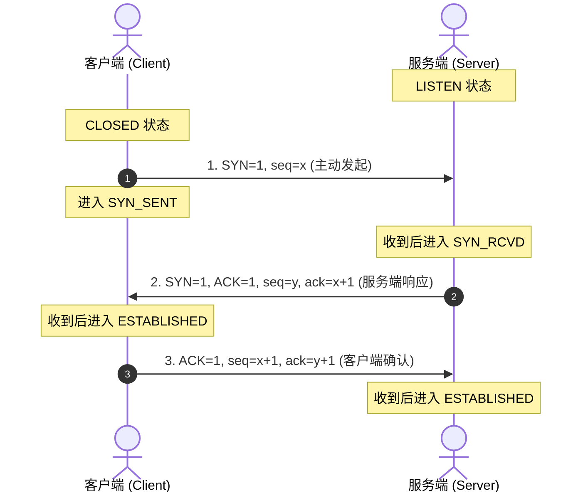
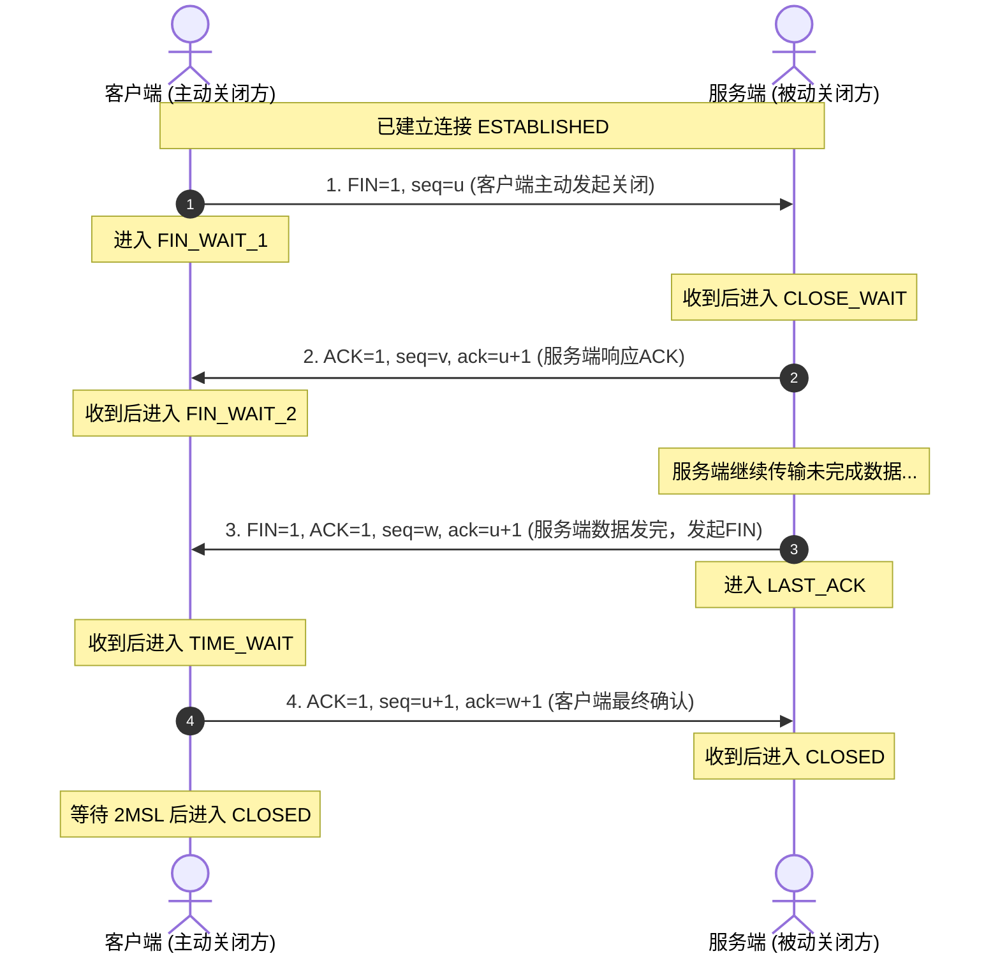

这是一套非常标准且高频的 **Java 后端开发技术面试真题**。以下为你整理的全套标准高分参考回答，兼顾**底层原理剖析**、**生产实战落地**与**面试表达逻辑**：

---

### 1. 请你先自我介绍一下

> **参考回答：**  
> “面试官您好，我叫万守洋，目前就读于河南农业大学软件工程专业，求职意向是 **Java 后端开发实习生**。  
> 在专业技能方面：
> 1. **Java 基础与并发**：扎实掌握 Java 核心集合、并发编程（线程池、ThreadLocal、AQS、CAS）与 JVM 内存模型、垃圾回收调优；
> 2. **主流框架与微服务**：熟练运用 Spring Boot 3、MyBatis-Plus，熟悉 Spring Cloud Alibaba 微服务体系（Nacos、Gateway、OpenFeign、Sentinel、Seata）；
> 3. **数据库与中间件**：深入理解 MySQL 索引底层结构、事务隔离、MVCC 与慢 SQL 调优；掌握 Redis 缓存治理方案（击穿/穿透/雪崩）及 Caffeine + Redis 多级缓存设计；熟悉 RabbitMQ 消息可靠投递、事务消息保障以及 Elasticsearch 全文检索。  
> 
> 在项目实践上：
> - 独立负责并落地过 **Novel 在线小说平台** 管理后台及高并发读写场景治理，通过多级缓存将高频读接口耗时从 45ms 降至 3ms，借助 Spring 事务同步器保证 MySQL 与 ES 的最终一致性；
> - 参与过 **万佳商城微服务电商系统** 的架构拆分与下单主链路研发，落地 Seata 分布式事务并基于 RabbitMQ 实现支付幂等与异步解耦。  
> 
> 平常我热爱钻研技术底层源码与工程规范，自驱力较强，非常期待能加入贵团队参与真实的生产业务开发。”

---

### 2. Java 泛型擦除是什么？

> **参考回答：**  
> 1. **定义**：Java 的泛型是**伪泛型**（编译期泛型）。在编译期，编译器会进行严格的类型安全检查，但在编译成 `.class` 字节码文件后，所有的泛型类型信息都会被**擦除**掉，替换为其上限（未指定时默认为 `Object`），并在必要的地方自动插入强制类型转换（`checkcast` 字节码指令）。
> 2. **为什么设计泛型擦除**：核心是为了**向前兼容**。Java 5 引入泛型时，为了兼容 Java 1.4 及更早版本的大量老库和字节码，没有选择像 C++ 模板那样在运行时生成具体类型的类。
> 3. **实际现象**：
>    - `List<String>` 和 `List<Integer>` 在运行期的 `getClass()` 是完全相等的，都是 `List.class`。
>    - 运行时通过反射可以绕过编译期检查，向 `List<Integer>` 中添加 `String`。
> 4. **元数据保留**：泛型擦除并非抹除了一切，类签名、方法签名中的泛型声明会保留在字节码的 `Signature` 属性中，运行期可以通过反射（如 `ParameterizedType`、`getGenericSuperclass()`）获取到这些泛型声明信息。

---

### 3. 线程池的核心参数和拒绝策略有哪些？

> **参考回答：**  
> `ThreadPoolExecutor` 的 **7 大核心参数**：
> 1. `corePoolSize`（核心线程数）：常驻线程数量，即便空闲也不会被销毁（除非设置了 `allowCoreThreadTimeOut`）。
> 2. `maximumPoolSize`（最大线程数）：线程池允许创建的最大线程总数。
> 3. `keepAliveTime`（空闲存活时间）：非核心线程空闲时的存活时间。
> 4. `unit`（时间单位）：存活时间单位（如 `TimeUnit.SECONDS`）。
> 5. `workQueue`（阻塞工作队列）：存放待执行任务的阻塞队列（如 `ArrayBlockingQueue`、`LinkedBlockingQueue`）。
> 6. `threadFactory`（线程工厂）：用于创建线程，通常自定义命名以方便排查日志。
> 7. `handler`（拒绝策略）：队列满且线程数达到最大时的拒绝处理策略。
>
> **任务提交流程**：
> 核心线程是否已满？$\to$ 未满则创建核心线程；$\to$ 已满则尝试加入阻塞队列；$\to$ 队列已满则创建非核心线程（直到 `maxPoolSize`）；$\to$ 依然无法容纳则触发拒绝策略。
>
> **JDK 内置的 4 大拒绝策略**：
> 8. `AbortPolicy`（默认）：直接抛出 `RejectedExecutionException` 异常。
> 9. `CallerRunsPolicy`：将任务交回提交该任务的主线程（调用者线程）直接同步执行。
> 10. `DiscardPolicy`：静默丢弃最新提交的任务，不报任何错误。
> 11. `DiscardOldestPolicy`：丢弃阻塞队列中最靠前（等待时间最久）的任务，并尝试重新提交当前任务。

---

### 4. 如果这一部分任务不可丢弃，你会采用什么策略和保底措施？

> **参考回答：**  
> 对于关键不可丢弃的任务（如支付回调通知、积分入账、审计流水），可以从**拒绝策略**与**持久化补偿机制**两层设计保底措施：
>
> 1. **拒绝策略选择 `CallerRunsPolicy`（调用者运行）**：
>    - 让主线程同步执行任务，主线程被占用后便无法继续接收新请求，从而向调用方施加**反压（Backpressure）**，自然降低上游流量的涌入速率。
> 2. **自定义拒绝策略 + 持久化落盘（DB / Redis / MQ）**：
>    - 自定义 `RejectedExecutionHandler`，当触发拒绝时，捕获任务的元数据，将其序列化后写入**数据库告警补偿表**或推送到 **RabbitMQ/Kafka 的死信/降级队列**。
>    - 配合定时任务（XXL-JOB）轮询补偿表中未执行成功的任务，在低峰期拉起重试。
> 3. **监控与熔断告警**：
>    - 在拒绝策略中集成 Micrometer/Prometheus 埋点打点，一旦触发拒绝阈值立即触发企业微信/钉钉告警，通知研发与运维介入扩容。
> 4. **架构升级思路**：
>    - 如果该任务极其核心且量大，不应只依赖进程内单机线程池，而应在业务入口处引入分布式消息队列（如 Kafka / RabbitMQ）做持久化削峰填谷。

---

### 5. 为什么会有核心线程数跟最大线程数这样的设定？

> **参考回答：**  
> 核心线程数与最大线程数的设计，是为了在**资源消耗**与**应对突发流量**之间取得最优平衡：
> 1. **常态节约资源**：线程在操作系统层面是重量级资源（每个线程默认分配 1MB 栈空间，且涉及内核态上下文切换）。平时业务流量处于低峰或常态时，只需维持 `corePoolSize` 几个常驻线程即可，避免盲目常驻过多线程造成内存浪费和 CPU 竞争。
> 2. **弹性应对突发峰值**：当出现短期突发流量时，任务短时间内积压打满工作队列，线程池能**动态向上弹性扩容**到 `maximumPoolSize`，利用非核心线程快速消化突发积压。
> 3. **为什么先入队再扩容**：因为创建线程需要申请操作系统资源，成本远高于将任务放进内存队列；因此线程池倾向于优先让任务排队等待，只有当排队也来不及消化时，才付出代价扩容线程。高峰过后，非核心线程会在空闲 `keepAliveTime` 后自动销毁，收缩回核心水位。

---

### 6. 设定核心线程数时会参考哪些指标？（QPS、CPU 还是其他？）

> **参考回答：**  
> 不能凭空拍脑袋，需要结合**计算公式初估 + 核心系统指标压测验证 + 动态调整**：
>
> 1. **任务类型初估**：
>    - **CPU 密集型**（加密、大批量计算、序列化）：线程数设为 `CPU 核心数 + 1`，减少线程上下文切换，`+1` 是为了在偶发缺页中断时保障 CPU 不空闲。
>    - **IO 密集型**（RPC 远程调用、数据库查询、第三方接口）：根据公式：
>      $$\text{线程数} = \text{CPU 核心数} \times \left(1 + \frac{\text{线程等待时间 IO}}{\text{线程计算时间 CPU}}\right)$$
>      通常可预设为 `2 * CPU 核心数`。
> 2. **结合业务指标反推**：
>    - **单机峰值 QPS 与任务平均 RT（响应时间）**：根据利特尔法则（Little's Law），并发线程数 $\approx \text{QPS} \times \text{RT}$。例如单机目标承受 500 QPS，每个任务耗时 40ms（0.04s），则理论并发线程需维持在 $500 \times 0.04 = 20$ 左右。
> 3. **硬件资源瓶颈校验**：
>    - 监控 CPU 使用率（理想在 60%~75%）、内存容量（防止线程过多或无界队列导致 OOM）、以及下游 DB/Redis 的连接池承载能力（不能因为线程池太猛把数据库连接池打满）。
> 4. **生产最佳实践**：
>    - 接入动态线程池框架（如开源的 **Dynamic-TP** 或 **Hippo4j**），无需重启服务即可通过配置中心动态调参，根据监控面板上的队列排队深度和活跃线程数在线微调。

---

### 7. 对 Python 有什么理解？用过哪些库或包？

> **参考回答：**  
> 1. **理解**：Python 是一门解释型、动态强类型的高级语言。语法极简优雅，生态极为丰富，尤其在 **AI 与大模型、数据分析、自动化脚本、网络爬虫** 领域具有不可替代的垄断级优势。
> 2. **常用库与框架**：
>    - **Web 开发**：FastAPI（高性能异步 ASGI 框架）、Flask（轻量级微服务接口开发）；
>    - **数据科学与处理**：NumPy（高效多维矩阵运算）、Pandas（结构化数据清洗分析）、Matplotlib/Seaborn（数据可视化）；
>    - **AI 与大模型生态**：PyTorch、Transformers（Hugging Face）、LangChain（大模型智能体与 RAG 链路搭建）；
>    - **网络爬虫与自动化**：Requests、BeautifulSoup4、Scrapy、Selenium；
>    - **系统与测试**：os, sys, asyncio, pytest。

---

### 8. Python 跟 Java 有什么区别？Python 更适合做哪些工具？

> **参考回答：**  
> 1. **语言特性与编译执行对比**：
>    - **类型系统**：Java 是**静态强类型**语言，编译期严格校验类型，大型项目重构与 IDE 代码跳转极其安全；Python 是**动态强类型**，变量无需声明类型，开发速度快但大型项目维护成本高。
>    - **执行效率与并发模型**：Java 先编译为字节码，运行时由 JVM 的 JIT（即时编译器）编译为高效机器码，配合真正利用多核的线程体系，执行效率和高并发吞吐量极高；Python 由解释器逐行执行，且 CPython 实现中有 **GIL（全局解释器锁）**，同一时刻仅允许一个线程执行字节码，更适合多进程或异步协程（asyncio）。
>    - **开发简易度**：Python “开箱即用”，几行代码就能完成文件解析或网络调用；Java 体系结构规范、工程化脚手架严密，但模板代码相对较多。
> 2. **Python 最适合做的工具场景**：
>    - **AI/LLM 辅助与 Agent 工具**：调用 OpenAI/DeepSeek/Gemini API，构建知识库 RAG、自动化数据处理；
>    - **自动化运维与数据抓取**：定时巡检脚本、日志清洗、网络爬虫数据采集；
>    - **快速原型验证与轻量级算法服务**：在正式开发 Java 大型架构前，用 FastAPI 快速验证算法逻辑和业务流程。

---

### 9. Spring AOP 的实现原理有哪两种？

> **参考回答：**  
> Spring AOP 底层基于**动态代理**，主要有两种实现方式：
> 1. **JDK 动态代理**：
>    - **原理**：基于 Java 原生反射包的 `java.lang.reflect.Proxy` 和 `InvocationHandler`。
>    - **前提**：目标类**必须实现了至少一个接口**。代理类会在内存中动态生成实现了同样接口的类，通过接口方法重写织入增强逻辑。
> 2. **CGLIB 动态代理**：
>    - **原理**：基于底层字节码操作框架（ASM）。
>    - **实现**：在内存中动态生成目标类的一个**子类**（Subclass），通过覆写父类的非 `final` 方法来实现增强拦截（利用 `MethodInterceptor`）。
>    - **前提**：目标类和目标方法**不能被 `final` 修饰**。
> 3. **Spring Boot 默认策略**：
>    - Spring Boot 1.x 默认如果类有接口走 JDK，无接口走 CGLIB；
>    - **Spring Boot 2.x/3.x 起默认全部走 CGLIB**（配置项 `spring.aop.proxy-target-class=true`），以统一代理行为，避免类型强转报错。

---

### 10. 你认为 AOP 的优势在于什么？

> **参考回答：**  
> 1. **核心优势：关注点分离（横向解耦）**：将与核心业务逻辑无关的通用技术支撑代码（横切关注点）与业务代码分离，符合单一职责原则和开闭原则。
> 2. **消除样板代码，提高开发效率与维护性**：无需在每个 Controller 或 Service 里重复编写事务提交回滚、入参出参打印、耗时统计等样板代码。
> 3. **极佳的非侵入性**：业务层完全无感知，随时可以通过修改切点配置或关闭切面来上下线某种横切功能。
> 4. **典型实战落地**：
>    - 声明式事务（`@Transactional`）；
>    - 统一权限校验与多端鉴权拦截；
>    - 接口执行耗时监控与链路追踪；
>    - 分布式锁（如基于 Redisson + 自定义 `@Lock` 注解 + SpEL 表达式）。

---

### 11. MySQL 有哪一些事务隔离级别？

> **参考回答：**  
> SQL 标准定义了 4 种事务隔离级别（隔离级别从低到高，并发性能从高到低）：
> 1. **读未提交（Read Uncommitted）**：
>    - 事务可以读取其他未提交事务修改的数据。
>    - 存在问题：**脏读**、不可重复读、幻读。
> 2. **读已提交（Read Committed, RC）**：
>    - 只能读取其他事务已经提交的数据。
>    - 解决：脏读；仍存在问题：**不可重复读**、幻读。（Oracle 等多数商业库默认）。
> 3. **可重复读（Repeatable Read, RR）**：
>    - 同一个事务内多次读取同一批数据，结果保持一致。
>    - 解决：脏读、不可重复读；**MySQL InnoDB 默认级别**。InnoDB 引擎通过 **MVCC + Next-Key Lock（临键锁）** 在当前读和快照读下基本解决了**幻读**问题。
> 4. **串行化（Serializable）**：
>    - 强制事务串行执行，读加共享锁，写加排他锁。
>    - 彻底解决所有并发读写问题，但并发性能极差，生产极少使用。

---

### 12. 什么是 MVCC？

> **参考回答：**  
> **MVCC（Multi-Version Concurrency Control，多版本并发控制）** 是 InnoDB 存储引擎实现高效**读写并发（读不加锁，读写不冲突）**的核心机制，主要应用于 RC 和 RR 隔离级别的快照读（普通 `SELECT`）。
>
> **底层实现依赖三大核心要素**：
> 1. **隐藏字段**：InnoDB 会在每行聚簇索引记录后隐式增加两个核心字段：
>    - `DB_TRX_ID`：最近一次修改/插入该记录的事务 ID；
>    - `DB_ROLL_PTR`：回滚指针，指向该记录在 Undo Log 中的历史版本。
> 2. **Undo Log 版本链**：
>    - 每次对数据行进行修改时，旧数据会被写入 Undo Log，并通过 `DB_ROLL_PTR` 串联成一条从新到旧的**历史版本链**。
> 3. **Read View（一致性读视图）**：
>    - 事务执行快照读时会生成一个 Read View 快照，核心包含 4 个属性：
>      - `m_ids`：当前系统中活跃（未提交）的事务 ID 列表；
>      - `min_trx_id`：当前活跃事务中最小的事务 ID；
>      - `max_trx_id`：系统即将分配给下一个事务的 ID（最大事务 ID + 1）；
>      - `creator_trx_id`：创建当前 Read View 的事务 ID。
>    - **可见性判断规则**：对比记录的 `DB_TRX_ID`：若小于 `min_trx_id` 或等于 `creator_trx_id`，可见；若大于等于 `max_trx_id`，不可见；若在区间内且在 `m_ids` 中，说明未提交不可见，顺着版本链继续往后找。
>
> **RC 与 RR 在 MVCC 上的核心区别**：
> - **RC**：每次执行 `SELECT` 语句都会**重新生成**一个新的 Read View（能读到别人刚提交的改动，导致不可重复读）；
> - **RR**：仅在事务开始后**第一次**执行 `SELECT` 时生成 Read View，整个事务生命周期复用同一个 Read View，从而保证了可重复读。

---

### 13. 开发了一条 SQL，准备上线前如何判断它的执行计划？

> **参考回答：**  
> 1. **执行命令**：使用 `EXPLAIN` 或 `EXPLAIN ANALYZE`（MySQL 8.0 提供真实执行耗时分析）加在 SQL 前分析执行计划。
> 2. **核心关注的关键字段**：
>    - **`type`（访问类型）**：衡量查询性能最直观指标，从优到劣依次为：
>      $$\text{system} > \text{const} > \text{eq\_ref} > \text{ref} > \text{range} > \text{index} > \text{ALL}$$
>      **生产红线**：严禁出现 `ALL`（全表扫描），查询应尽量达到 `ref`（普通非唯一索引匹配）或至少 `range`（索引范围扫描）。
>    - **`key` 与 `possible_keys`**：
>      - `possible_keys`：可能命中的候选索引；
>      - `key`：实际命中的索引。需核实是否走错索引（必要时使用 `FORCE INDEX`）。
>    - **`key_len`（实际使用索引长度）**：用来判断联合索引具体生效了几个字段（例如 3 字段联合索引，是否由于范围查询导致后序字段失效）。
>    - **`rows`**：InnoDB 预估需要扫描的行数，数值越小越好。
>    - **`Extra`（额外核心信息）**：
>      - 优：`Using index`（命中覆盖索引，无需回表聚簇索引查询）；`Using index condition`（索引下推 ICP，减少回表）。
>      - 警惕：`Using filesort`（使用了内存/磁盘外部排序，没有利用索引顺序，需优化索引排序）；`Using temporary`（使用了临时表，常见于 `GROUP BY` 或 `DISTINCT` 字段无索引）；`Using where`（回表过滤）。

---

### 14. Redis 缓存穿透、击穿、雪崩区别？什么情况下会出现穿透？如何解决？

> **参考回答：**  
> 1. **概念对比**：
>    - **缓存穿透**：请求的数据在 **Redis 和数据库中都完全不存在**。每次请求都会穿透缓存直冲数据库。
>    - **缓存击穿**：单个**高并发热点 Key** 突然过期失效（或被误删），瞬间大量并发请求直接打到 DB。
>    - **缓存雪崩**：**大量 Key 在同一时间集中过期**，或者 **Redis 节点整机宕机**，导致全量流量全部涌向 DB 导致崩溃。
> 2. **缓存穿透出现的场景**：
>    - 恶意攻击/爬虫：黑客扫描不存在的负数 ID（如 `id = -1`）或随机生成的非法 UUID；
>    - 业务数据被误物理删除，但前端或下游服务仍在持续高频调用。
> 3. **缓存穿透治理方案**：
>    - **接口层前置校验**：参数基本校验（正则过滤非数字、ID 范围限制、鉴权拦截）；
>    - **缓存空对象（Cache Null）**：查询 DB 结果为空时，依然将该 Key 写入 Redis，Value 设为 `""` 或特定占位符，并设置较短的过期时间（如 30~60 秒）；
>    - **布隆过滤器（Bloom Filter）**：在访问 Redis 之前加一层布隆过滤器（如 Redisson 的 `RBloomFilter`），将所有合法 ID 初始化加载至位图。若布隆过滤器判定不存在，则该数据一定不存在，直接阻断返回。

---

### 15. 用 Docker 和 K8s 搭过什么东西吗？

> **参考回答：**  
> 1. **Docker 实践**：
>    - **本地及测试环境依赖一键交付**：通过 Docker 容器化部署 MySQL 8.0（挂载数据卷与配置文件）、Redis 7.0、RabbitMQ（开启 Management 插件）、Nacos、Elasticsearch 8.x + Kibana 等中间件，极大节约了团队多环境配置成本。
>    - **业务镜像打包**：编写基于多阶段构建（Multi-stage build）的 `Dockerfile`，将 Spring Boot 项目构建成轻量级的基础 Alpine/Debian-slim 运行时镜像，并编写 `docker-compose.yml` 实现多服务编排联调。
> 2. **K8s 实践**：
>    - **业务微服务交付**：使用 `Deployment` 部署无状态的 Spring Boot 微服务，配置 `replicas` 多副本实现高可用与滚动升级（RollingUpdate）；
>    - **服务发现与负载均衡**：通过 `Service`（ClusterIP / NodePort）暴露内部通信网络，配合 Ingress 做域名解析和外网 HTTP 流量路由；
>    - **配置分离**：使用 `ConfigMap` 管理环境变量与配置，使用 `Secret` 管理数据库密码等敏感信息；
>    - **健康检查探针**：配置 `livenessProbe`（存活探针）与 `readinessProbe`（就绪探针），结合 Spring Boot Actuator 的 `/actuator/health` 实现容器故障自愈与优雅上下线。

---

### 16 & 17. TCP 三次握手与四次挥手过程、顺序、发起方与接收方

> **参考回答：**  
>
> #### (1) 三次握手（建立连接）

> - **第一步**：客户端（主动发起方）发送连接请求报文，标志位 `SYN=1`，随机初始化序列号 `seq=x`。客户端进入 `SYN_SENT` 状态；
> - **第二步**：服务端（接收方）接收并同意建立连接，回复标志位 `SYN=1, ACK=1`，确认号 `ack=x+1`，同时生成自己的随机序列号 `seq=y`。服务端进入 `SYN_RCVD` 状态；
> - **第三步**：客户端发送确认，标志位 `ACK=1`，确认号 `ack=y+1`，序号 `seq=x+1`。客户端进入 `ESTABLISHED` 状态；服务端收到该报文后也进入 `ESTABLISHED`。
> - **为什么必须是三次**：防止已失效的历史连接请求报文突然传到服务端引发错误建立；同时三次是双方互相确认彼此具备收发能力的**最小次数**。
>
> #### (2) 四次挥手（断开连接）

> - **第一步**：客户端（通常客户端发起，但两端均可）发出的释放连接报文，标志位 `FIN=1, seq=u`。客户端进入 `FIN_WAIT_1`；
> - **第二步**：服务端回复确认，`ACK=1, seq=v, ack=u+1`。服务端进入 `CLOSE_WAIT`（半关闭状态，通知应用层准备释放资源）；客户端收到后进入 `FIN_WAIT_2`；
> - **第三步**：服务端完成剩余数据发送后，向客户端发送释放报文，`FIN=1, ACK=1, seq=w, ack=u+1`。服务端进入 `LAST_ACK`；
> - **第四步**：客户端收到释放报文后发出最终确认，`ACK=1, seq=u+1, ack=w+1`。客户端进入 `TIME_WAIT` 状态，必须等待 **2MSL**（最大报文生存时间）后才彻底进入 `CLOSED`；服务端收到该 ACK 后立即进入 `CLOSED`。
> - **为什么挥手比握手多一次**：因为连接建立时，服务端的 SYN 和 ACK 是一起合并发送的；而断开连接时，服务端收到 FIN 只代表对方不再发送数据，但服务端可能还有待发送的业务数据，所以 ACK 和 FIN 必须**分两步**发出。

---

### 18. 你平常刷力扣吗？算法基础如何？

> **参考回答：**  
> “是的，我日常有规律地在力扣刷题，目前主要针对高频核心题型（如 LeetCode Hot 100、《剑指 Offer》、代码随想录）进行专项训练。重点掌握了链表、二叉树遍历与重构、双指针、滑窗、回溯、动态规划以及贪心算法等经典解法，注重算法在时间与空间复杂度上的权衡，以及编写边界条件时的健壮性。”

---

### 19. 贪心算法的整体思想是什么？

> **参考回答：**  
> 1. **核心思想**：在每一步进行选择决策时，都采取在当前状态下**最好或最优（局部最优）**的选择，期望通过每一步的局部最优推导出最终的**全局最优**。
> 2. **适用两大前提**：
>    - **贪心选择性质**：所求问题的整体最优解可以通过一系列局部最优的选择来达到；
>    - **最优子结构**：问题的最优解包含其子问题的最优解。
> 3. **贪心 vs 动态规划**：
>    - 动态规划（DP）会保存所有子状态的历史结果，具有“备忘录/后效性考量”，在选择时会综合权衡各个子问题的结果，并能通过状态转移“反悔”；
>    - 贪心算法是一旦做出局部最优选择便不可回退，走单行道。
> 4. **经典题型**：区间重叠问题（435. 无重叠区间）、分发饼干（455）、跳跃游戏（55）、零钱兑换（面额倍数特定情况）、最小生成树 Kruskal/Prim 算法、单源最短路 Dijkstra 算法。

---

### 20. 湖州研究院项目中 Spring Event 消息解耦写的近万 QPS，这个是 Kafka 吗？

> **参考回答：**  
> “面试官您看得很仔细，这里需要澄清一下底层的技术架构：
> 1. **Spring Event 是进程内的事件机制，不是 Kafka**：
>    - Spring Event（`ApplicationEventPublisher` 与 `@EventListener`）是 Spring 框架提供的**单 JVM 进程内**事件发布/订阅机制。它本质是观察者模式的内存实现，不支持跨节点、跨机器的消息投递，因此它不是分布式的 Kafka。
> 2. **近万 QPS 的真实落地架构**：
>    - 实际业务背景中，外部上报流量在入口网关处通过 Nginx / 网关集群进行负载均衡，均摊到后端的服务实例上；
>    - 单实例在接收到外部设备或业务的高频上报后，为了保证 HTTP 接收链路的极致吞吐（RT 控制在毫秒级）， Controller 只做入参校验和打包，然后通过 **Spring Event（结合 `@Async` 或内存队列 Disruptor）** 将事件发布给在内存中排队的异步监听器，实现**在同一个应用进程内部把主线程接入与耗时的业务逻辑（如指标聚合、审计校验、异步持久化）彻底解耦**；
>    - 如果是跨节点的大规模分布式数据削峰，集群层外部是由 Kafka / 消息中间件承载的，而 Spring Event 承担的是节点单机内存内部的模块间解耦。”

---

### 21. MQTT 用的是哪一个厂商？MQTT 服务器选型？

> **参考回答：**  
> 1. **主流厂商与开源产品**：在 IoT 物联网与边缘计算场景中，国内最常用的开源/商业厂商是 **EMQ（杭州映云科技）旗下的 EMQX**。
> 2. **为什么选 EMQX**：
>    - 底层基于 Erlang/OTP 语言构建，高并发与容错能力极强，单节点即可支撑百万级并发连接，支持分布式集群横向扩容；
>    - 自带强大的规则引擎（Rule Engine），可以以极低的开发成本将 MQTT Topic 中的数据实时清洗并直接转发至 Kafka、MySQL 或 Redis；
> 3. **备选选型**：
>    - 轻量级场景可用 **Eclipse Mosquitto**（单 C 编写，极致轻量，适合单机/边缘网关）；
>    - 云厂商托管方案常用 **阿里云 IoT 物联网平台** / **腾讯云 IoT Hub**；
>    - 现有架构复用方案：也可以直接在 **RabbitMQ** 中启用 `rabbitmq_mqtt` 插件提供 MQTT 协议接入支持。

---

### 22. 第一段实习优化核心业务表 SQL，这个业务表的数量级多大？

> **参考回答：**  
> “当时优化的核心业务表（例如订单明细表/业务流水日志表）单表数据量级在 **800 万到 1500 万行（千万级左右）**，单表磁盘空间占用了数十个 GB。在业务发展到这个体量时，由于早期索引设计不合理以及复杂的连表查询，慢 SQL 频发，在高峰期引发了严重的性能瓶颈。”

---

### 23. 它的哪些 SQL 慢？连表查询为什么慢？

> **参考回答：**  
> 主要慢在**多条件组合筛选的分页查询**和**多表 JOIN 查询**：
> 1. **深分页结合范围排序**：
>    - 例如后台管理列表查询：`SELECT * FROM order_info WHERE tenant_id = 101 AND status IN (1,2) AND create_time >= '2026-01-01' ORDER BY update_time DESC LIMIT 100000, 20`。
>    - 由于原表只有针对单列的零散索引，无法覆盖所有条件，导致索引遇范围查询失效，执行计划中出现 `Using filesort` 和大偏移量下的全量回表，扫描上百万行。
> 2. **为什么连表查询慢**：
>    - **连接字段缺失有效索引**：主表和被驱动表 JOIN 时，被驱动表的连接关联字段没有建立索引，导致 MySQL 无法走 Index Nested-Loop Join，退化为 **Block Nested Loop（BNL）或 Hash Join**，在内存中进行笛卡尔积式的大量比对；
>    - **字段类型或字符集隐式转换**：两张表的 `user_id` 一个是 `varchar(64) utf8mb4`，另一个是 `varchar(64) utf8`，或者类型一个为 bigint 一个为 varchar，导致关联字段无法利用索引而走全表扫描；
>    - **滥用 `SELECT *` 导致回表 IO 剧增**：无法利用覆盖索引（Covering Index），导致多表关联后产生海量的聚簇索引随机回表查询。

---

### 24. 它慢到什么程度？

> **参考回答：**  
> “在优化前，在高峰期或者查询历史范围数据时，单次 SQL 查询耗时普遍在 **3 秒到 8 秒**。极端情况下如果遇到用户翻到几十页之后，接口直接触发网关配置的 10 秒超时（返回 HTTP 504）。同时慢查询长时间霸占数据库连接，导致 Druid 数据库连接池被打满，CPU 占用率飙升到 85% 以上，频繁触发系统告警。”

---

### 25. 联合索引做完之后，实际效果如何？

> **参考回答：**  
> 优化的关键动作是结合最左前缀原则建立覆盖索引 `(tenant_id, status, create_time, update_time)`，并重构 SQL 消除深分页（采用子查询延迟关联 `JOIN (SELECT id FROM ... LIMIT ...)`）：
> - **执行时间**：从原先的 **3s~8s 骤降到 15ms~30ms**（提速数百倍），接口响应恢复在百毫秒内；
> - **扫描行数（`rows`）**：由百万级全表扫描降至几十行；
> - **执行计划变化**：`type` 从 `ALL` 优化为 `ref` 或 `range`；`Extra` 中的 `Using filesort` 和 `Using temporary` 彻底消除，大部分命中覆盖索引显示 `Using index`；
> - **集群稳定性**：数据库 CPU 利用率回落至 15%~25% 的健康水位，连接池打满告警彻底解除。

---

### 26. 项目组技术栈和业务介绍（如何标准陈述）

> **参考回答模板：**  
> - **业务背景**：例如专注在在线数字阅读与电商交易领域，覆盖前台用户浏览购买、创作者内容发布、后台运营审核与数据沉淀四大业务闭环；
> - **技术架构全貌**：
>   - **架构分层**：基于 Spring Boot 3 与 Spring Cloud Alibaba 演进微服务架构，以 Spring Cloud Gateway 作为流量统一入口；
>   - **存储与缓存**：以 MySQL 8 作为主关系库，结合 Redis 搭建多级缓存降低读压力，以 Elasticsearch 支撑亿级文本分词全文检索；
>   - **异步与高可用**：通过 RabbitMQ 实现异步解耦与削峰，集成 Sentinel 实现服务熔断与流控排队，引入 Seata 保证分布式事务一致性。

---

### 27. 反问环节（向面试官提问）

> **优质反问问题示例（体现求知欲与专业度，任选 2~3 个）：**  
> 1. “请问贵团队目前承接的核心业务，近期最大的技术挑战或架构演进方向是什么？”  
> 2. “如果我有幸能进入团队实习，在入职前您建议我在哪一块技术栈或业务领域做更针对性的提前储备？”  
> 3. “请问团队对实习生的培养机制是怎样的？日常会有针对性的 Code Review 和技术分享吗？”

---

### 28. ES 怎么同步？（Elasticsearch 与 MySQL 的同步方案）

> **参考回答：**  
> 生产中 ES 与 MySQL 的数据同步主要有 3 种主流架构方案：
>
> 1. **基于 MySQL Binlog 的 CDC 实时捕获（推荐，业务零侵入）**：
>    - 使用 **Canal** 或 **Flink CDC / Debezium** 伪装成 MySQL 从节点，监听并解析 MySQL 的 `binlog` 变更日志；
>    - 监听到数据变动后投递到 Kafka/RabbitMQ，消费者消费消息调用 ES 的 Bulk API 进行批量更新。
>    - **优势**：与业务系统完全解耦，即便业务有外部直接改库也能捕捉到。
> 2. **业务异步双写 / MQ 消息同步（简单高效）**：
>    - 在业务代码中完成 MySQL 保存后，通过 MQ 发送异步消息通知 ES 消费同步；
>    - **细节保障**：必须借助 **Spring 事务同步器（`TransactionSynchronizationManager.registerSynchronization`）**，确保 MySQL 事务真正 `afterCommit` 成功后再向 MQ 发消息，防止事务未提交 MQ 提前消费导致读到脏数据或事务回滚后脏写 ES。
> 3. **定时全量/增量批处理兜底**：
>    - 借助 **XXL-JOB / Logstash**，在夜间低峰期基于时间戳（`updated_time >= last_sync_time`）按游标分批分页拉取数据，调用 ES `_bulk` API 进行增量兜底校验，修复 MQ 异常导致的数据丢失。

---

### 29. 模糊查询为什么不用 ES？

> **参考回答：**  
> 虽然 ES 是搜索利器，但在部分模糊查询场景下不用 ES，是基于**架构代价、数据一致性与查询特征**的综合考量：
> 1. **数据一致性与延迟问题（NRT 近实时）**：
>    - ES 写入后存在默认 `1s` 的 Refresh 刷新间隔，属于近实时系统；而管理后台的一些强一致性业务（如修改完商品后立即精准查询核对）对实时性要求极高，用 ES 可能会由于主从/索引刷新延迟查出旧数据。
> 2. **左前缀匹配场景下 MySQL 已经极快**：
>    - 类似 `order_sn LIKE 'ORD2026%'` 这种带有**固定左前缀**的模糊匹配，MySQL 的 B+ 树索引依然能够命中索引范围扫描（`range`），耗时通常在数毫秒内，无需额外增加 ES 依赖。
> 3. **ES 对通配符 Wildcard/模糊查询代价高昂**：
>    - ES 擅长的是**分词全文检索（Full-Text Match）**。如果面对没有语义规则的纯字符串任意位置子串模糊匹配（如 `*abc*`），ES 底层必须扫描大量的倒排索引词条甚至退化为遍历，极其消耗内存，容易引起集群 GC 甚至 OOM。
> 4. **维护成本与架构复杂度**：
>    - 维护 ES 集群需要考虑磁盘、内存（JVM 堆内外）、分片数、数据同步链路与运维成本，低频轻量的简单查询没必要过度设计。

---

### 30. MySQL 读写分离在代码里到底怎么实现？

> **参考回答：**  
> 核心实现机制分为两大派系：**框架层动态数据源路由** 与 **中间件代理路由**：
>
> 1. **框架层实现：基于 Spring `AbstractRoutingDataSource` + AOP 自定义注解**：
>    - **数据源定义**：配置两个或多个 `DataSource`（一个 Master 负责写，若干个 Slave 负责读）；
>    - **上下文管理**：利用 `ThreadLocal` 维护当前线程需要绑定的数据源 Key（如 `MASTER` / `SLAVE`）；
>    - **继承核心类**：继承 Spring 的 `AbstractRoutingDataSource`，覆写其 `determineCurrentLookupKey()` 方法，从 `ThreadLocal` 中取出 Key 返回；
>    - **AOP 织入**：自定义 `@Master`、`@Slave` 注解，通过 AOP 切面在进入 Service/Mapper 方法前根据读写属性将对应 Key 放入 `ThreadLocal`，方法执行完毕后（`finally` 块）必须 `remove` 清理。
> 2. **中间件代理方案（如 ShardingSphere-JDBC / MyCat）**：
>    - 代码中无需编写任何注解或动态数据源逻辑，应用只当连接一个逻辑数据源；
>    - ShardingSphere-JDBC 会在 SQL 执行阶段进行 SQL 解析：如果是 `SELECT` 则路由给从库，如果是 `INSERT/UPDATE/DELETE` 则路由给主库；若处于同一个事务内（`@Transactional`），为防止主从延迟导致读取不一致，会自动将后续读请求强制路由给主库。

---

### 31. Spring Boot 怎么启动的？核心流程是什么？

> **参考回答：**  
> Spring Boot 启动从 `SpringApplication.run(Application.class, args)` 开始，核心分为**初始化创建 `SpringApplication`** 和 **执行 `run()` 两个阶段**：
>
> 1. **初始化 `SpringApplication` 对象**：
>    - 推断应用类型（是否为 Servlet Web 环境）；
>    - 利用 SPI（`spring.factories` / Spring 3.x 声明式组件）加载所有的 `ApplicationContextInitializer`（初始化器）和 `ApplicationListener`（事件监听器）。
> 2. **执行 `run()` 方法阶段（核心链路）**：
>    - **启动监听与计时**：启动 StopWatch 计时器，发布 `ApplicationStartingEvent`；
>    - **准备环境（`prepareEnvironment`）**：加载解析外部配置（`application.yml/properties`、系统环境变量、命令行参数），发布 `ApplicationEnvironmentPreparedEvent`；
>    - **创建容器（`createApplicationContext`）**：根据推断的类型，实例化对应的 IoC 容器（如 Web 环境实例化 `AnnotationConfigServletWebServerApplicationContext`）；
>    - **准备上下文（`prepareContext`）**：将环境注入容器，执行所有 Initializer 的初始化逻辑，注册主启动类 Bean 定义；
>    - **核心刷新容器（`refreshContext`）**：
>      - 调用 Spring 核心父类 `AbstractApplicationContext.refresh()` 方法；
>      - 执行 `BeanFactoryPostProcessor`（解析 `@Configuration`、`@ComponentScan`、加载 `AutoConfiguration` 自动装配类）；
>      - **在 `onRefresh()` 阶段启动内嵌 Web 容器**（如创建并启动内嵌 Tomcat/Jetty 服务器）；
>      - 实例化并初始化所有的单例 Bean（依赖注入、AOP 代理创建）；
>    - **收尾与扩展通知**：
>      - 遍历回调所有的 `ApplicationRunner` 和 `CommandLineRunner` 接口；
>      - 发布 `ApplicationReadyEvent`，Spring Boot 启动完成。

---

### 32. Nacos 多实例怎么保证一致性？

> **参考回答：**  
> Nacos 是一个支持 **AP（可用性优先）** 和 **CP（一致性优先）** 动态切换的双模式架构：
>
> 1. **服务注册发现的临时实例（默认）：采用 AP 模式（Distro 协议）**：
>    - **原理**：Distro 是阿里自研的高性能对等去中心化一致性协议。
>    - **机制**：
>      - 各节点地位对等，实例可以向任意一个 Nacos 节点注册；
>      - 节点接收到注册后，先将数据写入本地内存，并以异步方式广播同步给集群中其他 Nacos 节点；
>      - 节点间定期发送心跳校验机制，同步数据差集；优先保障写入低延迟和集群高可用。
> 2. **持久化服务实例：采用 CP 模式（Raft 协议）**：
>    - 如果注册为非临时（持久化）实例，Nacos 会采用 **JRaft 协议** 保证强一致性。
>    - 选举出唯一的 Leader 节点处理写入请求，Leader 通过日志复制（两阶段提交 WAL）给大多数 Follower 节点，确认过半写入成功才返回提交。
> 3. **配置中心的一致性**：
>    - 配置持久化存储于外置的 **MySQL 高可用集群** 中；各 Nacos 节点从集中式 DB 获取最新配置，并通过客户端长轮询（Long Polling）与 MD5 校验码机制保障客户端与服务端配置的一致推送。

---

### 33. Redis 挂了怎么办？

> **参考回答：**  
> 必须从**集群高可用架构、服务兜底降级、数据灾备恢复**多层次设防：
>
> 1. **集群层容灾（自愈能力）**：
>    - **主从 + 哨兵（Sentinel）模式**：监控主节点健康状态，当 Master 宕机后，哨兵自动选举 Slave 晋升为新的 Master，自动完成故障转移；
>    - **Redis Cluster 分片集群**：数据分片存储在多个 Master 上，当某个 Master 宕机时，其对应的 Slave 会自动被选举替代，保障整个集群持续可用。
> 2. **应用层服务熔断与多级缓存（防止系统被冲垮）**：
>    - **本地内存缓存兜底**：引入本地缓存（如 Caffeine），重要静态字典数据在本地常驻，Redis 挂了依然可以通过本地缓存响应；
>    - **限流降级（Sentinel / Resilience4j）**：一旦监测到 Redis 调用超时或报错比例升高，立即触发熔断降级，对非核心接口返回默认兜底值，阻断流量穿透到 MySQL，防止数据库连锁雪崩。
> 3. **数据恢复机制**：
>    - 依靠持久化机制（**RDB 快照 + AOF 增量日志** 每秒刷盘）；
>    - 机器重启后自动通过 AOF 重放恢复绝大部分数据，随后从节点向主节点触发全量复制（RDB 同步）与增量 Buffer 同步。

---

### 34. OOM 怎么定位排查？

> **参考回答：**  
> 生产环境排查 JVM OOM 遵循标准的 **“保留现场 $\to$ 观测定位 $\to$ 堆转储分析 $\to$ 代码修复”** 四步法：
>
> 1. **第一步：配置参数预先保留现场**：
>    - 生产环境 JVM 必须配置以下关键参数：
>      ```bash
>      -XX:+HeapDumpOnOutOfMemoryError 
>      -XX:HeapDumpPath=/data/logs/heapdump.hprof
>      ```
>      确保服务一旦发生 OOM 崩溃时，自动将内存快照导出到指定目录。
> 2. **第二步：现场快速排查（排查是否为外部 OOM）**：
>    - 使用 `dmesg -T | grep -i oom` 或 `cat /var/log/messages` 查看是否是因为物理机内存不足，被 Linux 操作系统的 **OOM Killer** 强行杀掉进程；
>    - 若服务未彻底死掉，使用命令行工具查看实时概况：
>      - `jstat -gcutil <pid> 1000 10`：查看新生代、老年代（O）、元空间（M）的使用率与 Full GC 触发频率；
>      - `jmap -histo:live <pid> | head -n 20`：查看内存中占用对象数和字节数最多的前 20 个类。
> 3. **第三步：离线深度分析 Dump 文件**：
>    - 将导出的 `heapdump.hprof` 下载到本地，使用 **Eclipse MAT（Memory Analyzer Tool）** 或 **JProfiler** 打开；
>    - **看 Leak Suspects（内存泄露疑点报告）**：MAT 会自动分析出占用内存超过特定百分比（如 30%+）的可疑对象；
>    - **看 Dominator Tree（支配树）**：定位具体是哪个大对象或集合持有了海量内存；
>    - **沿 GC Roots 溯源引用链**：沿着引用链向上追溯，找出到底是被哪段业务代码、哪个单例 Bean 或哪条线程强引用无法被回收。
> 4. **第四步：常见根因排查与修复**：
>    - **ThreadLocal 忘记清理**：线程池复用导致线程私有 Map 长期持有大对象；
>    - **数据库无分页慢查询**：一次性查出上百万条记录封装为 List 撑爆堆内存；
>    - **静态集合/本地缓存未设上限**：未设置淘汰策略（如不断向无边界的 `ConcurrentHashMap` 中写入数据）；
>    - **IO/文件流未正确关闭**：海量文件上传未走流式传输，在内存中构建完整 byte 数组。