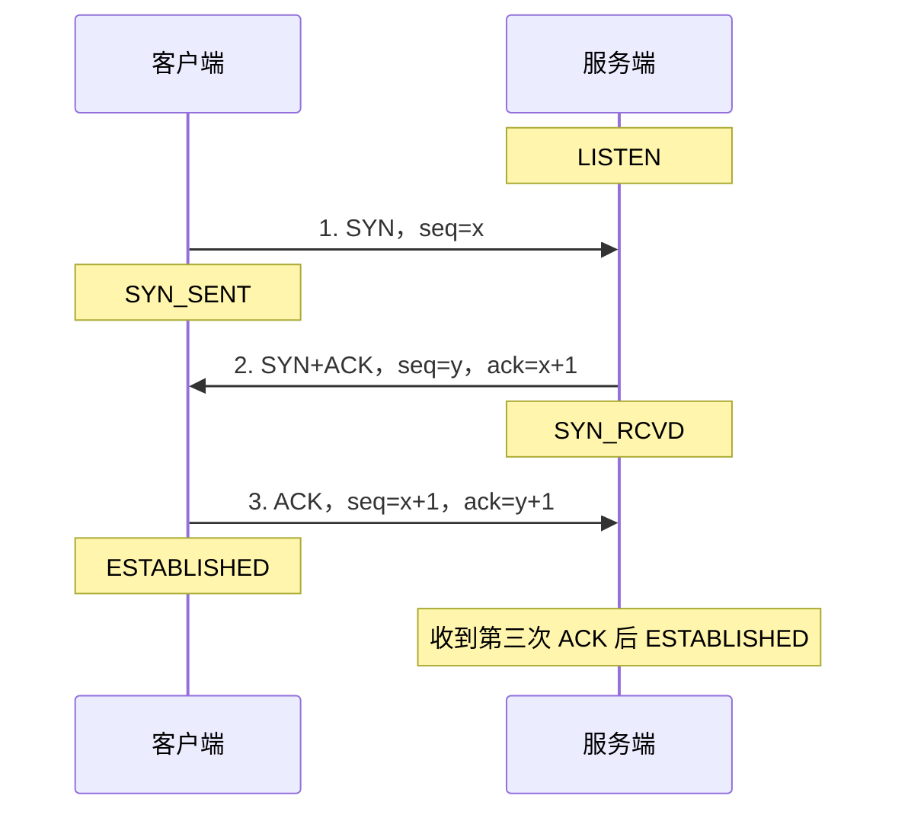
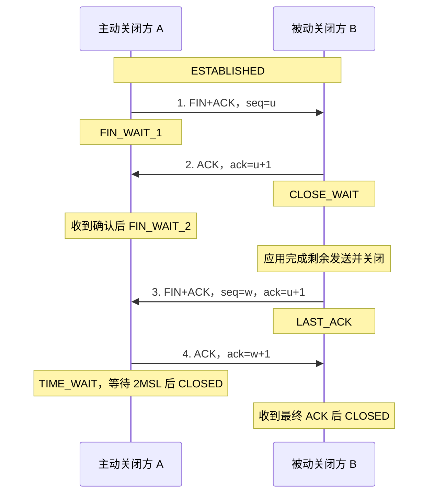

# 面试题与参考答案

> [!info] 阅读方式
> 共 34 题：点击每题后的“查看答案”跳转；答案开头可“返回原题”。第 16、17 题合并讲解，末尾“关联复习”可串联相关知识点。

> [!warning] 经历与示例要区分
> 所有【】均须按真实经历填写。项目表规模、耗时、QPS、Broker 厂商等未经核实，不作为现成的个人履历；代码和 SQL 示例用于解释原理，不代表已经在你的项目中实现或实测。

## 前言

无手撕环节，面试官态度极好，整场面试下来很舒服，在遇到难的问题也会进行旁敲侧击的提示，腾讯会议视频形式

## 面试问题

面试题（Time:40min）：

1. 请你先自我介绍一下 → [[#1. 请你先自我介绍一下|查看答案]] ^q01

2. 那我先问一些简单的问题吧，比如说那个Java会有泛型擦除是什么？ → [[#2. Java 泛型擦除是什么？|查看答案]] ^q02

3. 了解过并发的线程池的一些核心参数和拒绝策略吗？ → [[#3. 线程池的核心参数和拒绝策略有哪些？|查看答案]] ^q03

4. 那正常来说，比如说这一部分任务是不可丢弃的，那你会采用什么样的策略，加一个什么样的，就比如说保底措施，来保证这个任务失败的时候不被丢弃，然后正常在运行。 → [[#4. 如果这一部分任务不可丢弃，你会采用什么策略和保底措施？|查看答案]] ^q04

5. 然后我想问你一下，就是为什么核心线程数跟最大线程数，它为什么会有这样的一个设定? → [[#5. 为什么会有核心线程数跟最大线程数这样的设定？|查看答案]] ^q05

6. 比如说你一般设定核心线程数，你会参考哪一些指标？就比如说你会考虑就是普通的一些正常的qps或者最大qps或者是实例的cpu 吗？ → [[#6. 设定核心线程数时会参考哪些指标？（QPS、CPU 还是其他？）|查看答案]] ^q06

7. 你对Python有一些什么理解？比如说你用过一些 Python的什么库或者包吗？ → [[#7. 对 Python 有什么理解？用过哪些库或包？|查看答案]] ^q07

8. Python 跟 Java 有什么区别吗？就它们的语言特性或者是一些编译的简易度上，你认为Python 更适合做一些什么什么工具? → [[#8. Python 跟 Java 有什么区别？Python 更适合做哪些工具？|查看答案]] ^q08

9. 然后我想问一下你就是AOP吧，Spring AOP的实现原理是有哪两种？ → [[#9. Spring AOP 的实现原理有哪两种？|查看答案]] ^q09

10. 你认为AOP的优势在于什么？ → [[#10. 你认为 AOP 的优势在于什么？|查看答案]] ^q10

11. 我问一下那个mysql吧，mysql有哪一些事务隔离级别？ → [[#11. MySQL 有哪一些事务隔离级别？|查看答案]] ^q11

12. MVCC是什么？ → [[#12. 什么是 MVCC？|查看答案]] ^q12

13. 那我问一下那个，比如说你现在开发了一条 SQL，你要上线，你怎么判断这条SQL的执行计划？ → [[#13. 开发了一条 SQL，准备上线前如何判断它的执行计划？|查看答案]] ^q13

14. 然后那我问一下那个Redis常见的三个三个问题吧，就是缓存穿透跟缓存击穿跟雪崩，你能讲一下就什么情况下会出现穿透吗? → [[#14. Redis 缓存穿透、击穿、雪崩区别？什么情况下会出现穿透？如何解决？|查看答案]] ^q14

15. 你有了解过那个你用Docker跟K8s搭过什么东西吗？就比如说数据库Redis还是什么。 → [[#15. 用 Docker 和 K8s 搭过什么东西吗？|查看答案]] ^q15

16. 你能讲一下那个TCP的三次握手四次挥手的过程吗？ → [[#16 & 17. TCP 三次握手与四次挥手过程、顺序、发起方与接收方|查看答案]] ^q16

17. 能清楚的讲一下顺序吗？由谁发起，由谁接受这样 → [[#16 & 17. TCP 三次握手与四次挥手过程、顺序、发起方与接收方|查看答案]] ^q17

18. 我看了一下你的简历里面有一些数据结构与算法的一些描述，你平常是刷力扣吗? → [[#18. 你平常刷力扣吗？算法基础如何？|查看答案]] ^q18

19. 那我直接问到那个贪心的，它的一个思路是什么？回答一下贪心算法它的一个整体的思想 → [[#19. 贪心算法的整体思想是什么？|查看答案]] ^q19

20. 项目里面的，我看你的那个湖州研究院的时候有es相关，有一个Spring Event的消息接入与业务处理进行解耦，那个第三点,然后里面写的近万QPS，这个是Kafka吗? → [[#20. 湖州研究院项目中 Spring Event 消息解耦写的近万 QPS，这个是 Kafka 吗？|查看答案]] ^q20

21. 你有了解MQTT的用的是哪一个厂商吗？哪一个厂商的MQTT服务器？ → [[#21. MQTT 用的是哪一个厂商？MQTT 服务器选型？|查看答案]] ^q21

22. 就是那个你第一段实习里面XX那家公司的第四点，你优化了一些核心业务表的SQL，那我能了解一下就是这个业务表的数量级吗? → [[#22. 第一段实习优化核心业务表 SQL，这个业务表的数量级多大？|查看答案]] ^q22

23. 它的哪些SQL慢？连表查询慢? → [[#23. 它的哪些 SQL 慢？连表查询为什么慢？|查看答案]] ^q23

24. 它慢到什么程度？ → [[#24. 它慢到什么程度？|查看答案]] ^q24

25. 比如说联合索引完之后，它的效果是一个什么效果呢？ → [[#25. 联合索引做完之后，实际效果如何？|查看答案]] ^q25

26. 项目组技术栈和业务介绍 → [[#26. 项目组技术栈和业务介绍（如何标准陈述）|查看答案]] ^q26

27. 反问环节 → [[#27. 反问环节（向面试官提问）|查看答案]] ^q27

## 补充追问

28. ES怎么同步？ → [[#28. ES 怎么同步？（Elasticsearch 与 MySQL 的同步方案）|查看答案]] ^q28

29. 模糊查询为什么不用ES? → [[#29. 模糊查询为什么不用 ES？|查看答案]] ^q29

30. MySQL读写分离代码里到底怎么实现？ → [[#30. MySQL 读写分离在代码里到底怎么实现？|查看答案]] ^q30

31. SpringBoot怎么启动？ → [[#31. Spring Boot 怎么启动的？核心流程是什么？|查看答案]] ^q31

32. Nacos多实例怎么保证一致性？ → [[#32. Nacos 多实例怎么保证一致性？|查看答案]] ^q32

33. Redis挂了怎么办？ → [[#33. Redis 挂了怎么办？|查看答案]] ^q33

34. OOM怎么定位？ → [[#34. OOM 怎么定位排查？|查看答案]] ^q34

---

## 参考答案

### 1. 请你先自我介绍一下

[[#^q01|返回第 1 题]] · [[#面试问题|题目目录]]

**口述模板（约 60—90 秒，所有【】都要按实际经历填写）：**

> 面试官您好，我叫【姓名】，来自【学校、专业/当前工作背景】，主要学习和实践 Java 后端开发。技术上，我比较熟悉【真正掌握的两三项技术】，并在【真实项目或实习】中负责过【具体模块】。
>
> 其中我想重点介绍【一个最熟悉的项目】：它解决的是【业务问题】，我负责【个人职责】，针对【具体难点】采用了【方案】，通过【日志、压测或业务指标】验证了【真实结果】。这段经历让我对【事务、并发、SQL 优化等实际收获】有了更深入的理解。
>
> 我希望应聘 Java 后端岗位，也愿意围绕这个项目继续展开。谢谢。

**准备要点：** 不罗列所有中间件；突出一段自己能讲清楚的经历。没有可靠数据就讲解决的问题与验证方式，不编造“千万级”“提升百倍”。

**关联复习：** [[#20. 湖州研究院项目中 Spring Event 消息解耦写的近万 QPS，这个是 Kafka 吗？|Spring Event 项目追问]] · [[#22. 第一段实习优化核心业务表 SQL，这个业务表的数量级多大？|项目数据量口径]] · [[#26. 项目组技术栈和业务介绍（如何标准陈述）|业务与技术栈介绍]]

---

### 2. Java 泛型擦除是什么？

[[#^q02|返回第 2 题]] · [[#面试问题|题目目录]]

**可以这样回答：** Java 泛型主要在编译期做类型检查。编译器会将类型参数擦除为其上界，没有显式上界时通常是 `Object`，并在需要的位置插入类型转换；必要时还会生成桥接方法来保持重写后的多态。这样能兼容引入泛型前的代码和类库。

- `T extends Number` 擦除后主要使用 `Number`，而不是一律变成 `Object`。
- `new ArrayList<String>().getClass()` 与 `new ArrayList<Integer>().getClass()` 都是 `ArrayList.class`，**不是 `List.class`**。
- 类型擦除不等于所有信息都消失：类、字段、方法声明中的泛型信息可以保存在 class 文件的 `Signature` 属性中，反射可以读取；但普通对象一般不携带可直接读取的完整实参类型。
- 不能直接 `new T()`，也不能用 `instanceof List<String>` 判断元素类型；可以用 `instanceof List<?>` 判断是不是列表。

**易错点：** 不要说“Java 泛型在运行期为每一种类型生成一个新类”，也不要说“泛型信息全部消失”。

---

### 3. 线程池的核心参数和拒绝策略有哪些？

[[#^q03|返回第 3 题]] · [[#面试问题|题目目录]]

**可以这样回答：** `ThreadPoolExecutor` 的构造器有七个核心参数，重点还要讲清提交顺序和拒绝边界。

| 参数 | 作用 |
| --- | --- |
| `corePoolSize` | 核心线程数；默认按需创建，并非构造线程池时全部创建 |
| `maximumPoolSize` | 允许的最大工作线程数 |
| `keepAliveTime` | 超出核心数量的空闲线程的存活时间 |
| `unit` | 空闲时间单位 |
| `workQueue` | 保存等待执行的任务；容量直接影响扩容、延迟和内存 |
| `threadFactory` | 创建并命名线程，设置必要的线程属性 |
| `handler` | 无法接收任务时的拒绝处理器 |

**正常运行时的提交顺序：** 工作线程少于 core → 尝试创建线程；否则先入队；入队失败再尝试扩到 max；仍无法接收则拒绝。**线程池关闭后提交也会被拒绝**，实现中还会复查状态。

| 内置策略 | 行为与风险 |
| --- | --- |
| `AbortPolicy`（默认） | 抛出 `RejectedExecutionException`，由上游明确处理 |
| `CallerRunsPolicy` | 由提交任务的调用线程执行，形成反压；它不一定是主线程，且线程池已关闭时会丢弃任务 |
| `DiscardPolicy` | 静默丢弃当前任务 |
| `DiscardOldestPolicy` | 丢弃队首任务后重试提交；优先级队列的队首不一定是等待最久的任务 |

设置 `allowCoreThreadTimeOut(true)` 且存活时间大于 0，可以让核心线程也因空闲而回收。

**关联复习：** [[#4. 如果这一部分任务不可丢弃，你会采用什么策略和保底措施？|关键任务不丢失]] · [[#5. 为什么会有核心线程数跟最大线程数这样的设定？|core 与 max 的分工]] · [[#6. 设定核心线程数时会参考哪些指标？（QPS、CPU 还是其他？）|线程池参数估算]]

---

### 4. 如果这一部分任务不可丢弃，你会采用什么策略和保底措施？

[[#^q04|返回第 4 题]] · [[#面试问题|题目目录]]

**可以这样回答：** 我会先明确“任务不丢”的边界：**只有任务被可靠持久化后，才向上游确认已受理**。线程池只是执行器，不是可靠消息存储；仅换成 `CallerRunsPolicy` 或只在拒绝时落库，无法覆盖“已入内存队列但进程突然崩溃”的场景。

**可落地的保底链路：**

1. **先记录任务，再异步执行。** 业务更新和任务记录在同一个数据库事务中提交（任务表 / Outbox）；或者使用配置了可靠持久化和生产确认机制的 MQ。受理记录都没写成功时，返回失败/可重试，不谎报成功。
2. **任务可恢复。** 记录任务 ID、业务参数、状态、重试次数和下次执行时间。线程池拒绝时保留待处理状态；调度器重新拉取任务。执行中的任务设置租约或超时恢复机制，避免实例崩溃后永久卡住。
3. **区分拒绝与执行失败。** 拒绝策略不负责处理任务运行时抛出的异常；执行失败也要记录并重试。`submit` 的异常通常保存在 `Future` 中，不能提交后就完全不管。
4. **重试必须配合幂等。** 用业务唯一键、唯一约束、状态机或去重记录避免重复入账、重复通知等副作用；跨系统调用还要有幂等键或对账机制。采用退避、抖动和最大自动重试次数，仍失败的进入失败表/死信队列并告警、人工补偿。
5. **监控积压与恢复能力。** 关注待处理时长、拒绝数、失败数、重试数；存储、MQ 和下游故障时有明确的限流与降级策略。

**对拒绝策略的补充：** `CallerRunsPolicy` 可作为允许调用线程阻塞时的反压手段，但不能等同于“不丢任务”；HTTP 线程被占住后也不意味着整个系统不再接收新请求。自定义拒绝处理中的落库/MQ 操作本身同样可能失败。

**一句话总结：** 可靠受理 + 至少一次执行/投递 + 业务幂等 + 可观测补偿，而不是承诺内存线程池能做到端到端 exactly-once。

**关联复习：** [[#20. 湖州研究院项目中 Spring Event 消息解耦写的近万 QPS，这个是 Kafka 吗？|Spring Event 的可靠性边界]] · [[#28. ES 怎么同步？（Elasticsearch 与 MySQL 的同步方案）|Outbox 与 ES 同步]]

---

### 5. 为什么会有核心线程数跟最大线程数这样的设定？

[[#^q05|返回第 5 题]] · [[#面试问题|题目目录]]

**可以这样回答：** core 面向日常并发，max 给突发流量留出弹性，同时限定线程对 CPU、内存和下游连接的最大消耗。超过核心数量的线程在空闲一段时间后可回收，避免一直承担高峰时的资源成本。

**关键在于队列：**

- 达到 core 后，通常先入队，**不是先把线程扩到 max**。
- 无界队列通常能一直入队，因此 max 很难发挥作用，积压反而可能造成高延迟和 OOM。
- 有界队列在满后才触发继续扩容；`SynchronousQueue` 不存储排队任务，没有线程接手时会更直接地触发扩容或拒绝。
- 线程越多不一定越快：CPU 竞争、上下文切换、线程栈开销，以及数据库连接数都可能成为瓶颈。线程栈大小取决于 JVM/平台/`-Xss`，不能说固定为 1 MB。

参数设计本质是“正常负载、突发缓冲、最大资源预算”的平衡。

**关联复习：** [[#3. 线程池的核心参数和拒绝策略有哪些？|任务提交流程]] · [[#6. 设定核心线程数时会参考哪些指标？（QPS、CPU 还是其他？）|容量估算]] · [[#34. OOM 怎么定位排查？|队列积压与 OOM]]

---

### 6. 设定核心线程数时会参考哪些指标？（QPS、CPU 还是其他？）

[[#^q06|返回第 6 题]] · [[#面试问题|题目目录]]

**可以这样回答：** 我会先按**单实例的有效 CPU 配额、任务的计算/等待时间、正常与峰值吞吐、延迟目标、下游容量**估算，再通过压测确定，而不是只看 CPU 核数或套 `2N`。

1. **CPU 密集任务：** 线程数通常从可用 CPU 核数附近开始测试；`N` 或 `N+1` 都只是起点。容器里要看实际 CPU 配额，还要为 GC、Web 线程等留资源。
2. **阻塞 IO 任务的粗估：**

   `线程数 ≈ 有效 CPU 核数 × 目标 CPU 利用率 × (1 + 等待时间 / 计算时间)`

   其中 `Ucpu` 是目标 CPU 利用率，`W` 是等待时间，`C` 是计算时间。等待/计算比必须尽量实测，不能把 IO 密集型固定等同于 `2 × CPU`。
3. **用吞吐和耗时交叉验证：** Little 定律是 `L = λ × W`。假设一个同步任务占用一个工作线程，单实例每秒 500 个任务，平均执行时间 40 ms（不含排队），平均忙线程约为 `500 × 0.04 = 20`。**20 不是保证峰值和 P99 的最终配置**，还需要容量余量；异步流水线也不能把“在途请求数”直接当工作线程数。
4. **压测与监控：** 看 CPU、GC、活跃线程数、队列长度/排队时间、拒绝率、超时率、P95/P99，以及 DB/HTTP 连接池和下游限流。根据正常负载设 core，根据短时峰值与资源上限设 max，队列容量受可接受等待时长和内存预算约束。

**追问时说明：** 是单机 QPS 还是集群 QPS？一个请求会提交几个任务？瓶颈是不是下游？否则仅凭“峰值 QPS”无法推出合理线程数。

**关联复习：** [[#5. 为什么会有核心线程数跟最大线程数这样的设定？|队列与扩容关系]]

---

### 7. 对 Python 有什么理解？用过哪些库或包？

[[#^q07|返回第 7 题]] · [[#面试问题|题目目录]]

**可以这样回答：** Python 是动态强类型语言，语法简洁，标准库和第三方生态丰富，适合自动化脚本、数据处理、快速原型和 AI 相关开发。对“用过什么库”，我会只讲真正使用过、能解释输入输出和异常处理的库。

| 可准备的库 | 能讲的实际用途（不是默认已有的个人经历） |
| --- | --- |
| `pathlib / os`、`json`、`logging` | 遍历文件、解析 JSON、记录运行日志 |
| `requests` | 调用 HTTP 接口；设置超时、检查状态码和处理失败 |
| `pandas` | 读取 CSV/Excel、清洗去重、分组统计 |
| `pytest` | 编写断言、参数化测试和测试夹具 |
| `asyncio`、FastAPI | 异步 IO 或接口原型；仅在确实了解时展开 |

**经验表达模板：** “我主要把 Python 用在【真实任务】，用【库名】完成【步骤】，最后输出【结果】。我对【未实践领域】目前只是了解，没有线上经验。”

不要为了显得全面，一次报出很多自己没用过的框架。

**关联复习：** [[#8. Python 跟 Java 有什么区别？Python 更适合做哪些工具？|Python 与 Java 的区别]]

---

### 8. Python 跟 Java 有什么区别？Python 更适合做哪些工具？

[[#^q08|返回第 8 题]] · [[#面试问题|题目目录]]

**可以这样回答：** 两者都能做后端，区别主要在类型检查、常见运行实现、生态和工程取舍，不能简单概括成“Java 编译、Python 不编译”。

| 维度 | Java | Python（以常见 CPython 为例） |
| --- | --- | --- |
| 类型系统 | 静态强类型，主要在编译期检查 | 动态强类型，许多检查在运行时；可加类型标注并用静态检查工具 |
| 执行方式 | javac 生成字节码，JVM 解释执行并可用 JIT 编译热点代码 | 通常先编译为字节码，再由解释器执行；不是简单逐行执行源码 |
| 并发 | 平台线程可利用多核，也有线程池和虚拟线程等工具 | 常见启用 GIL 的构建中，同一解释器内通常不能并行执行多个线程的 Python 字节码；IO 可用线程/协程，CPU 任务可用多进程或释放 GIL 的原生库 |
| 开发与维护 | 类型约束和工程化生态利于大型项目协作 | 表达简洁、脚本效率高；大型项目同样需要模块化、类型约束和测试 |

**GIL 的边界：** GIL 是具体实现/构建的特征，不是 Python 语言必须有的规则；较新的 CPython 也提供可选自由线程构建。因此不要断言“所有 Python 永远只能单线程”。

**适合用 Python 做的工具：** 日志/文件批处理、数据清洗、接口巡检、自动化测试、算法实验和快速服务原型。Java 常用于已有 JVM 生态下的长期维护后端；最终仍按团队经验与实测性能选型。

---

### 9. Spring AOP 的实现原理有哪两种？

[[#^q09|返回第 9 题]] · [[#面试问题|题目目录]]

**可以这样回答：** Spring AOP 通常通过运行时动态代理实现，主要是 **JDK 动态代理**和 **CGLIB 子类代理**。外部调用先经过代理，代理按切点匹配拦截器链，执行前置、环绕等通知，再调用目标方法。

- **JDK 动态代理：** 通过 `Proxy` / `InvocationHandler` 创建实现目标接口的代理，调用者通过接口访问目标对象。
- **CGLIB：** 通过生成目标类的子类，拦截可重写的方法。不能代理 `final` 类；`final`、`private`、`static` 方法不能按这种方式被覆写增强。
- **选择规则：** Spring 的常规策略是有合适接口时可用 JDK，否则用类代理，也可显式配置。Spring Boot 2.x/3.x 的常见自动配置默认启用类代理（`spring.aop.proxy-target-class=true`），但不是说所有场景都不可更改。

**重要边界：** Spring AOP 主要拦截经代理发生的方法调用。`this.xxx()` 的同类内部调用绕过代理，可能导致 `@Transactional`、`@Async` 等不生效。AspectJ 的编译期/加载期织入是另一种机制，不要与 Spring 代理式 AOP 混为一谈。

**关联复习：** [[#10. 你认为 AOP 的优势在于什么？|AOP 的价值]] · [[#30. MySQL 读写分离在代码里到底怎么实现？|读写分离的切面顺序]]

---

### 10. 你认为 AOP 的优势在于什么？

[[#^q10|返回第 10 题]] · [[#面试问题|题目目录]]

**可以这样回答：** AOP 的优势是把日志、事务、监控、权限等横切逻辑从业务流程中抽离，减少重复代码，让业务方法更聚焦；统一修改一个切面，就能调整一组方法的公共行为。

**例子：** 订单创建方法只表达订单业务，事务提交/回滚由 `@Transactional` 对应的事务拦截器处理；接口耗时统计可放在环绕通知中，用 `try/finally` 记录成功与异常路径。

**也要讲代价：**

- 执行链更隐式，需要清楚切点范围、切面顺序、异常传播和代理边界。
- 不宜把核心业务规则都藏在切面里，也不能认为注解完全没有侵入性。
- 涉及事务、路由、鉴权等多个切面时，需要验证顺序，不能只验证“方法有没有被调用”。

**关联复习：** [[#9. Spring AOP 的实现原理有哪两种？|动态代理与自调用问题]] · [[#30. MySQL 读写分离在代码里到底怎么实现？|路由先于事务取连接]]

---

### 11. MySQL 有哪一些事务隔离级别？

[[#^q11|返回第 11 题]] · [[#面试问题|题目目录]]

**可以这样回答：** SQL 标准定义了四种隔离级别，MySQL InnoDB 默认通常是可重复读。先讲标准现象，再区分 InnoDB 的实现。

| 隔离级别 | 脏读 | 不可重复读 | 标准层面是否允许幻读 |
| --- | --- | --- | --- |
| 读未提交 RU | 可能 | 可能 | 允许 |
| 读已提交 RC | 避免 | 可能 | 允许 |
| 可重复读 RR | 避免 | 避免 | 允许 |
| 串行化 Serializable | 避免 | 避免 | 避免 |

- **脏读：** 读到了另一个事务尚未提交的数据。
- **不可重复读：** 在同一事务中再次读取某行，发现已被其他已提交事务修改。
- **幻读：** 再次按同一条件读取时，满足条件的行集合发生变化。

**InnoDB 的 RR 要补充：** 普通一致性读通过 MVCC 复用快照，因此重复快照读不会看到其他事务后来提交的新行；范围锁定读/更新则依靠合适的记录锁、间隙锁或 Next-Key Lock 限制并发插入。**不能把快照读和当前读混为一谈，也不能说 RR 下所有操作组合都绝对没有幻读相关现象。**

**串行化不等于所有事务只能单线程执行：** 它要求执行效果等价于某种串行顺序，通过锁等机制限制冲突并发，仍可能发生等待或死锁；实际吞吐影响取决于冲突情况。

**关联复习：** [[#12. 什么是 MVCC？|MVCC 与 Read View]]

---

### 12. 什么是 MVCC？

[[#^q12|返回第 12 题]] · [[#面试问题|题目目录]]

**可以这样回答：** MVCC 是多版本并发控制。InnoDB 通过记录版本信息、Undo Log 和 Read View，让普通一致性读找到对当前事务可见的历史版本，减少读写之间的锁冲突。它不是把整张表复制一份，也不意味着数据库所有读写都不加锁。

**三个要素：**

1. 聚簇索引记录的 `DB_TRX_ID` 表示修改该版本的事务 ID，`DB_ROLL_PTR` 指向相关 Undo 记录。
2. Undo Log 保存重建旧版本需要的信息，通过回滚指针形成可回溯的版本链。
3. Read View 保存创建视图时的活跃读写事务集合、边界事务 ID，以及创建者事务 ID 等，用来判断可见性。

**可见性口述：** 自己的修改通常可见；早于最小活跃事务 ID 的版本可见；大于等于视图创建时“下一个待分配事务 ID”的版本不可见；落在中间区间的版本，看对应事务是否在活跃集合中，在集合中则不可见。不满足时沿 Undo 找旧版本。

**RC 与 RR：**

- RC：每条一致性读语句通常建立新的 Read View。
- RR：通常在事务第一次一致性读时建立并复用 Read View；`START TRANSACTION WITH CONSISTENT SNAPSHOT` 等显式用法另有建立时机。
- `SELECT ... FOR UPDATE`、`UPDATE` 等当前读/写操作不是简单复用这个历史快照，而要读取并锁定相应的当前版本。

**例子：** T1 先普通查询余额为 100，T2 修改为 80 并提交。若 T1 没有自己的相关修改，RC 下再次查询可见 80；RR 下再次快照读仍可见 100。长事务会拖延旧版本清理，应避免长期持有事务。

**关联复习：** [[#11. MySQL 有哪一些事务隔离级别？|隔离级别]] · [[#30. MySQL 读写分离在代码里到底怎么实现？|主从延迟不是 MVCC 解决的问题]]

---

### 13. 开发了一条 SQL，准备上线前如何判断它的执行计划？

[[#^q13|返回第 13 题]] · [[#面试问题|题目目录]]

**可以这样回答：** 我先在接近生产的数据规模和分布上用 `EXPLAIN` 看预估计划，再结合实际耗时、扫描行数与并发压测判断，不能只看“有没有走索引”。

| 关注项 | 如何理解 |
| --- | --- |
| `type` | 判断访问方式；`const/eq_ref/ref/range/index/ALL` 是常见类型，但不是脱离业务的绝对性能排名 |
| `possible_keys / key` | 候选索引与实际选择的索引；结合过滤条件判断选择是否合理 |
| `key_len`、JSON 计划的 `used_key_parts` | 辅助判断用于查找的索引部分，不代表其他列完全没被用于过滤/覆盖 |
| `rows / filtered` | 预估扫描量与过滤比例，联表时关注输入行数的放大 |
| `Extra` | 是否覆盖索引、ICP、额外排序、临时表等 |

**几个容易答错的点：**

- `ALL` 不一定不合理，小表或读取大部分数据时全表扫描可能更划算。
- `Using index` 通常表示覆盖索引；`Using index condition` 是索引条件下推，二者不同。
- `Using where` 表示还要按条件过滤，**不等于一定回表**。
- `Using filesort` 表示没有直接利用索引顺序完成排序，**不等于必然写磁盘**。
- 范围条件可能限制后续列的索引区间构造，但后续列仍可能参与 ICP、覆盖或其他优化，不能说“范围后全部索引失效”。

**验证步骤：** MySQL 8.0.18+ 可在支持的语句上用 `EXPLAIN ANALYZE` 比较实际行数、循环次数与耗时；**它会真实执行语句**，先在安全环境评估耗时和影响。再检查慢日志、锁等待、返回量、冷/热缓存差异和 P95/P99，同时评估新增索引的写入与存储成本。不要上来就 `FORCE INDEX`。

**关联复习：** [[#23. 它的哪些 SQL 慢？连表查询为什么慢？|慢 SQL 的原因]] · [[#25. 联合索引做完之后，实际效果如何？|联合索引示例]]

---

### 14. Redis 缓存穿透、击穿、雪崩区别？什么情况下会出现穿透？如何解决？

[[#^q14|返回第 14 题]] · [[#面试问题|题目目录]]

**可以这样回答：** 穿透是反复查询不存在的数据；击穿是一个热点缓存失效后大量并发回源；雪崩是大量缓存同时失效或缓存服务整体不可用，导致回源流量突增。

| 问题 | 典型场景 | 对策 |
| --- | --- | --- |
| 穿透 | 请求不存在的 ID，缓存和数据库都查不到，反复打 DB | 参数校验、鉴权/限流、短 TTL 空值缓存、布隆过滤器 |
| 击穿 | 热点 key 过期或被淘汰，很多线程同时重建 | 单飞/互斥重建、预热；允许旧数据时采用逻辑过期和异步刷新 |
| 雪崩 | 大量 key 同时到期、Redis 故障 | TTL 加随机抖动、分批预热、高可用、熔断限流和受控回源 |

**穿透重点补充：**

- 空值缓存要与“没命中缓存”区分，TTL 不宜过长；新建数据后应考虑删除相关空值缓存，避免短期查不到新数据。
- 布隆过滤器在数据集合正确维护的前提下，“判不存在”可直接拦截，“判存在”仍可能是假阳性。**新增 ID 没同步进去时，业务上仍会误拦截**，必须设计初始化、更新与重建流程。
- 互斥重建要有超时、双重检查与正确释放锁的逻辑；Redis 都不可用了，不能指望依赖同一个 Redis 的锁继续兜底。

这些措施的目标是限制数据库压力，不是让所有缓存异常请求无条件回源。

**关联复习：** [[#33. Redis 挂了怎么办？|Redis 宕机的完整处理]]

---

### 15. 用 Docker 和 K8s 搭过什么东西吗？

[[#^q15|返回第 15 题]] · [[#面试问题|题目目录]]

**这是一道经历题，只回答自己真正做过的部分。**

**如果做过 Docker，可以这样组织：** “我在【本地/测试/生产】使用 Docker/Compose 部署过【实际组件】，配置了端口和容器网络、环境变量、数据卷与日志；Java 应用通过【真实构建方式】生成镜像，并做过【启动、健康检查或故障排查】。”

**需要能解释的知识点：**

- 容器可删除重建，MySQL/Redis 等需要保留的数据不能只放在容器可写层，要配置持久化与备份。
- K8s 的 `Deployment` 适合无状态服务；`StatefulSet` 配合 PV/PVC 管理有状态实例，但并不自动替数据库实现复制、备份和高可用。
- `Service` 提供稳定访问入口与服务发现，Ingress 主要承担 HTTP(S) 路由；DNS 解析需相应配置。
- `readinessProbe` 控制是否接流量，`livenessProbe` 判断是否需要重启，`startupProbe` 保护慢启动。不要因一个共享下游故障就让所有 Pod 反复重启。
- `requests/limits` 关系到调度和资源约束；Secret 的 Base64 编码不等于加密安全，还要配 RBAC、加密存储等措施。

**如果只学习过 K8s：** “Docker 有实际部署经验；K8s 目前做过【实验内容】/了解基本对象，没有生产集群运维经验。” 不要把了解过的组件包装成生产实践。

**关联复习：** [[#34. OOM 怎么定位排查？|容器 OOM 与资源限制]]

---

### 16 & 17. TCP 三次握手与四次挥手过程、顺序、发起方与接收方

[[#^q16|返回第 16 题]] · [[#^q17|返回第 17 题]] · [[#面试问题|题目目录]]

**可以这样回答：** 建立连接要同步双方初始序列号并确认通信；TCP 是全双工协议，关闭连接时两个发送方向分别关闭。下面以客户端主动连接、A 主动关闭为例，**服务端也可以主动关闭**。

#### 三次握手



1. 客户端发送 SYN，请求建立连接并给出自己的初始序列号。
2. 服务端发送 SYN+ACK，确认客户端的 SYN，并给出自己的初始序列号。
3. 客户端 ACK 确认服务端的 SYN；服务端收到后连接建立。第三次报文可以携带数据。

**为什么三次：** 双方的初始序列号都需要被确认，也要避免迟到的旧 SYN 让服务端把旧请求直接当成有效连接。不要只背“确认双方收发能力”，要能结合 seq/ack 说明。

#### 四次挥手（典型过程）



**顺序速记（第 17 题）：** A 发 FIN → B 回 ACK → B 发 FIN → A 回 ACK。

- SYN 和 FIN 各占用一个序列号；不带数据的纯 ACK 不占用序列号。
- A 的 FIN 只表示 A 不再发送数据，B 仍可发送，因此可能分开确认和关闭。**若条件合适，B 的 ACK 和 FIN 可以合并，并非永远恰好四个报文。**
- TIME_WAIT 通常由这个正常关闭流程中的主动关闭方承担，用于在对端重传 FIN 时再次确认，并让旧报文在网络中消退；等待时长为 2 × MSL。
- 大量 CLOSE_WAIT 常提示应用没有及时关闭连接；TIME_WAIT 多并不直接等于程序泄漏。

---

### 18. 你平常刷力扣吗？算法基础如何？

[[#^q18|返回第 18 题]] · [[#面试问题|题目目录]]

**经历模板：** “我【有规律刷题/目前正在专项练习】，主要练习【真实题型】。我更重视理解为什么这样做、时间空间复杂度和边界条件，而不只是记答案。比如【自己真正做过的一题】，我使用【思路】，复杂度是【真实分析】。”

**准备一个能展开的例子：** 例如无重复字符的最长子串可用滑动窗口，维护窗口中的字符位置，整体 O(n)；或者区间调度用贪心，说明为什么按结束时间排序。

如果被问数量，报真实数量或说明“没有精确统计”，不要凭空声称刷完 Hot 100、掌握全部题型。

**关联复习：** [[#19. 贪心算法的整体思想是什么？|贪心与正确性证明]]

---

### 19. 贪心算法的整体思想是什么？

[[#^q19|返回第 19 题]] · [[#面试问题|题目目录]]

**可以这样回答：** 贪心算法在每一步根据某个规则做局部最优选择，并且不再撤销已做出的选择。关键不只是“选眼前最好的”，而是证明该问题具有**贪心选择性质**和**最优子结构**，局部选择不会破坏全局最优。

**典型例子：最多选择多少个不重叠区间。** 按结束时间从早到晚排序，优先选择最早结束的区间，再选择与它不冲突的下一个区间。因为最早结束会给后续留下至少同样多的空间，可以用交换论证把某个最优解的第一个区间替换成它而不变差。排序后扫描，时间复杂度 O(n log n)。

**反例：不是所有“看起来贪心”的规则都对。** 面额为 1、3、4，凑 6 元时，优先选最大面额会得到 4+1+1（三枚），但最优是 3+3（两枚）。

**与动态规划的区别：** DP 定义状态并比较多个子问题/候选转移的最优值；贪心在有证明支持时直接排除其他选择。不能把 DP 描述成“会反悔的贪心”，DP 也不一定保存全部历史状态。若举 Dijkstra，要说明边权非负的适用条件。

---

### 20. 湖州研究院项目中 Spring Event 消息解耦写的近万 QPS，这个是 Kafka 吗？

[[#^q20|返回第 20 题]] · [[#面试问题|题目目录]]

**可以确定的回答：** Spring Event 不是 Kafka。它是 Spring 应用上下文中的进程内事件机制；Kafka 是跨进程的消息系统。仅凭“用了 Spring Event”和“近万 QPS”，无法判断项目有没有使用 Kafka。

**项目回答模板：**

> 我们外部接入采用【真实协议、Broker 或 MQ】，Spring Event 用于【接入模块】到【业务处理模块】的进程内解耦。监听器是【同步/异步，按真实配置】，可靠受理与重试由【实际机制】承担。“近万”指的是【具体阶段、单实例或集群】的【实测指标】，不是 Spring Event 自带的吞吐能力。

**原理边界必须清楚：**

- 默认事件广播通常在发布线程同步调用监听器，**使用 Spring Event 本身不会自动异步**。
- 异步需结合 `@Async` 与相应配置，或配置事件广播器的执行器；异步执行还要设计线程池隔离、异常处理和积压监控。
- 进程内事件没有天然的持久化、跨节点投递、消费确认或故障重放能力。`@TransactionalEventListener(AFTER_COMMIT)` 也不等于可靠消息投递。
- 若实际链路是 MQTT 接入，可按“设备 → MQTT Broker → 订阅接入程序 → Spring Event → 业务监听器”解释，**但这只是待核对的结构示例，不能据此编造 HTTP、Nginx、Disruptor 或 Kafka 的使用经历。**

**近万 QPS 的核对清单：** 单机/集群、实例数、硬件、报文大小、测试时长、入口接收量还是最终落库量、积压是否持续增长、P95/P99 和失败率。MQTT 上报更适合明确写“消息数/秒”；事件发布很快不代表业务已处理完成。

**关联复习：** [[#4. 如果这一部分任务不可丢弃，你会采用什么策略和保底措施？|持久化与幂等保底]] · [[#6. 设定核心线程数时会参考哪些指标？（QPS、CPU 还是其他？）|吞吐和线程数]] · [[#21. MQTT 用的是哪一个厂商？MQTT 服务器选型？|确认 MQTT Broker]]

---

### 21. MQTT 用的是哪一个厂商？MQTT 服务器选型？

[[#^q21|返回第 21 题]] · [[#面试问题|题目目录]]

**首先区分三个概念：** MQTT 是协议；Eclipse Paho 等是客户端库；EMQX、Mosquitto、HiveMQ 等才是 Broker 产品。用了 Paho 不代表服务端就是某一个厂商。

**回答模板：** “实际使用的是【Broker 产品/云服务名】，部署方式是【自建/托管】，我负责【接入/订阅/运维范围】。客户端使用【真实库名】，认证、Topic 和 QoS 配置是【真实设置】。”

**常见产品（用于识别，不代表项目已使用）：**

- EMQX：EMQ 的 MQTT Broker 产品。
- Eclipse Mosquitto：轻量级开源 MQTT Broker。
- HiveMQ：另一类 MQTT Broker 产品，也有托管服务。
- 云厂商的 MQTT/IoT 服务：需要报清实际服务名称。

如果不确定，应查看部署镜像、Helm/Compose 配置、控制台或运维文档；单看 `1883/8883` 端口不能识别厂商。面试中可以坦诚说明自己负责客户端接入，Broker 由其他同事维护。

**可能的追问：** QoS 0 至多一次，QoS 1 至少一次，QoS 2 在对应协议交互范围内提供一次交付语义；都不能直接证明下游数据库业务副作用端到端只发生一次，业务仍需考虑幂等。

**关联复习：** [[#20. 湖州研究院项目中 Spring Event 消息解耦写的近万 QPS，这个是 Kafka 吗？|消息接入链路]] · [[#4. 如果这一部分任务不可丢弃，你会采用什么策略和保底措施？|可靠消费]]

---

### 22. 第一段实习优化核心业务表 SQL，这个业务表的数量级多大？

[[#^q22|返回第 22 题]] · [[#面试问题|题目目录]]

**此题必须填真实数据，不能直接背“800 万到 1500 万行”。**

**回答模板：** “优化的是【表名/业务用途】，当时主表约【真实行数】，关联表约【真实行数】，日增量约【真实范围】。数据主要按【租户、状态、时间等】查询，典型查询范围是【条件】，我通过【监控、元数据或离线统计】确认这个量级。”

**建议准备的证据：**

| 指标 | 待补充 |
| --- | --- |
| 主表、关联表的行数及统计时间 | 【真实值，说明是估算还是精确值】 |
| 表与索引大小、日增量 | 【真实值或明确未知】 |
| 查询条件的数据分布与选择性 | 【常见租户、状态、时间范围】 |
| 并发量与返回结果规模 | 【真实场景】 |

`information_schema.tables` 的 InnoDB 行数通常是估计值；生产大表不能为了面试随意跑昂贵的全表统计。若当时只知道“百万量级”，明确说是估计，不要把假精确数字当事实。

**关联复习：** [[#23. 它的哪些 SQL 慢？连表查询为什么慢？|具体慢 SQL]] · [[#24. 它慢到什么程度？|耗时口径]] · [[#25. 联合索引做完之后，实际效果如何？|优化效果]]

---

### 23. 它的哪些 SQL 慢？连表查询为什么慢？

[[#^q23|返回第 23 题]] · [[#面试问题|题目目录]]

**可以这样回答：** 我会先拿出一条真实 SQL、绑定参数和执行计划，再说明它慢在哪里。JOIN 本身不必然慢，有索引也不必然快，关键是扫描量、连接方式、过滤时机、排序和等待。

**常见原因：**

1. **过滤不充分：** 缺少合适的联合索引、条件选择性低、函数/类型转换影响索引使用、返回列或数据过多。
2. **连接开销大：** 连接键缺少合适索引、输入集合太大、估算失准或一对多导致中间结果放大。Hash Join 不是天然低效，也不是“必然做笛卡尔积”；它在合适场景可能优于索引嵌套循环。
3. **排序与深分页：** 排序无法利用现有索引顺序，或者 `LIMIT 100000, 20` 必须跳过大量记录。不能以为最后只返回 20 行就只处理 20 行。
4. **不一定是计划问题：** 锁等待、磁盘 IO、连接池排队或实例负载也能造成慢请求，需要分开定位。

**经历模板：** “具体慢在【查询用途】，条件是【真实 WHERE/JOIN/ORDER BY】，计划显示【实际证据】，主要开销是【扫描/回表/排序/锁等待】。因此我选择【对应改动】，而不是仅因为有 JOIN 就拆查询。”

**关联复习：** [[#13. 开发了一条 SQL，准备上线前如何判断它的执行计划？|执行计划字段]] · [[#25. 联合索引做完之后，实际效果如何？|条件与联合索引的对应]]

---

### 24. 它慢到什么程度？

[[#^q24|返回第 24 题]] · [[#面试问题|题目目录]]

**此题要用证据量化，不能编造“3—8 秒、CPU 85%、网关 504”。**

**回答模板：** “在【环境、数据量、并发量、时间范围】下，这条 SQL 的【P95/典型耗时/最大耗时】约为【真实值】，对应接口耗时约为【真实值】。证据来自【慢查询日志、链路追踪或压测报告】，扫描行数/锁等待约为【真实情况】。”

**要区分：**

- SQL 执行耗时、获取连接等待、接口总耗时不是同一个指标。
- 一次最慢值不能代替稳定的 P95/P99，线上高峰和本机热缓存也不能直接比较。
- 如果只保留了单次测量，就明确说“单次观察值”，不要包装成统计指标。
- 没有留存具体数字，可以如实说明“当时未保留准确耗时，但从【证据】确认了瓶颈，后续应补充标准化压测记录”。

**关联复习：** [[#25. 联合索引做完之后，实际效果如何？|同口径比较优化前后]]

---

### 25. 联合索引做完之后，实际效果如何？

[[#^q25|返回第 25 题]] · [[#面试问题|题目目录]]

**可以这样回答：** 联合索引是否有效，要看它与真实过滤、排序和返回列是否匹配，并在相同条件下比较扫描量和耗时。不能先报一个“几十毫秒”的结论，再反推优化故事。

**下面是原理示例，不是你的项目实测结果。** 假设需求是在一个租户、一个状态下查询时间范围内最新的 20 条记录：

```sql
-- ? 表示绑定参数；示例仅返回 id 和 created_at
SELECT id, created_at
FROM orders
WHERE tenant_id = ?
  AND status = ?
  AND created_at >= ?
ORDER BY created_at DESC, id DESC
LIMIT 20;

CREATE INDEX idx_orders_tenant_status_created_id
ON orders (tenant_id, status, created_at, id);
```

**为什么这样设计：** 等值条件在前，后面的时间范围与排序方向匹配；这个例子的返回列都能从索引获得，有机会覆盖查询。若增加其他返回列，不一定仍然覆盖；是否消除排序、实际扫描多少行，都要看执行计划与数据分布。

**不要套错场景：**

- 换成 `status IN (...)`，或者按不同的 `update_time` 排序，原索引不一定能直接给出全局有序结果。
- MySQL 联合索引不是“列越多越好”；需要权衡更新维护成本、索引大小和重复索引。
- 延迟关联可以减少深分页中的回表，但**不会凭空消除 OFFSET 扫描成本**。能改交互时，采用基于上一页排序键的游标分页；例如 DESC 排序下寻找小于上一页末尾 `(created_at, id)` 的下一段数据，并实测其计划。

**真实结果请填：**

| 同口径指标 | 优化前 | 优化后 |
| --- | --- | --- |
| SQL/参数/数据规模/并发 | 【实际条件】 | 【保持可比】 |
| P95 或明确的单次耗时 | 【真实值】 | 【真实值】 |
| 实际扫描/返回行数 | 【真实值】 | 【真实值】 |
| key、排序、回表与计划变化 | 【实际计划】 | 【实际计划】 |
| 写入开销、CPU/IO 与回归结果 | 【实测】 | 【实测】 |

最后解释“为什么改善”，而不只说“加了联合索引就快了”。

**关联复习：** [[#13. 开发了一条 SQL，准备上线前如何判断它的执行计划？|如何验证执行计划]] · [[#22. 第一段实习优化核心业务表 SQL，这个业务表的数量级多大？|数据规模]] · [[#24. 它慢到什么程度？|耗时证据]]

---

### 26. 项目组技术栈和业务介绍（如何标准陈述）

[[#^q26|返回第 26 题]] · [[#面试问题|题目目录]]

**若面试官让你介绍自己的项目：** 按“业务 → 核心链路 → 技术职责 → 个人贡献”展开，不要把所有流行技术都列进去。

> 我们的项目服务于【真实用户/客户】，核心业务是【一两句话】。以【典型场景】为例，请求经过【入口与服务】，数据存到【真实存储】，其中【缓存/MQ/搜索等实际使用组件】分别解决【具体问题】。我负责【个人模块】，与【其他角色】协作，重点解决过【一个能展开的问题】。

**提前准备：** 一条主业务数据流、关键表/状态、各组件为什么需要、失败后怎么办，以及“我做的”和“团队其他人做的”的边界。没用过的 Seata、Kafka、K8s 等不要强行加入。

**若这个环节是面试官介绍团队：** 记录业务目标、岗位职责和技术挑战，再围绕已介绍的信息反问，不必硬套候选人自述。

**关联复习：** [[#1. 请你先自我介绍一下|自我介绍]] · [[#27. 反问环节（向面试官提问）|反问]]

---

### 27. 反问环节（向面试官提问）

[[#^q27|返回第 27 题]] · [[#面试问题|题目目录]]

**任选两到三个，避免重复面试官刚介绍过的内容：**

1. “这个岗位入职后通常会负责什么样的任务？您最看重新人前三个月达到哪些要求？”
2. “团队当前最主要的技术挑战是什么，是稳定性、性能、业务复杂度，还是工程效率？”
3. “团队的 Code Review、测试和导师反馈机制是怎样的？”
4. “结合今天的交流，您觉得我在哪些技术能力上还需要优先补强？”

根据对方回答追问一层即可。反问既是展示思考，也是在确认岗位是否符合自己的成长目标。

---

### 28. ES 怎么同步？（Elasticsearch 与 MySQL 的同步方案）

[[#^q28|返回第 28 题]] · [[#面试问题|题目目录]]

**可以这样回答：** 我把 MySQL 作为事实源，ES 作为搜索索引，通常通过“全量初始化 + 增量变更同步 + 对账修复”实现最终一致性。同步方案要覆盖新增、修改、删除、重复、乱序和故障恢复，而不只是调用一次 ES API。

#### 方案一：CDC 订阅 Binlog

`MySQL 提交 → Binlog → Canal / Debezium / Flink CDC →（可选 MQ）→ 索引消费者 → ES Bulk`

- 用 CDC 工具协调一致性快照与增量位点，确保全量过程中发生的变更不会漏掉；不要手工“全量导完再随便开始监听”。
- 持久化消费位点/检查点，失败后可重放；监控同步延迟与积压。
- 对业务侵入较小，但字段映射、聚合多表生成文档、DDL 变化、权限和运维仍有成本。

#### 方案二：事务 Outbox

业务数据与待同步事件写入**同一个本地事务**，后台可靠扫描/订阅 Outbox 并投递或直接更新 ES；收到成功确认后再标记完成，允许重复执行并做幂等。

**为什么只用 afterCommit 不够：** 数据库已提交后，进程可能在发送 MQ 前崩溃；`afterCommit` 只能约束时序，无法把“数据库提交”和“发消息”变成原子操作。需要 Outbox、设计正确的事务消息或可靠补偿。

#### 消费与恢复细节

1. **幂等与顺序：** 用业务主键作为文档 `_id`；相同 ID 的覆盖写不等于能解决乱序，还要按实体保序或使用单调业务版本拒绝旧变更，防止旧数据覆盖新数据。
2. **删除：** 要同步 delete；对可能乱序/长期重放的场景保留业务删除版本或墓碑，避免删除后又被旧事件“复活”。
3. **Bulk 逐项检查：** HTTP 请求整体成功，不代表每个文档都成功。对暂时失败退避重试，映射错误等永久性失败进入失败队列并告警，不能直接提交进度后忽略。
4. **全量重建：** 新建索引 → 导入快照 → 追平增量并核验 → 切换别名；旧索引按回滚计划保留。
5. **定时对账兜底：** 时间戳扫描要处理同一时间多条记录、重叠窗口与删除，不能用一个 `updated_time > last_time` 就断言不漏数据。

**一致性边界：** CDC/MQ 的同步延迟和 ES refresh 的搜索可见性延迟是两层问题。“写成功立即查到”要求更强时，可让关键读走 MySQL 主库或明确等待索引确认，不能把 ES 当跨库强一致事务。

**关联复习：** [[#4. 如果这一部分任务不可丢弃，你会采用什么策略和保底措施？|任务可靠性]] · [[#20. 湖州研究院项目中 Spring Event 消息解耦写的近万 QPS，这个是 Kafka 吗？|Spring Event 不代替可靠消息]] · [[#29. 模糊查询为什么不用 ES？|为什么不用 ES]]

---

### 29. 模糊查询为什么不用 ES？

[[#^q29|返回第 29 题]] · [[#面试问题|题目目录]]

**可以这样回答：** 是否用 ES 取决于查询语义、规模、一致性要求和维护成本，而不是看到“模糊查询”四个字就必须上 ES。

- **前缀匹配：** 如 `order_no LIKE 'ORD%'`，在类型、排序规则、选择性等条件合适时，可以利用 MySQL B+ 树索引做范围查找。
- **任意子串：** `LIKE '%abc%'` 通常不能靠普通 B+ 树索引做有效的前缀范围定位，但可先用租户、时间等条件缩小集合；少量、低频、范围可控的查询可能仍适合 MySQL。
- **真正搜索需求：** 大规模全文检索、分词、相关性排序、多字段检索等更适合评估 ES。任意子串也可以考虑 n-gram 或 wildcard 字段等设计，但要权衡索引体积、查询成本与实测效果。
- **一致性：** ES 需要同步且是近实时搜索，refresh 间隔可配置，不能把“默认约一秒”当绝对保证；需要写后立即看到的关键查询，可直接读 MySQL 主库。MySQL 从库同样可能有复制延迟。
- **成本：** ES 引入额外集群、映射、分片、同步和运维成本。对简单管理查询，如果 MySQL 已达到指标，就没必要重复建设。

**不要走另一个极端：** ES 的前导通配符查询可能昂贵，但不能笼统地说“ES 不支持模糊查询”“任意子串一定 OOM”。应该说明实际查询特征与压测结果。

**关联复习：** [[#28. ES 怎么同步？（Elasticsearch 与 MySQL 的同步方案）|ES 的同步与可见性]] · [[#25. 联合索引做完之后，实际效果如何？|MySQL 索引设计]]

---

### 30. MySQL 读写分离在代码里到底怎么实现？

[[#^q30|返回第 30 题]] · [[#面试问题|题目目录]]

**可以这样回答：** 数据复制和请求路由是两件事。MySQL 的主从复制由数据库配置完成；Java 代码里的读写分离，通常是让 ORM 使用一个逻辑 DataSource，在**获取物理连接之前**选择主库或从库。

#### 最小实现思路

`Service 代理 → 路由切面设置上下文 → 事务拦截器 → 逻辑 DataSource 获取连接 → 主库/从库`

下面是 Spring 代理式、同步调用场景的核心代码示意，需要启用 AOP 与事务基础设施（如相应 Spring Boot starter），省略 import、连接池属性和业务实体；各类应放到各自文件中。**本例采用保守规则：所有声明式事务都走主库，只有无事务且明确标注的读方法走从库。** 这不是“只读事务自动读从库”的实现。

```java
enum DbRole { MASTER, REPLICA }

final class RouteContext {
    private static final ThreadLocal<DbRole> CURRENT = new ThreadLocal<>();
    static DbRole get() { return CURRENT.get(); }
    static void restore(DbRole role) {
        if (role == null) CURRENT.remove();
        else CURRENT.set(role);
    }
}

class RoutingDataSource extends AbstractRoutingDataSource {
    @Override
    protected Object determineCurrentLookupKey() {
        DbRole role = RouteContext.get();
        return role == null ? DbRole.MASTER : role;
    }
}

@Target(ElementType.METHOD)
@Retention(RetentionPolicy.RUNTIME)
@interface ReadReplica {}
```

把实际主、从连接池装入路由器；MyBatis/JPA 以及对应事务管理器都必须使用这个**逻辑数据源**，不能另接一套物理主库连接池：

```java
// 位于 @Configuration 类中；两个物理连接池已另行配置
@Bean
@Primary
DataSource dataSource(
        @Qualifier("masterDataSource") DataSource master,
        @Qualifier("replicaDataSource") DataSource replica) {
    Map<Object, Object> targets = new HashMap<>();
    targets.put(DbRole.MASTER, master);
    targets.put(DbRole.REPLICA, replica);
    RoutingDataSource routing = new RoutingDataSource();
    routing.setTargetDataSources(targets);
    routing.setDefaultTargetDataSource(master);
    routing.setLenientFallback(false);
    return routing; // Spring 初始化时解析目标数据源
}
```

切面覆盖所有业务入口，默认走主，且顺序必须早于事务拦截器。嵌套调用要恢复上一层上下文，而不是一律 `remove`：

```java
@Aspect
@Component
@Order(Ordered.HIGHEST_PRECEDENCE)
class ReadWriteRouteAspect {
    private final TransactionAttributeSource txAttributes =
            new AnnotationTransactionAttributeSource();

    @Around("execution(public * com.example.service..*.*(..))")
    public Object route(ProceedingJoinPoint point) throws Throwable {
        Class<?> type = AopUtils.getTargetClass(point.getTarget());
        Method method = AopUtils.getMostSpecificMethod(
                ((MethodSignature) point.getSignature()).getMethod(), type);
        boolean hasTx = txAttributes.getTransactionAttribute(method, type) != null;
        boolean inTx = TransactionSynchronizationManager.isActualTransactionActive();
        boolean replicaRead = AnnotatedElementUtils.hasAnnotation(method, ReadReplica.class);

        DbRole previous = RouteContext.get();
        DbRole chosen = (!hasTx && !inTx && replicaRead)
                ? DbRole.REPLICA : DbRole.MASTER;
        try {
            RouteContext.restore(chosen);
            return point.proceed(); // 内层事务拦截器之后才开始/加入事务
        } finally {
            RouteContext.restore(previous);
        }
    }
}
```

**使用约定：** `@ReadReplica` 放在被代理的 Service 实现方法上，方法及其直接数据库操作只能读；写方法使用 `@Transactional`，事务内读也走主库。物理从库账号设置只读权限可再加一层防护。

**必须能回答的坑：**

1. **顺序：** 通常事务一开始就会获取/绑定连接；拿到连接后再改 ThreadLocal，并不能把该事务切换到另一个库。
2. **复制延迟：** 写后立即读、资金/库存校验、`SELECT ... FOR UPDATE` 等走主库。无事务方法也不能仅因为是 SELECT 就一律走从库。后续独立请求若读从库仍可能读旧值，应有主库读取或一致性等待策略。
3. **代理与线程：** 同类内部调用可能绕过切面；`@Async`、线程池和响应式链路不能直接依赖同一个 ThreadLocal。示例不覆盖手工事务、异步上下文或绕开 Service 的调用。
4. **事务传播与嵌套：** 本例保守地把有事务的方法路由到主库；若要让只读事务走从库，需要额外设计连接延迟获取、事务传播与上下文栈，并专门测试 `REQUIRES_NEW` 等情况。
5. **集成测试：** 用不同标记的数据源验证“无事务读从库、事务读写主库、异常后上下文清理、嵌套调用恢复、写后读一致性”，不能只测方法返回值。

**现成方案：** ShardingSphere-JDBC 属于应用进程内的 JDBC 层方案；ShardingSphere-Proxy/MyCat 等是独立代理。它们可以减少自定义路由代码，但事务内读路由、强制主库、锁定读和故障处理仍受具体版本/规则影响，不能笼统承诺“所有 SELECT 从库，所有事务自动正确”。

**关联复习：** [[#9. Spring AOP 的实现原理有哪两种？|AOP 代理边界]] · [[#11. MySQL 有哪一些事务隔离级别？|事务隔离]] · [[#12. 什么是 MVCC？|MVCC 不解决主从延迟]]

---

### 31. Spring Boot 怎么启动的？核心流程是什么？

[[#^q31|返回第 31 题]] · [[#面试问题|题目目录]]

**可以这样回答：** 从 `main` 调用 `SpringApplication.run(...)` 开始，核心是准备环境、创建并刷新 Spring 容器、完成 Web 服务生命周期、执行启动回调。下面按常见 Spring Boot 2.x/3.x 思路描述，具体内部实现随版本变化。

1. **构造 SpringApplication：** 保存主配置源，推断应用类型（非 Web、Servlet、Reactive），准备初始化器和监听器等扩展。
2. **准备启动与环境：** 获取启动参数，通知启动监听器，创建/准备 Environment，加载配置文件、环境变量和命令行配置。
3. **创建并准备 ApplicationContext：** 按应用类型创建上下文，设置环境，执行 `ApplicationContextInitializer`，注册主配置类等 Bean 定义。
4. **refresh 容器：**
   - 执行 BeanFactoryPostProcessor，解析配置类、组件扫描和自动配置，补充 Bean 定义。
   - 注册 BeanPostProcessor，完成必要的容器基础设施。
   - 在 Servlet Web 场景中，`onRefresh` 通常创建并初始化内嵌 WebServer；服务真正启动接流量与后续生命周期阶段配合，不能粗略说“所有 Bean 初始化前 Tomcat 就已对外就绪”。
   - 实例化非懒加载单例，完成依赖注入、初始化回调和可能的 AOP 代理，再完成刷新与生命周期通知。
5. **启动后回调：** 发布 `ApplicationStartedEvent`，执行 `ApplicationRunner` / `CommandLineRunner`，最后发布 `ApplicationReadyEvent`；失败则走失败处理与相应事件。

**自动配置怎么来的：** `@SpringBootApplication` 包含配置类标记、组件扫描和 `@EnableAutoConfiguration`。自动配置候选类再根据 `@Conditional...` 条件决定是否生效。Boot 2.7 开始支持、Boot 3 主要通过 `META-INF/spring/org.springframework.boot.autoconfigure.AutoConfiguration.imports` 声明自动配置候选；这不代表所有 `spring.factories` 扩展都被同一种机制取代。

**若追问 java -jar：** 可执行 Boot JAR 先由启动器处理嵌套依赖和类路径，再调用项目入口；这属于打包启动层，和 `SpringApplication.run` 中的容器启动流程要分开讲。

**关联复习：** [[#9. Spring AOP 的实现原理有哪两种？|Bean 初始化与 AOP 代理]]

---

### 32. Nacos 多实例怎么保证一致性？

[[#^q32|返回第 32 题]] · [[#面试问题|题目目录]]

**可以这样回答：** 先确认版本、部署方式，以及问的是“服务注册信息”还是“配置”。以常见 **Nacos 2.x** 架构为例，不同数据走不同一致性机制，不能说整个 Nacos 随时统一切换 AP/CP。

| 数据类别 | 常见机制 | 需要说明的边界 |
| --- | --- | --- |
| 临时实例的注册/状态数据 | Distro，偏 AP | 责任节点/客户端连接归属、异步同步和校验修复，强调可用性与最终一致性，不保证每一瞬间所有节点完全相同 |
| 持久实例等相关一致性数据 | JRaft，偏 CP | Leader 复制日志并由多数派确认提交；失去多数派时相应一致性写入受限 |
| 配置中心数据 | 以外置 MySQL 部署为例，数据库持久化 + 节点通知/缓存刷新 + 客户端订阅 | 数据落库和所有客户端采用新配置不是同一个时刻；其他存储/嵌入式部署需按版本核对 |

**展开时这样说：**

- **Distro：** 并非一句“任意节点写本地再广播”就能解释全部细节，需要考虑数据归属、同步、节点失效和恢复校验；短暂不一致是这种取舍下需要面对的情况。
- **Raft：** 依靠任期、Leader、日志复制和多数派提交保障相应状态一致；不是数据库式两阶段提交，WAL 也不是 Raft 的同义词。三节点组通常可在故障一个节点后继续形成多数派，但有网络分区和具体部署前提。
- **配置：** 发布成功后，节点与客户端通过通知、拉取、校验和本地缓存更新完成传播；Nacos 1.x 常见 HTTP 长轮询，2.x 客户端主要使用 gRPC 长连接/推送，需看实际版本。外置数据库本身也要考虑高可用。

**最重要的一句：** “多个服务实例最终都能收到同一版配置”不等于“在同一毫秒切换配置”，更不等于“Nacos 让业务数据库的数据自动强一致”。强依赖配置同步切换的业务，应设计版本、灰度和兼容策略。

---

### 33. Redis 挂了怎么办？

[[#^q33|返回第 33 题]] · [[#面试问题|题目目录]]

**可以这样回答：** 先判断 Redis 承担什么职责，再做故障隔离、高可用切换和恢复。**缓存可以降级，库存、鉴权、锁等关键状态不能不加区分地 fail-open。**

#### 应用侧先止损

- 缩短合理的超时，限制重试，熔断持续失败的调用，避免大量工作线程卡住。
- 普通缓存读可以用允许陈旧的本地缓存、默认展示或有限回源；回源必须配合限流、并发隔离和数据库容量预算，不能把全部流量直接打到 MySQL。
- 登录/鉴权、库存扣减、幂等控制、分布式锁等必须按业务正确性设计保底：如受控拒绝、只读模式，或切换到事先设计的数据库约束/状态机。不能因为 Redis 出错就默认鉴权通过或库存充足。

#### Redis 侧恢复服务

- Sentinel 监控主从并协调故障转移，客户端需支持重新发现主节点和重连。
- Redis Cluster 在满足副本、投票等条件时进行分片故障转移；无合适副本、网络分区或集群覆盖策略都可能影响可用性，不是“有 Cluster 就永不宕机”。
- 复制通常是异步的，故障转移可能丢失部分最近写入；高可用不自动等于强一致和零丢数据。

#### 数据与流量恢复

1. 排查进程、网络、内存、连接数、慢命令、磁盘和复制状态，确认是单节点故障还是系统性故障。
2. 按真实配置从健康副本、RDB/AOF 或备份恢复。AOF 的 `everysec` 只是通常按秒刷盘的策略，不是任意故障下绝对零丢失保证。
3. 分批限速预热热点，校验关键数据并处理 TTL；逐步恢复流量，避免重启后的冷缓存再次压垮 DB。
4. 补齐故障告警、演练、恢复时间与可接受数据损失目标。

**容易混淆：** Redis Sentinel 是 Redis 高可用组件；应用层限流熔断产品里的 Sentinel 是另一类工具。

**关联复习：** [[#14. Redis 缓存穿透、击穿、雪崩区别？什么情况下会出现穿透？如何解决？|穿透、击穿、雪崩]] · [[#4. 如果这一部分任务不可丢弃，你会采用什么策略和保底措施？|关键任务受理边界]]

---

### 34. OOM 怎么定位排查？

[[#^q34|返回第 34 题]] · [[#面试问题|题目目录]]

**可以这样回答：** 先区分“JVM 抛出哪种 OOM”和“进程被操作系统/容器杀掉”，再按内存区域收集证据，最后用对象引用或原生内存证据定位原因。不能一遇到 OOM 就只加 `-Xmx`。

#### 1. 先分类并止损

| 现象 | 优先检查 |
| --- | --- |
| `Java heap space` / GC 压力过大 | 堆容量、对象分配峰值、缓存/队列无界增长、泄漏 |
| `Metaspace` | 类加载数量、重复类加载器、动态生成类 |
| `Direct buffer memory` | 直接内存上限、Netty/NIO Buffer 使用与释放 |
| `unable to create native thread` | 线程数量、线程栈、进程/容器 PID 和系统资源限制 |
| 进程被 kill、容器 `OOMKilled` | cgroup/容器总内存、宿主机内存、内核日志 |

退出码 137 只表明常见的 SIGKILL 结果，**单凭它不能确定就是 OOM**；应结合 Pod 状态、事件和内核记录。内核直接杀进程时，JVM 可能没有机会写 heap dump。先在保留必要现场的前提下限流、摘流或恢复实例，避免故障扩大。

#### 2. 预先配置可用的证据

```text
-XX:+HeapDumpOnOutOfMemoryError
-XX:HeapDumpPath=/data/dumps
-Xlog:gc*:file=/data/logs/gc.log:time,uptime,level,tags
```

上面是 **JDK 9+ / Linux 路径示例，不是在本机执行的命令**；路径要存在、可写、空间足够，并按部署环境设置持久化与日志轮转。Dump 主要覆盖 JVM 能处理的相关 OOM，不能覆盖所有原生内存问题或内核 kill。Dump 可能含口令、令牌和业务数据，要限制访问与传输范围。

#### 3. 采集现场（以下也是 Linux/JDK 排查示例）

```bash
# JVM 仍存活且具备诊断权限时
jcmd <pid> VM.flags
jcmd <pid> GC.heap_info
jcmd <pid> Thread.print
jstat -gcutil <pid> 1000 10

# 容器侧结合 Last State、Reason、Events 判断
kubectl describe pod <pod> -n <namespace>
kubectl logs <pod> -n <namespace> --previous

# Linux 内核侧，可能需要相应权限
dmesg -T | grep -i -E 'oom|killed process'
```

- `jcmd <pid> VM.native_memory summary` 需要 JVM 启动时开启 `-XX:NativeMemoryTracking=summary` 等配置；NMT 也不是进程所有第三方原生分配的完整账本。
- 对象直方图和 `GC.heap_dump` 可进一步分析，但可能造成停顿、Full GC 或大量磁盘 IO。`jmap -histo:live` 也有明显影响，不能在高峰期毫无评估地反复执行。
- 具体命令支持与 GC 指标含义依 JDK/收集器而异，先确认工具版本与目标进程匹配。

#### 4. 离线分析并验证修复

用 MAT 查看 Dominator Tree 的 retained size、可疑对象与 GC Roots 引用链，区分“对象本来就很多的容量不足”与“业务已不用但仍被持有的泄漏”。结合 GC 日志看回收后的存活量是否持续上升，不要只看某一类对象数量最多就认定泄漏。

**常见修复方向：** 无界任务队列改为有界并处理反压；缓存设容量/淘汰；大查询分页或流式处理；ThreadLocal 在 finally 清理；检查线程池、类加载器和直接内存释放。

**容器容量必须算总账：** Java 堆 + 元空间 + 直接内存 + 线程栈 + JVM/其他原生开销都计入进程/容器预算，不能把 `-Xmx` 直接设置为整个容器内存上限。修复后复现同样负载，观察 GC 后存活量、峰值内存、延迟与错误率，确认问题不再出现。

**关联复习：** [[#3. 线程池的核心参数和拒绝策略有哪些？|线程池队列与资源上限]] · [[#15. 用 Docker 和 K8s 搭过什么东西吗？|K8s 资源限制]]
