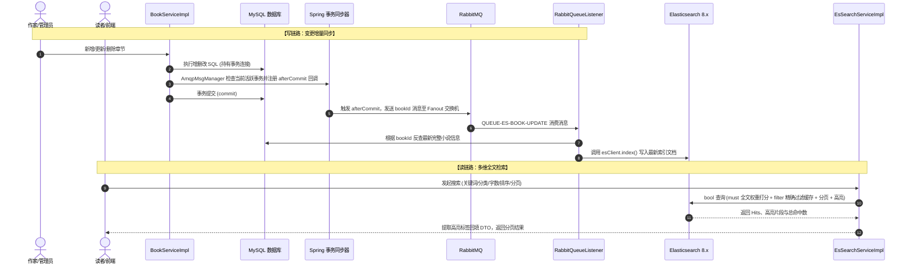

在本项目中，**搜索与数据同步链路**是典型的“**读写分离 + 异步解耦 + 最终一致性**”的高性能架构设计。针对您提出的三个核心问题（**怎么操作的、怎么实现的、为什么这样做**），以下紧密结合项目源代码进行全方位、深层次的拆解剖析。

---

### 全局架构与链路流程全貌



---

### 一、Elasticsearch 全文检索：怎么操作、怎么实现、为什么这样做

#### 1. 怎么操作与怎么实现（代码落地）

前端通过控制器 [`SearchController.java`](file:///c:/Users/35998/Desktop/job/project/novel/src/main/java/novel/controller/front/SearchController.java#L36-L39) 调用 `searchBooks` 接口，服务层核心实现位于 [`EsSearchServiceImpl.java`](file:///c:/Users/35998/Desktop/job/project/novel/src/main/java/novel/service/impl/EsSearchServiceImpl.java)。

##### ① 条件装配与弹性架构
```java
// EsSearchServiceImpl.java
@ConditionalOnProperty(prefix = "spring.elasticsearch", name = "enabled", havingValue = "true")
@Service
public class EsSearchServiceImpl implements SearchService
```
项目使用 Elasticsearch 8.x 官方 Java Client (`ElasticsearchClient`)，通过 `@ConditionalOnProperty` 注解实现按需装配：开启时走 ES 搜索；未启用或测试环境自动降级到基于 MySQL 的 [`DbSearchServiceImpl.java`](file:///c:/Users/35998/Desktop/job/project/novel/src/main/java/novel/service/impl/DbSearchServiceImpl.java)。

##### ② Bool 复合查询构建（`must` 与 `filter` 动静结合）
代码位置：[`EsSearchServiceImpl.java#L112-L197`](file:///c:/Users/35998/Desktop/job/project/novel/src/main/java/novel/service/impl/EsSearchServiceImpl.java#L112-L197)

```java
BoolQuery boolQuery = BoolQuery.of(b -> {
    // 1. 全文检索关键词：保留在 must 中，计算 BM25 相关度得分，并设置字段权重
    if (!StringUtils.isBlank(condition.getKeyword())) {
        b.must((q -> q.multiMatch(t -> t
            .fields(EsConsts.BookIndex.FIELD_BOOK_NAME + "^2",        // 书名权重 2.0
                    EsConsts.BookIndex.FIELD_AUTHOR_NAME + "^1.8",    // 作者名权重 1.8
                    EsConsts.BookIndex.FIELD_BOOK_DESC + "^0.1")      // 简介权重 0.1
            .query(condition.getKeyword())
        )));
    }

    // 2. 精确条件与范围条件：全部移至 filter（不计算得分，且可命中 ES Filter Cache）
    // 基础过滤：只查字数 > 0 的有效书籍
    b.filter(RangeQuery.of(m -> m.field(EsConsts.BookIndex.FIELD_WORD_COUNT).gt(JsonData.of(0)))._toQuery());

    // 精确 Term 过滤：频道、分类、连载状态、VIP免费/收费
    if (Objects.nonNull(condition.getWorkDirection())) {
        b.filter(TermQuery.of(m -> m.field(EsConsts.BookIndex.FIELD_WORK_DIRECTION).value(condition.getWorkDirection()))._toQuery());
    }
    if (Objects.nonNull(condition.getCategoryId())) {
        b.filter(TermQuery.of(m -> m.field(EsConsts.BookIndex.FIELD_CATEGORY_ID).value(condition.getCategoryId()))._toQuery());
    }
    if (Objects.nonNull(condition.getBookStatus())) {
        b.filter(TermQuery.of(m -> m.field(EsConsts.BookIndex.FIELD_BOOK_STATUS).value(condition.getBookStatus()))._toQuery());
    }
    if (Objects.nonNull(condition.getIsVip())) {
        b.filter(TermQuery.of(m -> m.field(EsConsts.BookIndex.FIELD_IS_VIP).value(condition.getIsVip()))._toQuery());
    }

    // 范围 Range 过滤：字数区间、最新更新时间
    if (Objects.nonNull(condition.getWordCountMin())) {
        b.filter(RangeQuery.of(m -> m.field(EsConsts.BookIndex.FIELD_WORD_COUNT).gte(JsonData.of(condition.getWordCountMin())))._toQuery());
    }
    if (Objects.nonNull(condition.getWordCountMax())) {
        b.filter(RangeQuery.of(m -> m.field(EsConsts.BookIndex.FIELD_WORD_COUNT).lt(JsonData.of(condition.getWordCountMax())))._toQuery());
    }
    if (Objects.nonNull(condition.getUpdateTimeMin())) {
        b.filter(RangeQuery.of(m -> m.field(EsConsts.BookIndex.FIELD_LAST_CHAPTER_UPDATE_TIME).gte(JsonData.of(condition.getUpdateTimeMin().getTime())))._toQuery());
    }
    return b;
});
```

##### ③ 动态排序与深分页防护
代码位置：[`EsSearchServiceImpl.java#L56-L64`](file:///c:/Users/35998/Desktop/job/project/novel/src/main/java/novel/service/impl/EsSearchServiceImpl.java#L56-L64)
- **排序**：如果请求指定了 `sort`（如 `word_count desc`），自动通过 `StringUtils.underlineToCamel` 将数据库字段风格转为 ES 驼峰字段 `wordCount`，并配置倒序：
  ```java
  searchBuilder.sort(o -> o.field(f -> f
      .field(StringUtils.underlineToCamel(condition.getSort().split(" ")[0]))
      .order(SortOrder.Desc))
  );
  ```
- **分页**：计算偏移量 `from = (pageNum - 1) * pageSize` 与 `size = pageSize`。在通用 DTO [`PageReqDto.java`](file:///c:/Users/35998/Desktop/job/project/novel/src/main/java/novel/core/common/req/PageReqDto.java#L52-L54) 中约束了 `pageSize` 最大值为 100，防止恶意大单页查询拖垮 ES。

##### ④ 高亮声明与结果集提取回填
代码位置：[`EsSearchServiceImpl.java#L66-L101`](file:///c:/Users/35998/Desktop/job/project/novel/src/main/java/novel/service/impl/EsSearchServiceImpl.java#L66-L101)
- **构建阶段设置高亮标签**：
  ```java
  searchBuilder.highlight(h -> h
      .fields(EsConsts.BookIndex.FIELD_BOOK_NAME, t -> t.preTags("<em style='color:red'>").postTags("</em>"))
      .fields(EsConsts.BookIndex.FIELD_AUTHOR_NAME, t -> t.preTags("<em style='color:red'>").postTags("</em>"))
  );
  ```
- **解析阶段替换原生内容**：遍历 `response.hits().hits()`，如果 `hit.highlight()` 中存在高亮片段，用高亮片段覆盖原始字段：
  ```java
  if (!CollectionUtils.isEmpty(hit.highlight().get(EsConsts.BookIndex.FIELD_BOOK_NAME))) {
      book.setBookName(hit.highlight().get(EsConsts.BookIndex.FIELD_BOOK_NAME).get(0));
  }
  if (!CollectionUtils.isEmpty(hit.highlight().get(EsConsts.BookIndex.FIELD_AUTHOR_NAME))) {
      book.setAuthorName(hit.highlight().get(EsConsts.BookIndex.FIELD_AUTHOR_NAME).get(0));
  }
  ```

#### 2. 为什么这样做（架构考量）

1. **`must` 与 `filter` 职责分离（性能与缓存）**：
   - 如果把分类、字数等过滤条件全放在 `must` 中，ES 会为每一个文档计算相关度得分（Score），极大消耗 CPU。
   - 放在 `filter` 中的子句**不计算得分**，而且 ES 节点内部会自动将 `filter` 的布尔匹配结果缓存到 **Node Query Cache (Bitset)** 中。后续用户进行不同关键词的搜索时，相同的分类或状态过滤条件可以直接复用内存缓存，显著降低磁盘 I/O 和延迟。
2. **多字段加权 Boost (`^2`, `^1.8`, `^0.1`) 符合真实业务直觉**：
   - 用户搜索“剑来”时，最期望看到的是小说名是《剑来》或作者名为“剑来”的书，绝不希望因为某本书的 1000 字简介里提了一句“剑来”而把它排在第一位。将书名权重设为 2.0、作者 1.8、简介降权至 0.1，保证了最相关的结果排在首位。

---

### 二、RabbitMQ 异步增量同步：怎么操作、怎么实现、为什么这样做

#### 1. 怎么操作与怎么实现（代码落地）

##### ① 变更触发点（生产者）
在 [`BookServiceImpl.java`](file:///c:/Users/35998/Desktop/job/project/novel/src/main/java/novel/service/impl/BookServiceImpl.java) 中，每当产生影响小说展示元数据的动作时，都会触发变更消息通知：
- **新增章节**：[`saveBookChapter`](file:///c:/Users/35998/Desktop/job/project/novel/src/main/java/novel/service/impl/BookServiceImpl.java#L406) -> 更新了最新章节 ID、最新章节名、更新时间及总字数，调用 `amqpMsgManager.sendBookChangeMsg(dto.getBookId())`；
- **删除章节**：[`deleteBookChapter`](file:///c:/Users/35998/Desktop/job/project/novel/src/main/java/novel/service/impl/BookServiceImpl.java#L538) -> 重置最新章节与减少字数，调用 `amqpMsgManager.sendBookChangeMsg(chapter.getBookId())`；
- **修改章节**：[`updateBookChapter`](file:///c:/Users/35998/Desktop/job/project/novel/src/main/java/novel/service/impl/BookServiceImpl.java#L602) -> 章节改名或字数调整，调用 `amqpMsgManager.sendBookChangeMsg(chapter.getBookId())`。

##### ② MQ 拓扑声明与广播设计
在 [`AmqpConfig.java`](file:///c:/Users/35998/Desktop/job/project/novel/src/main/java/novel/core/config/AmqpConfig.java#L23-L43) 与 [`AmqpConsts.java`](file:///c:/Users/35998/Desktop/job/project/novel/src/main/java/novel/core/constant/AmqpConsts.java#L14-L31) 中：
- 交换机：`EXCHANGE-BOOK-CHANGE`，定义为 `FanoutExchange`（广播扇出交换机）；
- 队列：`QUEUE-ES-BOOK-UPDATE` 绑定到该交换机。

##### ③ 异步监听与幂等 Upsert 写入（消费者）
代码位置：[`RabbitQueueListener.java#L37-L47`](file:///c:/Users/35998/Desktop/job/project/novel/src/main/java/novel/core/listener/RabbitQueueListener.java#L37-L47)
```java
@Component
@ConditionalOnProperty(prefix = "spring", name = {"elasticsearch.enabled", "amqp.enabled"}, havingValue = "true")
@RequiredArgsConstructor
@Slf4j
public class RabbitQueueListener {

    private final BookInfoMapper bookInfoMapper;
    private final ElasticsearchClient esClient;

    @RabbitListener(queues = AmqpConsts.BookChangeMq.QUEUE_ES_UPDATE)
    @SneakyThrows
    public void updateEsBook(Long bookId) {
        // 1. 根据 ID 查询 MySQL 最新数据
        BookInfo bookInfo = bookInfoMapper.selectById(bookId);
        // 2. 构造 ES 文档并根据 ID 执行全量覆盖 (Upsert)
        IndexResponse response = esClient.index(i -> i
            .index(EsConsts.BookIndex.INDEX_NAME)
            .id(bookInfo.getId().toString())
            .document(EsBookDto.build(bookInfo))
        );
        log.info("Indexed with version " + response.version());
    }
}
```

#### 2. 为什么这样做（架构考量）

1. **写请求链路解耦与性能提升（削峰填谷）**：
   - 作家发布或修改章节是系统高频的核心事务，涉及多张表的数据写入与校验。如果同步调用 ES 客户端写入，网络 RPC 和 ES 索引构建耗时（通常几十毫秒到几百毫秒）会直接拉长前端 HTTP 响应时间；若 ES 偶发性 GC、网络抖动或集群故障，还会直接导致作家发布章节失败。
   - 改为 RabbitMQ 异步投递，主业务只需几毫秒投递完消息即可返回成功，保证高可用和极致的写响应性能。
2. **只传 `bookId` 而不传全量数据的并发与一致性设计（Lazy Fetch）**：
   - **极低的带宽占用**：消息载荷（Payload）仅为一个简单的 `Long` 数字，极大地减轻 RabbitMQ 的集群内存与网络吞吐压力。
   - **避免消息乱序带来的“新数据被旧数据覆盖”**：如果 MQ 消息内包裹全量快照，网络抖动可能导致“第二次修改的消息”先到达并落库、“第一次修改的消息”后到达覆盖，造成脏数据。而只传递 `bookId`，消费者收到消息时主动去查 MySQL 的最新状态，天然保障了最终数据落入 ES 的一定是当时数据库中的最新版本。
3. **使用 Fanout 交换机的可扩展性**：
   - 小说信息发生变更，除了需要同步 ES，未来往往还需要：刷新 Redis 缓存、通知外部推荐系统、给书架订阅读者发送 App 推送等。
   - 采用 `FanoutExchange`，未来只要新挂载一个消费队列（如项目中预留的 `QUEUE-REDIS-BOOK-UPDATE`）绑定到交换机即可，**原有发消息的代码完全无需侵入修改**。

---

### 三、Spring 事务同步器保证“事务提交后再发消息”

这是该数据同步链路中最核心、最经典的设计细节。

#### 1. 怎么操作与怎么实现（代码剖析）

核心逻辑封装在 [`AmqpMsgManager.java`](file:///c:/Users/35998/Desktop/job/project/novel/src/main/java/novel/manager/mq/AmqpMsgManager.java#L35-L49)：

```java
@Component
@RequiredArgsConstructor
public class AmqpMsgManager {

    private final AmqpTemplate amqpTemplate;

    @Value("${spring.amqp.enabled:false}")
    private boolean amqpEnabled;

    public void sendBookChangeMsg(Long bookId) {
        if (amqpEnabled) {
            sendAmqpMessage(amqpTemplate, AmqpConsts.BookChangeMq.EXCHANGE_NAME, null, bookId);
        }
    }

    private void sendAmqpMessage(AmqpTemplate amqpTemplate, String exchange, String routingKey,
        Object message) {
        // 如果在事务中则在事务执行完成后再发送，否则可以直接发送
        if (TransactionSynchronizationManager.isActualTransactionActive()) {
            TransactionSynchronizationManager.registerSynchronization(
                new TransactionSynchronization() {
                    @Override
                    public void afterCommit() {
                        amqpTemplate.convertAndSend(exchange, routingKey, message);
                    }
                });
            return;
        }
        amqpTemplate.convertAndSend(exchange, routingKey, message);
    }
}
```

##### 关键步骤解析：
1. **活跃事务感知**：利用 Spring 底层提供的 [`TransactionSynchronizationManager.isActualTransactionActive()`](file:///c:/Users/35998/Desktop/job/project/novel/src/main/java/novel/manager/mq/AmqpMsgManager.java#L38)，判断当前执行线程的 `ThreadLocal` 中是否存在一个尚未提交的 Spring 管理事务（如方法上的 `@Transactional`）。
2. **注册同步监听器**：如果有事务正在运行，**立即拦截并阻止当前发送行为**，调用 `registerSynchronization(...)` 注册一个匿名的 [`TransactionSynchronization`](file:///c:/Users/35998/Desktop/job/project/novel/src/main/java/novel/manager/mq/AmqpMsgManager.java#L40) 回调接口。
3. **提交后回调触发**：重写 `afterCommit()` 方法。Spring 的事务管理器在执行完所有数据库操作、成功调用底层的 `Connection.commit()` 之后，才会执行 `afterCommit()` 勾子，此时才真正调用 `amqpTemplate.convertAndSend` 发送 MQ 消息。
4. **无事务兼容**：如果方法没有加 `@Transactional`，则退化为直接发送，保证通用性。

#### 2. 为什么这样做（解决两大致命系统缺陷）

##### 痛点 ①：避免“幽灵消息”与脏读（Ghost Message & Dirty Read）
在传统的事务写法中，如果在事务方法体内直接发送 MQ：
```java
// 反模式（未做事务同步器拦截）
@Transactional
public void saveBookChapter(...) {
    bookInfoMapper.updateById(newBookInfo);
    // 此时数据库事务尚未 commit！
    amqpTemplate.convertAndSend(...); // 消息出去了！
}
```
- **时序竞争（Race Condition）**：RabbitMQ 的消息传递极其迅速（可能仅需 1~2 毫秒），消费者 `RabbitQueueListener` 收到消息后立即执行 `bookInfoMapper.selectById(bookId)`。而此时主业务线程的数据库事务**还在 commit 的网络往返或写 binlog 阶段**！
- 在常见的数据库默认隔离级别（如 MySQL RC 或 RR）下，消费者**根本读不到新提交的章节或字数更新**，依然读出旧数据并写回 ES，导致同步失效！

##### 痛点 ②：避免“事务回滚导致的数据永久不一致”
- 假设在保存章节的最后阶段，后续逻辑抛出了运行时异常（例如写入后续表失败、网络中断或触发乐观锁异常），Spring 事务将发生 **Rollback 回滚**，MySQL 中的数据被撤销。
- 但如果消息在回滚之前就已经发给了 MQ，RabbitMQ **无法回滚已经进入队列并被消费的消息**！消费者会照样根据脏数据同步到 ES 中，造成 **MySQL 中根本没有这本书/这个章节，但 ES 里却搜索得到**的严重分布式数据不一致隐患！

##### 痛点 ③：防止外部网络 RPC 阻塞数据库连接池
- 数据库连接是宝贵的系统资源。如果在 `@Transactional` 内调用远程 MQ 发送，一旦 RabbitMQ 遇到网络拥塞、重试（`retry.max-attempts: 3`），会导致数据库事务迟迟无法提交，长期霸占数据库连接池连接和行级排他锁，迅速导致高并发下的数据库连接池耗尽（HikariCP 报错）和并发性能雪崩。
- 事务提交后再发消息，**将外部网络 I/O 剥离出了数据库事务边界**，极大缩短了事务持锁时间。

---

### 四、一致性闭环设计：定时任务全量同步兜底

虽然通过“Spring 事务同步器 + RabbitMQ”能解决 99.9% 场景下的准实时增量同步，但若发生 RabbitMQ 宕机、死信丢弃或网络极端分区，数据仍可能产生微量不一致。

项目中引入了 [`BookToEsTask.java`](file:///c:/Users/35998/Desktop/job/project/novel/src/main/java/novel/core/task/BookToEsTask.java) 作为兜底保障：
- **XXL-JOB 分布式调度**：通过 `@XxlJob("saveToEsJobHandler")` 实现定时全量巡检同步。
- **游标分页防深度分页性能崩塌**：采用基于主键的滚动游标（`id > maxId limit 30`），完全规避了传统 `LIMIT offset, size` 在数十万数据量下的全表扫描性能衰减。
- **批量写入**：利用 `esClient.bulk()` 批量写入 ES，大幅降低网络往返开销。

### 总结对照

| 维度 | 怎么实现的 | 为什么这样做 |
| :--- | :--- | :--- |
| **全文检索** | `EsSearchServiceImpl`: `multiMatch` + 字段权重 (`bookName^2`)，状态/字数全入 `filter`，`highlight` 染色回填 | 动静分离提升相关度打分精确性；利用 ES Filter Cache 提高吞吐；高亮直观提升读者体验 |
| **异步解耦** | `BookServiceImpl` 触发变更 -> `FanoutExchange` 广播 -> `RabbitQueueListener` 消费反查并 `index` | 缩短核心写链路耗时，削峰填谷；只传 `bookId` 避免乱序覆盖与网络开销；Fanout 具备极强扩展性 |
| **事务同步** | `AmqpMsgManager`: `TransactionSynchronizationManager.registerSynchronization` 并在 `afterCommit` 中发消息 | 彻底杜绝事务未提交时的消费者脏读；避免事务回滚导致的幽灵消息与数据不一致；将网络 I/O 移出事务边界保护数据库连接池 |