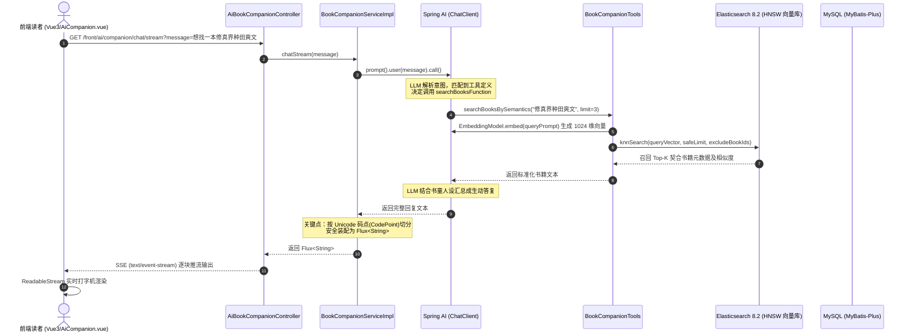

在你的小说项目中，**“Spring AI 智能书童与向量语义找书”** 是一个兼具业务实用性与前沿工程设计的核心亮点模块。

整个模块将大语言模型（LLM）的**意图理解能力**、Elasticsearch 8 的**向量语义检索**、Spring AI 的 **Function Calling（函数回调）** 以及响应式编程 **`Flux<String>` + Unicode 码点分块打字机输出** 深度融合。

以下依据你项目中的真实代码实现，从**总体架构全景**、**Spring AI 与 4 大业务 Tools 编排**、**Elasticsearch 8 向量检索与语义找书**、**响应式 `Flux<String>` 与 Unicode 码点防截断乱码机制** 以及 **为什么这样做（技术选型与深度思考）** 五个维度为你进行全方位剖析：

---

### 一、 总体架构与业务流转全景

在用户打开右下角悬浮窗与“小墨书童”对话时，整体数据流与控制流转如下图所示：



---

### 二、 Spring AI (`ChatClient`) + 4 大业务 Tools 设计与落地

#### 1. 怎么操作的？
读者在前端输入任意自然语言，例如：
- *“找一本主角杀伐果断、在修真界种田的小说”*
- *“最近有什么高人气的点击榜小说？”*
- *“把 ID 为 12 的小说加进我的书架”*
- *“根据我书架读过的书，给我推荐几本类似的”*

后端大模型无需做复杂的硬编码 `if-else` 分支路由，而是由 Spring AI 的 **Tool/Function Calling 机制** 自主判断读者意图，并动态调用对应的 Spring Bean 工具。

#### 2. 怎么实现的？
在 [`BookCompanionServiceImpl.java`](file:///c:/Users/35998/Desktop/job/project/novel/src/main/java/novel/service/impl/BookCompanionServiceImpl.java#L49-L56) 中，服务启动时通过 `@PostConstruct` 对 `ChatClient` 完成初始化与绑定：

```java
@PostConstruct
public void init() {
    this.chatClient = chatClientBuilder
            .defaultSystem(aiProperties.getSystemPrompt()) // 注入书童人设 Prompt
            .defaultFunctions("searchBooksFunction", "getBookRankFunction", 
                             "addToBookshelfFunction", "recommendBooksFunction") // 挂载 4 大业务 Tool
            .build();
    log.info("[智能书童] 初始化完成，已加载默认人设 Prompt 与 4 大业务 Function Tools");
}
```

在 [`AiProperties.java`](file:///c:/Users/35998/Desktop/job/project/novel/src/main/java/novel/core/ai/config/AiProperties.java#L36-L51) 中严格约束了系统人设（语气亲切、称呼读者为“少侠/阁下”、结构化展示排版）。

在 [`BookCompanionTools.java`](file:///c:/Users/35998/Desktop/job/project/novel/src/main/java/novel/core/ai/tools/BookCompanionTools.java) 中，利用 Java 17+ `record` + `@JsonPropertyDescription` 为大模型生成准确的 JSON Schema，注册了 **4 大业务工具 Bean**：

| 工具 Bean 名称 | 入参 Record | 业务职责与底层支撑 |
| :--- | :--- | :--- |
| **`searchBooksFunction`** | `SearchBooksRequest(queryPrompt, limit)` | **语义找书**：调用 `BookVectorSyncService` 将自然语言转成向量，再交由 ES8 执行 KNN 余弦检索。 |
| **`getBookRankFunction`** | `GetBookRankRequest(rankType)` | **榜单查询**：直接打通底层 `BookService` 查询点击榜（`visit`）、新书榜（`newest`）、更新榜（`update`）。 |
| **`addToBookshelfFunction`** | `AddToBookshelfRequest(bookId)` | **一键加书架**：结合 `UserHolder.getUserId()` 获取当前登录态，调用 `UserService.addBookshelf()` 完成写入。 |
| **`recommendBooksFunction`** | `RecommendBooksRequest(count)` | **偏好分析推荐**：从 MySQL 获取读者书架最近 10 本书，在 ES8 提取对应向量聚类计算**偏好中心向量（Centroid Vector）**，排查已读后推荐相似书籍。 |

#### 3. 创新亮点：封装 `SafeFunctionCallback` 防御空串崩溃
在 [`SafeFunctionCallback.java`](file:///c:/Users/35998/Desktop/job/project/novel/src/main/java/novel/core/ai/tools/SafeFunctionCallback.java#L56-L80) 中，你自定义了工具回调包装器：
```java
@Override
public String call(String functionArguments) {
    I request = null;
    if (functionArguments != null && !functionArguments.isBlank()) {
        String trimmed = functionArguments.trim();
        if (!trimmed.isEmpty() && !trimmed.equals("{}")) {
            try {
                request = this.objectMapper.readValue(trimmed, this.inputType);
            } catch (Exception e) {
                log.warn("[AI Tool Callback] 工具 [{}] 入参反序列化失败，使用默认参数", this.name);
            }
        }
    }
    O response = this.function.apply(request);
    ...
}
```
* **为什么这样做**：部分大模型在 Function Calling 触发无参或参数缺省时，会传递 `""`（空字符串）或无效 JSON。Spring AI 默认的 Jackson 反序列化会抛出 `MismatchedInputException: No content to map due to end-of-input` 导致整个对话中断。通过 `SafeFunctionCallback` 做了防御式空值与容错捕获，确保调用稳定性。

---

### 三、 Elasticsearch 8 向量检索与自然语言语义找书

传统的全文搜索（如 SQL `LIKE %xxx%` 或普通 ES 分词）只能进行词面匹配，如果用户搜索 **“主角杀伐果断、在赛博世界修真的爽文”**，传统检索无法理解“杀伐果断”、“赛博修真”的语义特征。

#### 1. 怎么实现的？

##### ① 索引结构：HNSW 稠密向量
在 [`EsVectorStoreService.java`](file:///c:/Users/35998/Desktop/job/project/novel/src/main/java/novel/core/ai/vector/EsVectorStoreService.java#L43-L89) 中，动态创建了 ES8 原生 Dense Vector 索引：
```java
.properties("embedding", p -> p.denseVector(d -> d
        .dims(1024)                  // 适配通义千问 text-embedding-v3 或 OpenAI 1024 维
        .index(true)
        .similarity("cosine")        // 采用余弦相似度
        .indexOptions(io -> io
                .type("hnsw")        // HNSW 分层小世界图索引算法
                .m(16)               // 每个节点双向链表数
                .efConstruction(100) // 构图探索深度
        )
))
```

##### ② 知识向量化沉淀 (Pipeline)
在 [`BookVectorSyncService.java`](file:///c:/Users/35998/Desktop/job/project/novel/src/main/java/novel/core/ai/vector/BookVectorSyncService.java#L39-L95) 与 [`EsVectorBookDto.java`](file:///c:/Users/35998/Desktop/job/project/novel/src/main/java/novel/core/ai/dto/EsVectorBookDto.java#L104-L131)：
- 将小说基本信息提取为语义特征文本：
  `《书名》 | 分类：仙侠 | 作者：耳根 | 评分：90分 | 简介：...`
- 调用 Spring AI 的 `EmbeddingModel.embed(summaryText)` 生成 1024 维 Float 向量；
- 采用 20 本/批的 Bulk 批量操作写入 ES8（约 1000 本存量书籍）。

##### ③ KNN 相似度过滤搜索
在 [`EsVectorStoreService.java`](file:///c:/Users/35998/Desktop/job/project/novel/src/main/java/novel/core/ai/vector/EsVectorStoreService.java#L138-L187)：
```java
SearchResponse<EsVectorBookDto> response = esClient.search(s -> s
        .index(indexName)
        .knn(k -> {
            k.field("embedding")
                    .queryVector(queryVector)
                    .k((long) safeTopK)
                    .numCandidates((long) numCandidates);
            if (finalFilterQuery != null) {
                k.filter(finalFilterQuery); // 支持布尔过滤，排除用户已加书架的书
            }
            return k;
        })
        .size(safeTopK),
        EsVectorBookDto.class
);
```

##### ④ 读者画像偏好中心向量推荐
在 [`BookCompanionServiceImpl.java`](file:///c:/Users/35998/Desktop/job/project/novel/src/main/java/novel/service/impl/BookCompanionServiceImpl.java#L107-L150) 的 `recommendSimilarBooks` 中：
- 取出读者书架上最近 10 本书的向量集合 $\{V_1, V_2, \dots, V_m\}$；
- 计算读者当前的偏好质心向量：
  $$V_{centroid} = \frac{1}{m}\sum_{i=1}^{m} V_i$$
- 用质心向量 $V_{centroid}$ 到 ES8 检索 KNN，同时在 Filter 中 `mustNot.terms(readBookIds)` 排除已读书籍，精准召回未读过的契合好书；
- **降级兜底**：若未登录或未生成向量，自动降级为 MySQL 热门高分点击榜查询。

---

### 四、 响应式 `Flux<String>` 结合 Unicode 码点分块流式输出

很多系统在做大模型 SSE（Server-Sent Events）打字机流式输出时，经常出现前端文本乱码、Emoji 变成两个 `??` 或者黑色方块乱码的痛点问题。

#### 1. 痛点根因剖析：Java UTF-16 与 Emoji 代理对（Surrogate Pair）
- Java 内部的 `char` 和常规 `String.substring(i, i + size)` 是以 **16-bit Code Unit（码元）** 为基准操作的。
- 常见的 ASCII 码和大部分中文字符位于基本多语言平面（BMP），占用 1 个 `char`（2 个字节）。
- 但很多常用 **Emoji（如 🧙‍♂️、🤖、📚、🔥、✨）** 位于辅助平面，在 UTF-16 编码下必须使用 **两个连续的 `char`（高位代理 + 低位代理，Surrogate Pair）** 才能表示一个合法的字符。
- 如果代码粗暴地按固定字数切片（例如 `fullResponse.substring(i, i + 2)`），一旦切分点恰好落在这对代理对之间：
  - 前一个 chunk 分发了半个代理字符（孤立高位代理 `\uD83D`）；
  - 后一个 chunk 分发了另半个代理字符（孤立低位代理 `\uDE00`）；
  - 浏览器的 `TextDecoder('utf-8')` 或 JSON 序列化在遇到单个代理字符时，由于非法 Unicode 序列，会强制降级替换成 `\uFFFD`（即 ``）或 `??`，造成**永久性乱码损坏**。

#### 2. 项目代码中的完美解决方案
在 [`BookCompanionServiceImpl.java`](file:///c:/Users/35998/Desktop/job/project/novel/src/main/java/novel/service/impl/BookCompanionServiceImpl.java#L72-L82) 中：
```java
// 按 Unicode 码点（支持 Emoji 4 字节代理对）安全流式分块，彻底避免 Emoji 乱码
return Flux.create(sink -> {
    // 将整个字符串转换为 32-bit 的 Unicode 码点数组 (int[])
    int[] codePoints = fullResponse.codePoints().toArray();
    int len = codePoints.length;
    int chunkSize = 2; // 每次推送 2 个完整 Unicode 字符
    for (int i = 0; i < len; i += chunkSize) {
        int end = Math.min(i + chunkSize, len);
        // 基于 codePoints 数组构建安全子串，确保绝不把双码元 Emoji 截断在半中腰
        sink.next(new String(codePoints, i, end - i));
    }
    sink.complete();
});
```
* **核心原理**：`fullResponse.codePoints()` 返回的是每一个完整的 32 位 Unicode 字符标量值（Code Point）。无论该字符在内存中占几个 `char`（无论是 1 个还是 2 个），在 `codePoints` 数组中均只视作一个整体元素 `int`。从码点切片生成的子串永远包含成对的代理字符，彻底杜绝多字节 Emoji 截断乱码。

#### 3. 前后端交互链路配合
1. **Controller 声明响应式流**：
   在 [`AiBookCompanionController.java`](file:///c:/Users/35998/Desktop/job/project/novel/src/main/java/novel/controller/front/AiBookCompanionController.java#L38-L43)：
   ```java
   @GetMapping(value = "/chat/stream", produces = "text/event-stream;charset=UTF-8")
   public Flux<String> chatStream(@RequestParam("message") String message) {
       return bookCompanionService.chatStream(message);
   }
   ```
   Spring WebFlux/MVC 自动识别 `Flux<String>` + `text/event-stream`，自动转换为 SSE 标准格式输出（`data: xxx\n\n`）。

2. **前端流式消费**：
   在 [`front/novel-front-web/src/api/ai.js`](file:///c:/Users/35998/Desktop/job/project/novel/front/novel-front-web/src/api/ai.js#L32-L81) 中使用原生的 `fetch` + `response.body.getReader()`：
   - 监听 `ReadableStream` 的字节流；
   - 依据 SSE 规范按 `\n\n` 划分事件分块；
   - 提取 `data:` 后的文本增量回调 `onChunk(chunk)`；
   - 在 [`AiCompanion.vue`](file:///c:/Users/35998/Desktop/job/project/novel/front/novel-front-web/src/components/common/AiCompanion.vue#L268-L277) 中响应式追加：`assistantMsg.content += chunk`，配合光标动画形成丝滑的打字机特效。

---

### 五、 核心设计思考：为什么这样做？

| 技术选型 / 设计点 | 为什么不采用传统方案？ | 本方案优势与解决的痛点 |
| :--- | :--- | :--- |
| **Spring AI `ChatClient` + 4 大 Tools** | 传统做法写死意图识别规则，无法处理读者灵活多变的表达（如“来两本爽文”、“书荒了给我推荐好看的”）。 | 充分利用 LLM 泛化理解能力与 Function Calling 自主规划，把“意图解析”完全委托给大模型，业务逻辑解耦在单一职责的 Tools 中。 |
| **ES8 HNSW 向量检索 + 余弦相似度** | MySQL `LIKE` 无法匹配深层语义；普通 ES 分词缺乏关联度理解；外挂独立向量数据库（如 Milvus/Chroma）增加运维与网络成本。 | ES 8.x 原生支持 Dense Vector 与 HNSW 索引，既保留传统全文检索与复杂 Term Filter（排除已读），又实现高效毫秒级向量召回，技术栈统一。 |
| **用户画像质心向量（Centroid）** | 传统的基于协同过滤（CF）或标签匹配需要大量曝光日志和冷启动数据，小团队很难训练专用推荐模型。 | 借力通用 Embedding 模型的隐空间表征，把书架向量平均得到即时的偏好向量，天然具备零样本（Zero-shot）冷启动与跨题材泛化能力。 |
| **`Flux.defer` + `codePoints()` 码点流** | 传统方式若在 Controller 阻塞式返回，首包延迟（TTFT）过高；若在 Java 字符层随意切片流式下发，高频出现 Emoji 代理对截断导致字符损坏变成 `??`。 | `Flux.defer` 确保多租户懒加载调用隔离；`codePoints().toArray()` 彻底在 JVM 层面保障多字节 UTF-16 字符的原子性，兼顾了打字机极致体验与字符完整性。 |
| **多级容错与优雅降级** | ES8 服务未启动、大模型接口欠费限流、用户未登录等不可控外部依赖异常。 | `SafeFunctionCallback` 捕获反序列化异常；KNN 失败或书架为空时无缝降级到全站高分榜单；大模型报错时返回拟人化温馨提示，保障系统高可用。 |